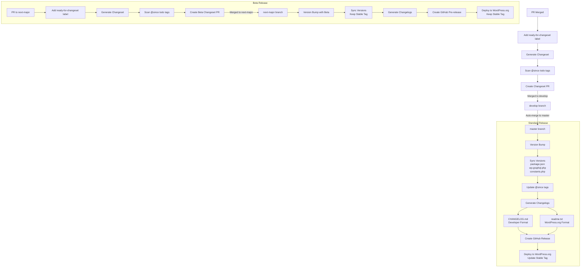

# Changesets

This directory contains "changesets" which help us manage versioning and changelogs.

## Automated Changeset Generation

Changesets are automatically generated when PRs are labeled with `ready-for-changeset` based on:

1. PR Title: Must follow conventional commit standards

   - `feat:` = minor version bump
   - `fix:` = patch version bump
   - Optional scopes can be used: `feat(graphiql):`, `fix(core):`
   - Breaking changes can be indicated by:
     - Adding an exclamation mark: `feat!:` or `fix!:`
     - Note: Any valid scope can be used (e.g., `feat(graphiql):`), but breaking changes should use the `!` suffix

2. PR Description Sections:
   - Breaking Changes: Used to identify major version bumps
   - Upgrade Instructions: Added to changelog for breaking changes
   - Description: Used as changelog entry

## How Changesets Work in WPGraphQL

Changesets are automatically generated when PRs are labeled to track changes and automate releases. The process works as follows:

1. Contributors submit PRs following our conventional commit standards
2. GitHub Actions automate the process:
   - Validates PR format and content
   - Generates and commits changesets
   - Creates releases and deploys

For detailed information about the automation process, see [GitHub Workflows](../.github/workflows/README.md).

## What is a Changeset?

A changeset is a file that describes changes made in a PR. It includes:

- Type of change (patch/minor/major)
- PR number and link
- Whether it contains breaking changes
- Description of changes
- Upgrade notes (if any)
- Files containing `@since next-version` that need updating

## Example Changeset

```md
---
type: minor
pr: 123
breaking: false
---

### feat: Add new GraphQL field to Post type

[PR #123](https://github.com/wp-graphql/wp-graphql/pull/123)

#### Description

Adds a new GraphQL field `customField` to the Post type that exposes custom meta data.

#### Upgrade Notes

Users implementing the PostType interface will need to implement this new field.

#### Files with @since next-version

- src/Type/ObjectType/PostType.php
```

## How are Changesets Used?

### Release Process

> **Note**: All releases are deployed to WordPress.org, with different handling for stable vs beta releases.



When a release is created:

1. All changesets are collected
2. Version bump is determined (patch/minor/major)
3. Changelog entries are generated for:
   - CHANGELOG.md: Generated by @changesets/cli/changelog
     - Detailed developer changelog
     - Includes PR links and commit references
     - Used by GitHub releases
   - readme.txt: Generated by our custom formatter
     - WordPress.org compatible format
     - Groups changes by type (Features/Bugfixes)
     - Updates stable tag (standard releases only)
     - Follows WordPress.org readme standards
4. Version numbers are updated in:
   - constants.php
   - package.json
   - wp-graphql.php
5. `@since next-version` tags are replaced with new version (standard releases only)
6. Changes are committed and pushed
7. GitHub release is created
8. Plugin is deployed to WordPress.org:
   - Standard releases: Update stable tag to new version
   - Beta releases: Keep stable tag pointing to last stable

## Branch Strategy

### Active Development (v2.x)

- `master`: Current stable release (2.x.x)
- `develop`: Development branch for next 2.x release
- All feature/bugfix PRs target `develop`

### Maintenance Mode (v1.x)

> **Note**: 1.x branch is in limited support mode with manual releases only.

- Only critical bug fixes and security patches
- Limited to latest minor.patch of v1.x series

### Next Major Version (v3.x)

- `next-major`: Development branch for v3.0
- Breaking changes and major features target this branch
- Follows beta release process (see Beta Releases Guide)

## Release Workflow

### Current Version (v2.x)

The release process is fully automated:

1. PRs are merged to `develop` with the `ready-for-changeset` label
2. Changesets are collected in a PR from `changeset-collection` to `develop`
3. When the changeset collection PR is merged to `develop`, a workflow automatically:
   - Merges `develop` into `master`
   - Processes changesets to determine version bump
   - Updates version numbers and `@since` tags
   - Generates changelogs
   - Creates a GitHub release
   - Deploys to WordPress.org

### Beta Releases

For beta releases (e.g., v3.0.0-beta.1):

1. PRs are merged to `next-major` with the `ready-for-changeset` label
2. Changesets are collected in a PR from `changeset-beta` to `next-major`
3. When the changeset collection PR is merged to `next-major`, the same workflow:
   - Processes changesets with prerelease flag
   - Updates version numbers with beta suffix
   - Keeps stable tag unchanged
   - Creates a GitHub pre-release
   - Deploys to WordPress.org
   - **Note: `@since` tags are NOT updated for beta releases**

See [Beta Releases Guide](../docs/beta-releases.md) for more details.

## Customizations

WPGraphQL uses some custom changeset behaviors:

1. Automatic generation from PR metadata
2. Multi-file version updates (constants.php, wp-graphql.php, etc)
3. Dual changelog generation (CHANGELOG.md and readme.txt)
4. WordPress.org deployment integration
5. `@since next-version` tag replacement
