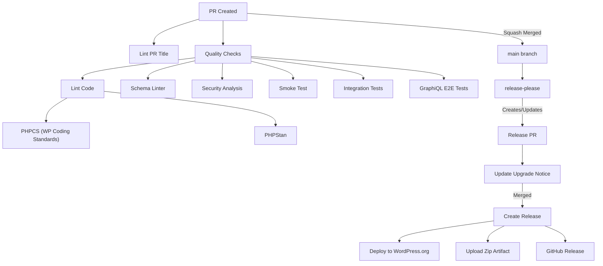

# GitHub Actions Workflows

This directory contains GitHub Actions workflows that automate our development, testing, and release processes. Here's how they work together:

## Code Quality & Testing

### 1. Code Quality Checks (`lint.yml` and `lint-reusable.yml`)
- Checks for:
  - WordPress Coding Standards compliance using PHPCS
  - Static type and error checking with PHPStan
- Uses change detection to only lint plugins that have changed files
- `lint.yml` detects which plugins have changes and triggers `lint-reusable.yml` for each affected plugin
- Runs all plugins on release PRs or pushes to main
- Each plugin's linting runs independently (PHPCS and PHPStan)

### 2. Schema Linting (`schema-linter.yml`)

- Validates GraphQL schema structure for each plugin in the monorepo
- Uses matrix strategy to test each plugin independently
- Ensures schema follows GraphQL best practices
- Compares schema against previous releases to detect breaking changes
- Each plugin's schema is compared against its own release history (e.g., `wp-graphql/v2.7.0`, `wp-graphql-smart-cache/v1.0.0`)
- Supports plugins that extend the schema (e.g., smart-cache tests with both wp-graphql and smart-cache active)

### 3. Testing Integration (`testing-integration.yml`)

- Runs comprehensive integration tests via Codeception
- Tests across multiple PHP and WordPress versions
- Uses "boundary testing" approach for efficiency (~8 jobs for PRs, ~18 for merges)
- Collects code coverage from multiple configurations

### 4. GraphiQL E2E Tests (`graphiql-e2e-tests.yml`)

- End-to-end testing of GraphiQL interface using Playwright
- Ensures GraphiQL functionality works as expected
- Tests user interactions and UI components

### 5. Smoke Test (`smoke-test.yml` and `smoke-test-reusable.yml`)

- Validates production zip artifacts work correctly for each plugin in the monorepo
- Uses change detection to only test plugins that have changed files
- `smoke-test.yml` detects changes and triggers `smoke-test-reusable.yml` for each affected plugin
- Tests each plugin across different WP/PHP versions (boundary testing approach)
- Builds the plugin zip (same as release process)
- Handles plugin dependencies (e.g., builds wp-graphql first if required by another plugin)
- Installs plugins in a clean WordPress environment
- Runs smoke tests to verify core functionality
- Currently tests: wp-graphql (WP 6.8/PHP 8.3, WP 6.1/PHP 7.4) and wp-graphql-smart-cache (same versions)

### 6. CodeQL Analysis (`codeql-analysis.yml`)

- Performs security analysis
- Identifies potential vulnerabilities
- Runs on schedule and on code changes

## PR Validation

### PR Title Validation (`lint-pr.yml`)

- Validates PR titles follow [conventional commit](https://www.conventionalcommits.org/) format
- Ensures proper scoping and breaking change indicators
- Blocks breaking change markers (`!`) on non-release types (only `feat!`, `fix!`, `perf!` allowed)
- Runs on PR creation and updates

## Release Process

### Release Please (`release-please.yml`)

We use [release-please](https://github.com/googleapis/release-please) for automated releases. The workflow is **component-agnostic** and works for any plugin defined in `release-please-config.json`:

1. **On Push to Main**: release-please analyzes commits and creates/updates a Release PR
2. **Release PR Contents**:
   - Version bump based on commit types (`feat:` → minor, `fix:` → patch, `!` → major)
   - Auto-generated changelog from commit messages
   - Version updates across all configured files
3. **On Release PR Merge**:
   - Creates GitHub Release with changelog
   - Detects which components had releases (supports multiple plugins in monorepo)
   - Deploys each component to WordPress.org in parallel (matrix strategy)
   - Updates all version numbers in build directory before deployment:
     - `readme.txt` Stable tag
     - `wp-graphql.php` Version header and @version docblock
     - `constants.php` WPGRAPHQL_VERSION constant
   - Uploads zip artifact to GitHub release
   - Creates/updates SVN tag on WordPress.org

**Manual Re-deployment**:
- Can be triggered via `workflow_dispatch` with `redeploy_tag` input (e.g., `wp-graphql/v2.7.0`)
- Automatically deletes existing SVN tag before re-deployment to ensure clean deployment
- Useful for fixing deployment issues or updating version numbers

### Update Release PR (`update-release-pr.yml`)

- Triggers when release-please creates/updates a Release PR
- **Component-agnostic**: Works for any plugin in the monorepo
- Replaces `x-release-please-version` placeholders with actual version:
  - In all PHP files (`@since x-release-please-version` → `@since 2.7.0`)
  - In `readme.txt` (`Stable tag: x-release-please-version` → `Stable tag: 2.7.0`)
- Checks for breaking changes in the CHANGELOG
- Updates the Upgrade Notice section in `readme.txt` if breaking changes exist
- Commits changes back to the Release PR branch
- Ensures WordPress.org users see warnings before upgrading

### Schema Artifact Upload (`upload-schema-artifact.yml`)

- Generates GraphQL schema artifact on release
- Uploads schema to GitHub Release
- Used for schema tracking and breaking change detection

### Test Release Scripts (`test-scripts.yml`)

- Tests the monorepo release scripts in `scripts/`
- Runs on push/PR when scripts change
- Runs monthly to catch environment-related issues
- Can be triggered manually

## Build

### GraphiQL Build (`build-graphiql.yml`)

- Builds the GraphiQL interface
- Compiles assets and dependencies
- Prepares for distribution

## Workflow Flow

## Workflow Dependencies

- All quality checks and tests must pass before PR can be merged
- PRs are squash merged with the PR title becoming the commit message
- release-please uses commit messages to determine version bumps
- WordPress.org deployment depends on successful release creation

## Change Detection

The workflows use change detection to optimize CI runs:

- **Regular PRs**: Only run tests/linting for plugins that have changed files
- **Release PRs**: Run all tests for all plugins (branches starting with `release-please--`)
- **Change detection patterns**: Defined in `integration-tests.yml` and `lint.yml` using `tj-actions/changed-files`

This ensures:
- Faster CI feedback for focused changes
- Comprehensive testing when releases are prepared
- Extensions are tested when core WPGraphQL changes (due to dependencies)

## Contributing

When adding or modifying workflows:

1. Document the workflow in this README
2. Update the flowchart if process changes
3. Ensure proper error handling and notifications
4. Test workflows in a feature branch first

When adding a new plugin:

1. **Add change detection patterns** in `integration-tests.yml`, `lint.yml`, and `smoke-test.yml`:
   - Add plugin output in `detect-changes` job
   - Add file patterns in `files_yaml` section
   - Add plugin job that uses the reusable workflow
2. **Add test job** that uses `integration-tests-reusable.yml`
3. **Add lint job** that uses `lint-reusable.yml`
4. **Add smoke test job** that uses `smoke-test-reusable.yml`:
   - Configure plugin paths, zip names, and plugin slugs
   - Set `requires_wp_graphql: true` if plugin depends on wp-graphql
   - Set `needs_build: true` if plugin requires JS asset building
   - Add WP/PHP version matrix entries
5. Ensure plugin is added to `release-please-config.json` (see [Architecture Docs](../docs/ARCHITECTURE.md#future-plugins))
6. **Add plugin to Schema Linter matrix** in `schema-linter.yml`:
   - Set `component` to match release tag prefix
   - Configure `active_plugins` for schema generation

## Plugin Naming Conventions

When adding plugins to the monorepo, be aware of the difference between directory names, GitHub component names, and WordPress.org slugs:

- **Directory name** (`plugins/wp-graphql-smart-cache/`): Used for file paths and repository structure. **We keep this consistent with core** (`wp-graphql`) by using hyphens, even if WordPress.org requires a different format.
- **GitHub component name** (`wp-graphql-smart-cache`): Used in `release-please-config.json` and for GitHub release tags (e.g., `wp-graphql-smart-cache/v2.0.1`). Matches directory name for consistency.
- **WordPress.org slug** (`wpgraphql-smart-cache`): Used for WordPress.org SVN repository, zip file names, and WP-CLI commands. **WordPress.org policy changed** - they no longer allow the `wp-` prefix for new plugins, so plugins must use `wpgraphql` (no hyphen) as part of the full plugin name.

**Why the difference?**
- We maintain `wp-graphql-smart-cache` in the repository to stay consistent with the core `wp-graphql` plugin naming convention
- The build process automatically creates a zip with the WordPress.org-compliant name (`wpgraphql-smart-cache.zip`)
- This allows us to keep internal consistency while meeting WordPress.org requirements

**Example for wp-graphql-smart-cache:**
- Directory: `plugins/wp-graphql-smart-cache/` (matches core `wp-graphql` convention)
- GitHub component: `wp-graphql-smart-cache` (in `release-please-config.json`)
- GitHub release tag: `wp-graphql-smart-cache/v2.0.1`
- WordPress.org slug: `wpgraphql-smart-cache` (WordPress.org policy requirement)
- Zip file: `wpgraphql-smart-cache.zip` (created by build script with WordPress.org-compliant name)

The release workflow automatically maps component names to WordPress.org slugs when deploying. For smoke tests, use the WordPress.org slug in the `plugin_slug` field.