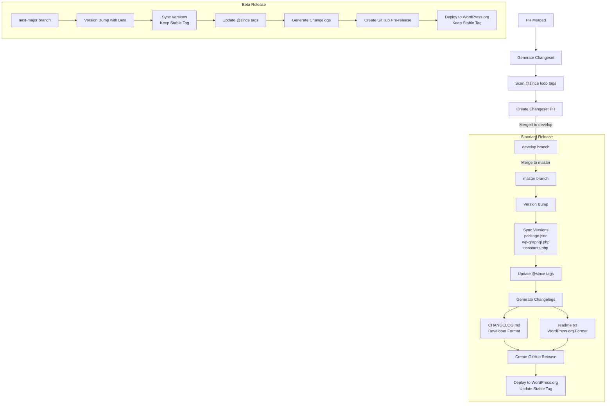

# GitHub Actions Workflows

This directory contains GitHub Actions workflows that automate our release process. Here's how they work together:

## PR to Changeset Process

### 1. PR Validation (`lint-pr.yml`)
- Validates PR titles follow conventional commit format
- Ensures proper scoping and breaking change indicators
- Runs on PR creation and updates

### 2. Changeset Generation (`generate-changeset.yml`)
Triggered when a PR is merged:
1. Validates:
   - PR title format
   - Required PR description sections
2. Generates a changeset file containing:
   - Version bump type (patch/minor/major)
   - PR reference
   - Breaking change indicators
   - Upgrade instructions
3. Creates a new PR with the changeset

## Release Process

> **Note**: All releases are deployed to WordPress.org, with different handling for stable vs beta releases.

### 1. Standard Releases (`deploy-to-wordpress.yml`)
Triggered by:
- Push to `master`
- Manual workflow dispatch
- Published GitHub release

> **Note**: 1.x releases are handled manually and do not use this automation.

Steps:
1. Version Validation:
   - Checks branch is `master` or `1.x/master`
   - Verifies version numbers match across files
2. Version and Release:
   - Collects all changesets
   - Updates version numbers
   - Generates changelogs
   - Creates git tag
   - Creates GitHub release
3. WordPress.org Deployment:
   - Builds plugin
   - Deploys to WordPress.org
   - Updates stable tag to new version
   - Creates release artifacts

### 2. Beta Releases (`beta-release.yml`)
Triggered by push to `next-major` branch:
1. Validates:
   - Branch is `next-major`
   - Stable tag isn't modified
2. Creates Beta Release:
   - Enters pre-release mode if needed
   - Updates version with beta suffix
   - Creates GitHub pre-release
   - Deploys to WordPress.org (keeping existing stable tag)

## Changelog Generation

Two changelog formats are maintained:
1. `CHANGELOG.md`:
   - Detailed developer changelog
   - Includes PR links and commit references
   - Used for GitHub releases
2. `readme.txt`:
   - WordPress.org compatible format
   - Groups changes by type
   - Updates stable tag (standard releases only)
   - Follows WordPress.org readme standards

## Version Management

Version numbers are synchronized across:
- `package.json`
- `wp-graphql.php`
- `constants.php`
- `readme.txt` (stable tag for non-beta releases)

## Error Handling

Each workflow includes validation steps and error handling:
- PR format validation
- Branch validation
- Version number consistency
- Beta release safeguards
- WordPress.org deployment checks

## Manual Intervention

Some steps require manual review:
1. Changeset PRs:
   - Review generated changeset
   - Verify version bump type
   - Check breaking change documentation
2. Release PRs:
   - Review changelog entries
   - Verify version updates
   - Check WordPress.org readme format

## Related Documentation
- [Changesets Guide](../../.changeset/README.md)
- [Beta Releases Guide](../../docs/beta-releases.md)
- [Upgrade Guide](../../docs/upgrading.md)