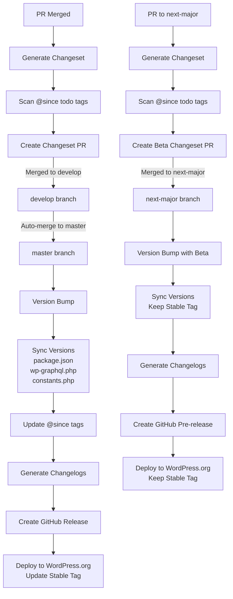

# GitHub Actions Workflows

This directory contains GitHub Actions workflows that automate our release process. Here's how they work together:

## PR to Changeset Process

### 1. PR Validation (`lint-pr.yml`)

- Validates PR titles follow conventional commit format
- Ensures proper scoping and breaking change indicators
- Runs on PR creation and updates

### 2. Changeset Generation (`generate-changeset.yml`)

Triggered when a PR is labeled with `ready-for-changeset`:

1. Validates:
   - PR title format
   - Required PR description sections
2. Generates a changeset file containing:
   - Version bump type (patch/minor/major)
   - PR reference
   - Breaking change indicators
   - Upgrade instructions
3. Creates or updates a collection PR with the changeset

## Release Process

> **Note**: All releases are deployed to WordPress.org, with different handling for stable vs beta releases.

### Unified Release Workflow (`release-and-deploy.yml`)
