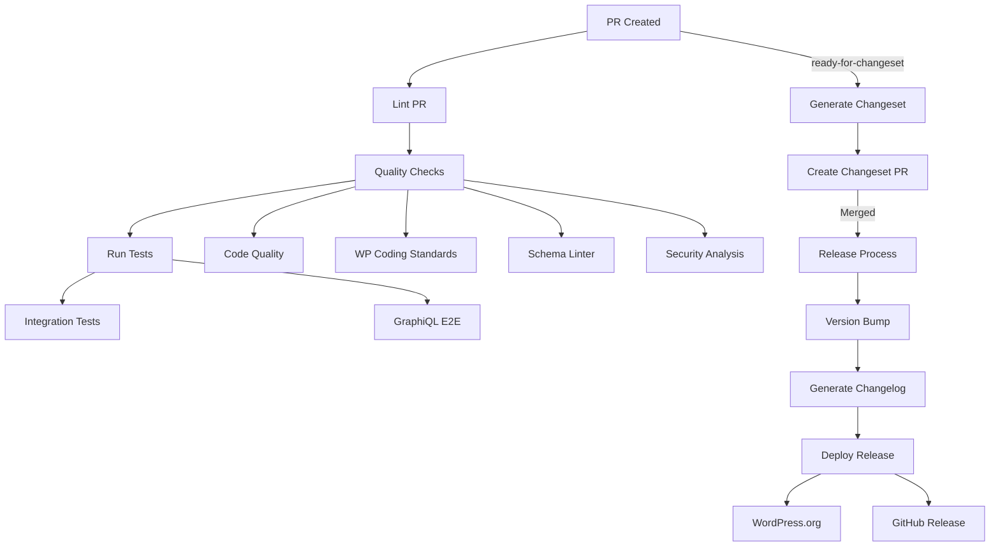

# GitHub Actions Workflows

This directory contains GitHub Actions workflows that automate our development, testing, and release processes. Here's how they work together:

## Code Quality & Testing

### 1. Code Quality Checks (`code-quality.yml`)

- Runs static analysis and code quality checks
- Ensures code meets quality standards
- Identifies potential issues and improvements

### 2. WordPress Coding Standards (`wordpress-coding-standards.yml`)

- Validates code against WordPress Coding Standards
- Ensures consistent code style across the project
- Runs PHPCS with WordPress-specific ruleset

### 3. Schema Linting (`schema-linter.yml`)

- Validates GraphQL schema structure
- Ensures schema follows GraphQL best practices
- Prevents breaking schema changes

### 4. Testing Integration (`testing-integration.yml`)

- Runs comprehensive integration tests
- Tests across multiple PHP and WordPress versions
- Validates core functionality

### 5. GraphiQL E2E Tests (`graphiql-e2e-tests.yml`)

- End-to-end testing of GraphiQL interface
- Ensures GraphiQL functionality works as expected
- Tests user interactions and UI components

### 6. CodeQL Analysis (`codeql-analysis.yml`)

- Performs security analysis
- Identifies potential vulnerabilities
- Runs on schedule and on code changes

## PR and Changeset Process

### 1. PR Validation (`lint-pr.yml`)

- Validates PR titles follow conventional commit format
- Ensures proper scoping and breaking change indicators
- Runs on PR creation and updates

### 2. Changeset Generation (`changeset-generation.yml`)

Triggered when a PR is labeled with `ready-for-changeset`:

1. Validates:
   - PR title format
   - Required PR description sections
2. Generates a changeset file containing:
   - Version bump type (patch/minor/major)
   - PR reference
   - Breaking change indicators
   - Upgrade instructions
3. Creates or updates a collection PR with the changeset

## Build and Deploy

### 1. GraphiQL Build (`build-graphiql.yml`)

- Builds the GraphiQL interface
- Compiles assets and dependencies
- Prepares for distribution

### 2. Docker Image Deploy (`deploy-docker-image.yml`)

- Builds Docker images for testing
- Publishes to GitHub Container Registry
- Used for development and testing environments

### 3. Schema Artifact Upload (`upload-schema-artifact.yml`)

- Generates schema artifacts
- Uploads schema for documentation
- Used for schema tracking and validation

### 4. Release Process (`release.yml`)

Handles the complete release process:

1. Version Management
   - Bumps versions across files
   - Updates @since tags
   - Syncs versions across package.json and PHP files
2. Changelog Generation
   - Compiles changes from changesets
   - Generates formatted changelog
3. Distribution
   - Creates GitHub release
   - Deploys to WordPress.org
   - Updates stable/beta tags as needed

## Workflow Dependencies

Some workflows depend on others or specific conditions:

- Integration tests must pass before releases
- Code quality checks must pass before PR merges
- Changeset generation requires proper PR formatting
- Release process depends on successful changeset merging

## Contributing

When adding or modifying workflows:

1. Document the workflow in this README
2. Update the flowchart if process changes
3. Ensure proper error handling and notifications
4. Test workflows in a feature branch first
