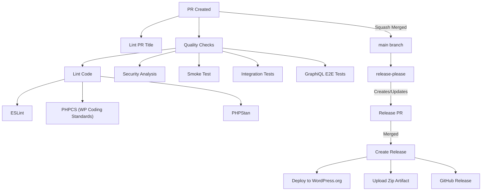

# GitHub Actions Workflows

This directory contains GitHub Actions workflows that automate our development, testing, and release processes. Here's how they work together:

## Code Quality & Testing

### 1. Code Quality Checks (`lint.yml` and `reusable-lint.yml`)
- Checks for:
  - WordPress Coding Standards compliance using PHPCS
  - Static type and error checking with PHPStan
- `lint.yml` triggers the reusable workflow defined in `reusable-lint.yml` for each plugin in the matrix.
- `reusable-lint.yml`:

### 2. Testing Integration (`testing-integration.yml`)

- Runs comprehensive integration tests via Codeception
- Tests across multiple PHP and WordPress versions
- Uses "boundary testing" approach for efficiency (~8 jobs for PRs, ~18 for merges)
- Collects code coverage from multiple configurations

### 3. GraphiQL E2E Tests (`graphiql-e2e-tests.yml`)

- End-to-end testing of GraphiQL interface using Playwright
- Ensures GraphiQL functionality works as expected
- Tests user interactions and UI components

### 4. Smoke Test (`smoke-test.yml`)

- Validates the production zip artifact works correctly
- Builds the plugin zip (same as release process)
- Installs it in a clean WordPress environment
- Runs smoke tests to verify core functionality

### 5. CodeQL Analysis (`codeql-analysis.yml`)

- Performs security analysis
- Identifies potential vulnerabilities
- Runs on schedule and on code changes

## PR Validation

### PR Title Validation (`lint-pr.yml`)

- Validates PR titles follow [conventional commit](https://www.conventionalcommits.org/) format
- Ensures proper scoping and breaking change indicators
- Blocks breaking change markers (`!`) on non-release types (only `feat!`, `fix!`, `perf!` allowed)
- Runs on PR creation and updates

## Release Process

### Release Please (`release-please.yml`)

We use [release-please](https://github.com/googleapis/release-please) for automated releases:

1. **On Push to Main**: release-please analyzes commits and creates/updates a Release PR
2. **Release PR Contents**:
   - Version bump based on commit types (`feat:` → minor, `fix:` → patch, `!` → major)
   - Auto-generated changelog from commit messages
   - Version updates across all configured files
   - `@since x-release-please-version` placeholders replaced with actual version (native to release-please)
3. **On Release PR Merge**:
   - Creates GitHub Release with changelog
   - Deploys to WordPress.org
   - Uploads zip artifact to release

### Schema Artifact Upload (`upload-schema-artifact.yml`)

- Generates GraphQL schema artifact on release
- Uploads schema to GitHub Release
- Used for schema tracking and breaking change detection

## Build

### GraphiQL Build (`build-graphiql.yml`)

- Builds the GraphiQL interface
- Compiles assets and dependencies
- Prepares for distribution

## Workflow Flow

## Workflow Dependencies

- All quality checks and tests must pass before PR can be merged
- PRs are squash merged with the PR title becoming the commit message
- release-please uses commit messages to determine version bumps
- WordPress.org deployment depends on successful release creation

## Contributing

When adding or modifying workflows:

1. Document the workflow in this README
2. Update the flowchart if process changes
3. Ensure proper error handling and notifications
4. Test workflows in a feature branch first
