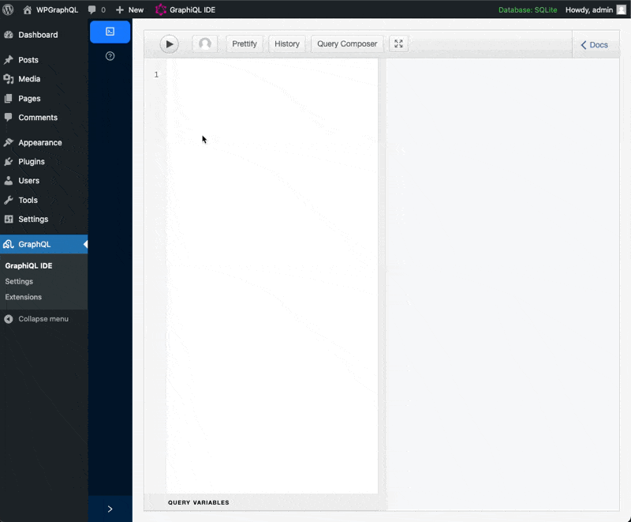

# WPGraphQL

**Unlock the power of WordPress data with GraphQL**

WPGraphQL provides an extendable GraphQL API for any WordPress site, unlocking modern development workflows.

Whether you're a WordPress developer exploring GraphQL or a GraphQL expert diving into WordPress, WPGraphQL simplifies data interaction and empowers your development workflow.

---

### 🎯 **Vision**

WPGraphQL aims to be the **canonical GraphQL API for WordPress**, providing:

- **A complete, flexible GraphQL schema** for accessing WordPress data
- **Standards-based implementation** following GraphQL and WordPress best practices
- **An extensible foundation** for plugins to build upon
- **Production-ready performance** suitable for high-traffic sites
- **Long-term stability** with semantic versioning and backward compatibility

#### What Belongs in WPGraphQL Core?

**In scope:**

- GraphQL schema for WordPress core features (posts, pages, users, taxonomies, etc.)
- Performance optimizations that benefit all users
- Developer APIs for extending the schema
- Standards and patterns for the WPGraphQL ecosystem

**Candidates for core (via Experiments):**

- Proposed features that need real-world validation before committing
- Breaking changes that require community feedback
- Performance improvements that need testing at scale
- [Learn more about Experiments →](/docs/experiments)

**Better as extensions:**

- Plugin-specific integrations (ACF, Yoast, WooCommerce, etc.)
- Opinionated workflows or conventions
- Features specific to particular frameworks or use cases

**The difference:** Experiments are potential core features being validated. Extensions are intentionally separate functionality that should remain as plugins. Experiments may graduate to core or be removed; extensions live independently forever.

This focus keeps WPGraphQL maintainable while enabling a rich ecosystem of extensions.

---

### 🚀 **Get Started**

1. 📦 Install WPGraphQL: `wp plugin install wp-graphql --activate`
2. 👩‍💻 Try it out: [Live Demo](https://repl.wpgraphql.com)
3. 📖 Read the [Quick Start Guide](https://wpgraphql.com/docs/quick-start).
4. 💬 Join the [Community on Discord](https://wpgraphql.com/discord)
5. ⭐ [Star the Repo](https://github.com/wp-graphql/wp-graphql) on GitHub 😉

---

### 🌟 **Key Features**

- **Flexible API**: Access posts, pages, custom post types, taxonomies, users, and more.
- **Extendable Schema**: Easily add functionality with functions like `register_graphql_field` and `register_graphql_connection`.
  - Plugins like [WPGraphQL Smart Cache](https://github.com/wp-graphql/wp-graphql-smart-cache), [WPGraphQL for ACF](https://github.com/wp-graphql/wp-graphql-acf) and [other extension plugins](https://wpgraphql.com/extensions) demonstrate the power of extendability.
- **Modern Framework Integration**: Works seamlessly with [Next.js](https://vercel.com/guides/wordpress-with-vercel), [Svelte](https://www.okupter.com/blog/headless-wordpress-graphql-sveltekit), [Astro](https://docs.astro.build/en/guides/cms/wordpress/) and other frameworks.
- **Optimized Performance**: Query only the data you need. Collect multiple resources in one request, reducing round-trips. Use [WPGraphQL Smart Cache](https://github.com/wp-graphql/wp-graphql-smart-cache) for enhanced performance and network-level caching and cache-invalidation.
- **Developer Tools**: Explore the schema with tools like the [GraphiQL IDE](https://www.wpgraphql.com/docs/wp-graphiql) and [WordPress Playground](https://wordpress.org/plugins/wp-graphql/?preview=1).

---

### 📖 **Documentation**

- [Quick Start](https://www.wpgraphql.com/docs/quick-start)
- [Intro to GraphQL](https://wpgraphql.com/docs/intro-to-graphql)
- [Intro to WordPress](https://wpgraphql.com/docs/intro-to-wordpress)
- [Extensions](https://www.wpgraphql.com/extensions)
- [Advanced Topics](https://www.wpgraphql.com/docs/wpgraphql-concepts)

---

### 🤝 **Community Support**

WPGraphQL is powered by a passionate community of contributors, backers, and sponsors.

 

Want to help maintain and grow WPGraphQL?

- [Support the project on Open Collective](https://opencollective.com/wp-graphql)
- [Join the Community on Discord](https://wpgraphql.com/discord)
- [Contribute to the project on GitHub](https://github.com/wp-graphql/wp-graphql)

---

### 🙌 Shout Outs

We extend our gratitude to the following projects and organizations for their contributions to the WordPress and GraphQL ecosystems:

- **[Webonyx](https://github.com/webonyx/graphql-php)**: For the amazing `graphql-php` library that powers WPGraphQL's core functionality.
- **[Ivome](https://github.com/ivome/graphql-relay-php)**: For the `graphql-relay-php` library used in relay connections.
- **[Automattic](https://automattic.com)**: For supporting WPGraphQL's ongoing development as a canonical WordPress plugin.
- **[Gatsby](https://www.gatsbyjs.com)**: For their contributions to the WPGraphQL ecosystem and support for headless WordPress development.
- **[WPEngine](https://wpengine.com)**: For funding early development of WPGraphQL and supporting its growth.
- **[Facebook](https://graphql.org)**: For open-sourcing the GraphQL spec, GraphiQL, and maintaining the JavaScript reference implementation.
- **[Apollo](https://www.apollographql.com)**: For pushing GraphQL forward and inspiring schema design best practices.
- **The WordPress REST API Contributors**: For paving the way with the WP-API project, inspiring WPGraphQL's architecture.

Thank you to all these organizations and individuals for their efforts in shaping the tools we rely on today.

---

### 🔌 **Canonical Plugin**

WPGraphQL is becoming a [Canonical Plugin on WordPress.org](https://wordpress.org/news/2024/10/wpgraphql/), ensuring long-term support and a growing community of users and contributors.

---

### 🛠 **Privacy & Telemetry**

WPGraphQL uses the [Appsero SDK](https://appsero.com/privacy-policy) to collect telemetry data **only after user consent**, helping us improve the plugin responsibly.
