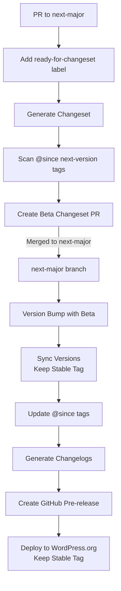

# Beta Releases

WPGraphQL uses beta releases to test major changes and breaking features before they are released to the public.

> [!NOTE]
> Beta releases are automated via GitHub Actions. See [GitHub Workflows](../.github/workflows/README.md) and [Changesets](../.changeset/README.md) for technical details.

## Branch Strategy

Beta releases are developed on the `next-major` branch:

- Breaking changes and major features target this branch
- Breaking changes should use the `!` suffix in PR titles (e.g., `feat!:`)
- Regular features and fixes continue to target `develop`
- Beta releases are not deployed to WordPress.org

## Beta Release Process

> [!NOTE]
> Beta releases are deployed to WordPress.org but maintain the stable tag from the last stable release. This allows users to explicitly install beta versions while keeping stable installations on the last stable release.



### Automated Process

The beta release process is automated via GitHub Actions:

1. PRs with breaking changes target the `next-major` branch
2. When a PR is ready, a maintainer adds the `ready-for-changeset` label
3. This triggers the changeset generation workflow which:
   - Creates a changeset based on the PR
   - Adds it to the `changeset-beta` collection branch (determined automatically based on target branch)
   - Creates/updates a PR from `changeset-beta` to `next-major`
4. When the collection PR is merged to `next-major`:
   - The beta release workflow automatically runs
   - Version is bumped with beta suffix
   - `@since` tags are updated
   - Changelog is generated
   - GitHub pre-release is created
   - Plugin zip is built and attached to the release

### Changeset Generation

Breaking changes are tracked through changesets, which are automatically generated when PRs are labeled. To indicate a breaking change:

1. Add `!` suffix to your PR title: `feat!: breaking change`
2. Document breaking changes in PR description
3. Include upgrade instructions in PR description

The automation will handle:

- Version bumping
- Changelog updates
- `@since` tag updates

### Manual Steps

Some aspects require manual review:

1. Before labeling PRs:
   - Ensure breaking changes are properly documented
   - Verify upgrade instructions are included
   - Check `@since todo` tags are present
2. Before merging the changeset collection PR:
   - Review generated changesets
   - Verify version bump types
   - Check breaking change documentation

## Version Numbering

- Beta releases: `v3.0.0-beta.1`, `v3.0.0-beta.2`, etc.
- Final release: `v3.0.0`

## Testing Beta Releases

Beta releases can be tested by:

1. Installing from the GitHub release assets
2. Using Composer with the specific beta version:
   ```json
   {
     "require": {
       "wp-graphql/wp-graphql": "3.0.0-beta.1"
     }
   }
   ```
3. Cloning the repository and checking out the beta tag

## Providing Feedback

Feedback on beta releases can be provided through:

1. GitHub Issues
2. The beta release PR discussion
3. WPGraphQL Discord

## Notes

- Beta releases are marked as pre-releases on GitHub
- The stable tag in readme.txt is not updated for beta releases
- Breaking changes must include upgrade notes
