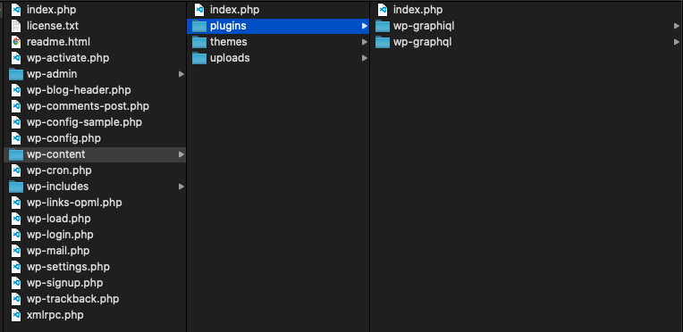
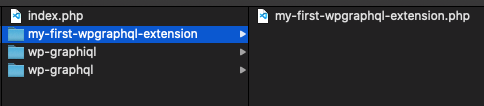
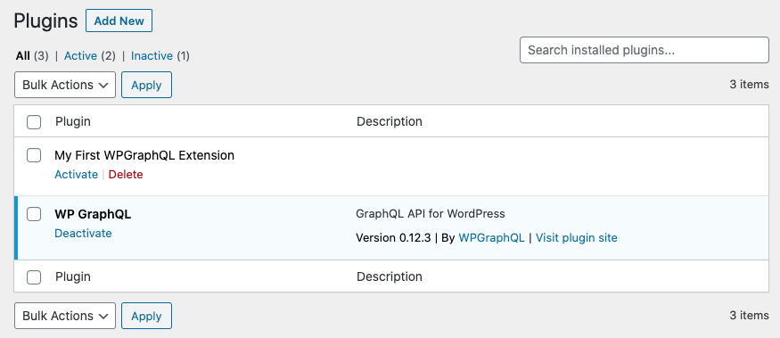
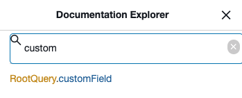
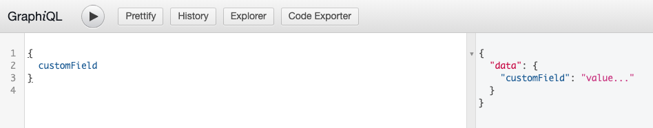
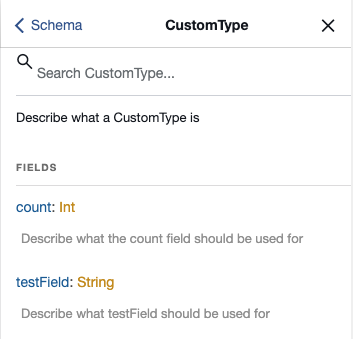
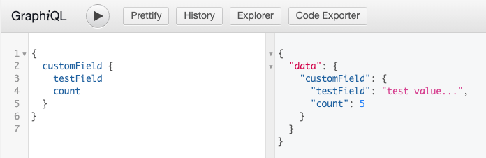

## Video Tutorial

The following video walks through how to build a WPGraphQL Extension plugin. After watching the video, viewers should be able to create a WordPress plugin that extends the WPGraphQL Schema with new fields.

If you prefer learning these concepts by reading, scroll down to the written tutorial below.

https://youtu.be/0plIW5hf6lM

## Written Tutorial

The following written tutorial should be helpful for developers of any experience level, but it will be most useful for developers that have some previous experience building WordPress plugins.

It's similar, but not identical, to the video tutorial above.

This tutorial should be helpful for developers of any experience level, but it will be most useful for developers that have some previous experience building WordPress plugins.

Before starting this tutorial, you should have a [local WordPress development environment](https://getflywheel.com/layout/local-wordpress-development-environment-how-to/) setup with [WPGraphQL installed and activated](/docs/quick-start/).

## What we're building

In this guide we will build a plugin that extends the WPGraphQL Schema adding a custom Type and a Root Query Field that returns that type.

By the end of this tutorial we should be able to:

- Use GraphiQL to search and find `CustomType` and `RootQuery.customField`
- Write a GraphQL Query to query for `customField` and get data returned

## Getting Started

The first step to building a WordPress plugin is to create a directory and a PHP file to put the code in.

In your WordPress site, navigate in the file system to the `wp-content/plugins` directory.

The below screenshot shows the plugins directory with a few plugins already there.



### Scaffold the plugin

Create a new folder. Let's call it `my-first-wpgraphql-extension`. It is considered best practice to name WordPress plugin directories will all lowercase letters and hyphens to separate words.

Within that directory create a PHP file with the same name as the directory: `my-first-wpgraphql-extension.php`



Open the PHP file in a text editor or IDE.

Add an [opening php tag](https://www.php.net/manual/en/language.basic-syntax.phptags.php) as the first line of the file, then immediately below, add the following snippet and save it:

```php
/**
 * Plugin Name: My First WPGraphQL Extension
 */
```

Navigate to your WordPress Admin's Plugins page, and you should see "My First WPGraphQL Extension" plugin as a plugin available for activating.



Click "Activate" to activate the plugin. With the plugin active, any code we write will now be executed by WordPress. Without activating the plugin, any code we write would not be executed by WordPress.

## Register a GraphQL Field

Now that we have an active plugin, let's extend the WPGraphQL Schema by registering a new field to the Schema.

We will make use of the [register\_graphql\_field](/functions/register_graphql_field/) function within the [graphql\_register\_types](/actions/graphql_register_types/) action.

Add the following snippet below the previous snippet that defined the plugin name:

```php
add_action( 'graphql_register_types', 'example_extend_wpgraphql_schema' );

function example_extend_wpgraphql_schema() {
  register_graphql_field( 'RootQuery', 'customField', [
    'type' => 'String',
    'description' => __( 'Describe what the field should be used for', 'your-textdomain' ),
    'resolve' => function() {
       return 'value...';
    }
  ] );
};
```

### Breaking it down

The first line of this code is telling WordPress that when the action `graphql_register_types` is fired, execute the function named `example_extend_wpgraphql_schema`.

#### Hook into the WPGraphQL Schema

The action `graphql_register_types` is fired by WPGraphQL when the GraphQL Schema is being built. This gives us access to hook in and modify the Schema before it's returned. This is the action you must hook into to modify the WPGraphQL Schema with new types or fields.

#### Register the Field

Below is the function `add_custom_field_to_graphql_root_query`, which will execute as the Schema is being built.

Here, we call another function "register\_graphql\_field", which accepts 3 parameters:

- **Type Name**: The name of the existing GraphQL Type to register a field to
- **Field Name**: The name the registered field should have
- **Config**: An array to configure the field

We pass `RootQuery` as the Type Name to register the field to and `customField` as the name of the field.

This means that the `RootQuery` type in the Schema will now have a field named `customField` and the field will follow the contract defined in the config.

The config array includes `type`, `description` and `resolve`.

The `type` key of the config array is used to declare what GraphQL Type the field will return. In our case, we defined the `type` as `String`. This means that we are making a contract with the API that when this field is asked for, a String will be returned.

The `description` key of the config array is set to a [translated](https://codex.wordpress.org/Function_Reference/_2) string that will be used in Schema documentation for use in tools like GraphiQL.

The `resolve` key of the config array is set to an anonymous function which will be executed whenever the field is asked for in a Query. Since we defined the `type` as String, we need to make sure this function returns a string. In our case we have it return the string `"value..."`.

### Test it

At this point, we can open up GraphiQL in the WordPress Dashboard and search the word "custom" and we should see our new "customField" field in the Schema.



And since the field is on the RootQuery type, we can test querying for it like so:

```graphql
{
  customField
}
```

Executing this query returns the `"value..."` value that we defined in our resolve function for the field.



## Register a GraphQL Type

Let's take it a step further and say that we have more complex data than we can return with a String. We can define a new Object Type to use in the Schema.

For example sake, let's say we needed to return a custom object type that we will call `CustomType` which has a `testField` field that will return a string, and a `count` field that will return an integer.

We can register this type to the WPGraphQL schema with the following code. This can be placed within the `example_extend_wpgraphql_schema` function:

```php
register_graphql_object_type( 'CustomType', [
  'description' => __( 'Describe what a CustomType is', 'your-textdomain' ),
  'fields' => [
    'testField' => [
      'type' => 'String',
      'description' => __( 'Describe what testField should be used for', 'your-textdomain' ),
    ],
    'count' => [
      'type' => 'Int',
      'description' => __( 'Describe what the count field should be used for', 'your-textdomain' ),
    ],
  ],
] );
```

### Breaking it down

This snippet registers a new Object Type to the WPGraphQL Schema. The first argument passed is the name of the type. Type names must be unique, meaning there can only be one type in the entire Schema with that name. We used the name `CustomType`.

The next argument passed is a config array to configure the Type.

The `description` key of the config array is a [translated string](https://developer.wordpress.org/reference/functions/__/) that will be used in Schema documentation for use in tools like GraphiQL.

The `fields` key of the config array is an array of fields, following the same pattern as the `register_graphql_field` function, each with a `type` and optional `description` and `resolve` function.

In our case, we passed an array of 2 fields: `testField` and `count`, defining them as a `string` and `Integer` respectively.

Now we have a type `CustomType` in our Schema and we can verify this by searching in GraphiQL.



**Note:** *Anytime you change the Schema on the server, you will need to refresh GraphiQL to re-fetch the Schema and pick up your changes.*

## Use a Custom Type with a Custom Field

We just registered a CustomType to the Schema, but it's not in use at all. In order to query data in the shape of the CustomType, it needs to be defined as the Type of a field.

Let's change the `type` of our `customField` to be `CustomType` instead of `String`. And let's change the resolver to return something that matches the shape of `CustomType` so we can fulfill the contract we have with the Schema.

**Before:**

```php
register_graphql_field( 'RootQuery', 'customField', [
  'type' => 'String',
  'resolve' => function() {
    return 'value...';
  }
] );
```

**Change to:**

```php
register_graphql_field( 'RootQuery', 'customField', [
  'type' => 'CustomType',
  'resolve' => function() {
    return [
      'count' => 5,
      'testField' => 'test value...',
    ];
  }
] );
```

Here we change the `type` to be `CustomType` and we change the resolve function to return an array with a key of "count" and a value of "5", and a key of "testField" with a value of "test value…".

Since the field `customField` no longer returns a string, but instead returns the type `CustomType` we would need to adjust our query to reflect.

**Before**:

```graphql
{
  customField
}
```

**Change to**:

```graphql
{
  customField {
    testField
    count
  }
}
```

Executing the query now should return results like so:



## Conclusion

This tutorial covered some of the basic ways to extend the WPGraphQL Schema for your needs, including registering fields to the Schema and registering new Types to the Schema.

### Next Steps

Now that you have a basic understanding of building a WPGraphQL Extension, consider taking it to the next level and learning more about the APIs available to extend the Schema, and learn more about GraphQL and WPGraphQL Concepts

- [Developer Reference Guide](/developer-reference/): Learn about other APIs to extend the WPGraphQL Schema.
- [Intro to GraphQL](/docs/intro-to-graphql/): Learn more about concepts of the GraphQL query language spec.
- [How WPGraphQL Works](/docs/wpgraphql-concepts/): Learn more about how WPGraphQL executes requests
