WPGraphQL provides support for querying Categories, Tags and Custom Taxonomies in various ways.

This page will be most useful for users what are familiar with [GraphQL Concepts](/docs/intro-to-graphql/) and understand the basics of [writing GraphQL Queries](/docs/intro-to-graphql/#queries-and-mutation).

## Querying Categories and Tags

Categories and Tags are built-in post types in WordPress, and WPGraphQL supports querying them out of the box.

Below are some common examples of querying Categories and Tags with WPGraphQL.

### Lists of Categories

Below is an example of querying a list of Category terms. In this example, we ask for `categories`, and then on the `categories` field we ask for `edges`, `node` then the `id`, and `name` of each `node` (each category term).

```graphql
query GetCategoryEdges {
  categories {
    edges {
      node {
        id
        name
      }
    }
  }
}
```

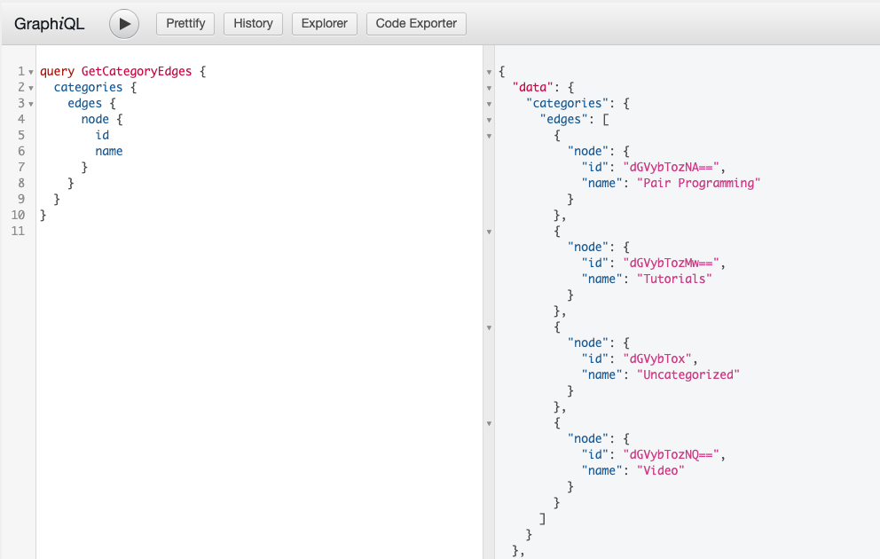

Below is the same query, but asking for nodes directly, skipping the `edges` field.

```graphql
query GetCategoryNodes {
  categories {
    nodes {
      id
      name
    }
  }
}
```

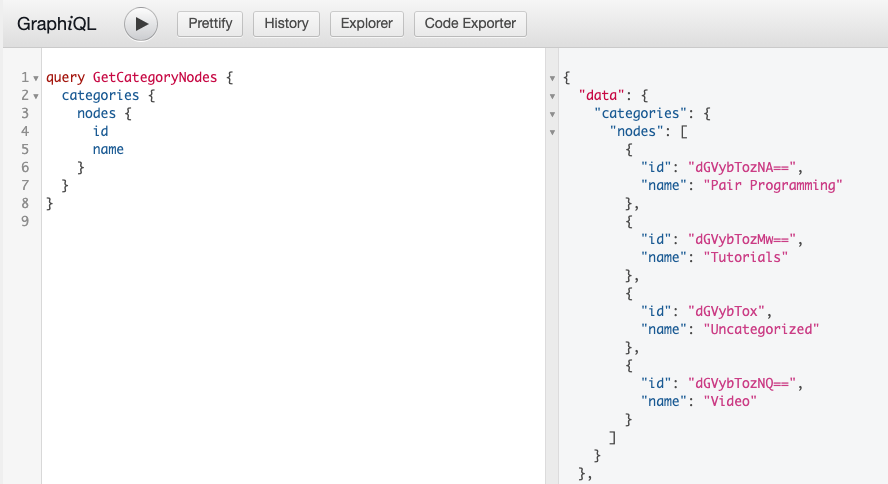

> **Edges? Nodes? Huh?** If you’re not yet familiar with GraphQL Connections, edges and nodes will look like a foreign concept. To get a better understanding of Edges, Nodes and other conventions of GraphQL Connections: [Read the GraphQL Connections Guide](/docs/connections/)

### Lists of Tags

Querying Tags is almost identical to querying Categories. You could execute the same queries as above, but swap out `categories` for `tags` and it would work.

For example:

```graphql
query GetTagNodes {
  tags {
    nodes {
      id
      name
    }
  }
}
```

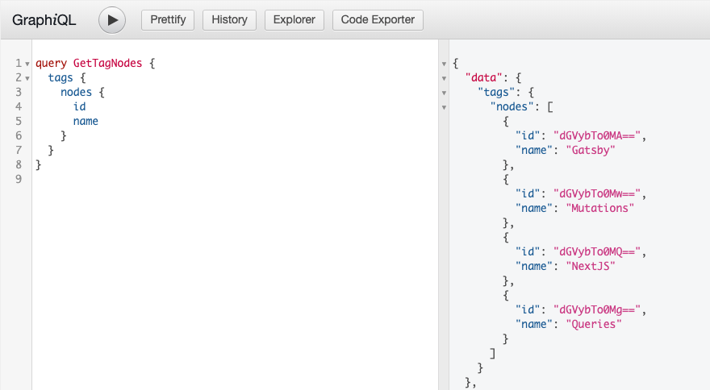

### Hierarchical vs Flat Taxonomies

One of the primary differences between Categories and Tags is that Categories are Hierarchical (Category terms can have parent-child relationships with other Category terms) and Tags are flat with no parent-child relationships.

[Read more about working with hierarchical data in WPGraphQL](/docs/hierarchical-data/).

### Filtering a List of Terms

> The following examples will use Categories and Tags interchangeable, as they operate largely the same. Behind the scenes, they are both Taxonomy Terms and WordPress and WPGraphQL both treat them nearly identically.

Queries for [Connections](/docs/connections/) (lists of nodes) can be filtered. Below are some examples of filtering using the `where` argument. There are many arguments available for filtering Terms.

**Query Tags with similar name**

The following example shows querying tags with a name like "Gatsby".

```graphql
query GetTagNodes {
  tags(where: {nameLike: "Gatsby"}) {
    nodes {
      id
      name
    }
  }
}
```

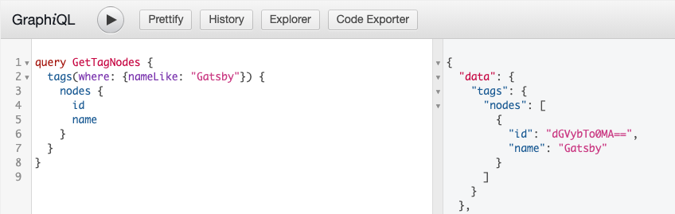

## Single Term by Global ID

Below is an example of querying a single term (of any Taxonomy) using the `termNode` field and passing the GraphQL [Global ID](/docs/wpgraphql-concepts/).

> The `termNode` field returns a TermNode [Interface](/docs/interfaces/) Type, which allows for terms of *any* Taxonomy to be queried.

```graphql
{
  category: termNode( id: "dGVybTozNA==" ) {
    __typename
    id
    name
  }
  tag: termNode( id: "dGVybTo0MA==" ) {
    __typename
    id
    name
  }
}
```


### Single term by URI

The following example shows a query for a single Tag using the uri (the url path) to the term.

```graphql
{
  tag( id: "/tag/gatsby/", idType: URI ) {
    __typename
    id
    name
    uri
  }
}
```

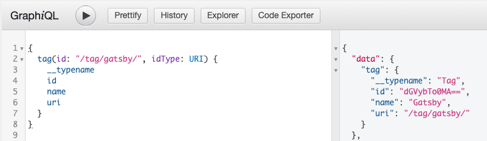

## Mutations

WPGraphQL provides mutations (the ability to change data through GraphQL) for Categories, Tags and Custom Taxonomy Terms that are configured to show in the GraphQL Schema.

WPGraphQL adheres to WordPress access control rights, ensuring data can only be created, updated or deleted by users that have proper permission to do so. Learn more in the [WPGraphQL Security Guide](/docs/security/).

## Create a Category

Below is an example of a GraphQL Mutation to create a Category.

The only required field to create a Category is the `name`.

```graphql
mutation {
  createCategory(input: {name: "New Category"}) {
    category {
      id
      name
    }
  }
}
```

This mutation will only succeed for users with proper capabilities to create Terms in the Category Taxonomy.

**Successful Mutation**

If the user executing the mutation is authenticated and has proper capabilities to create a Category, the category will be created and the fields asked for in response will be returned.

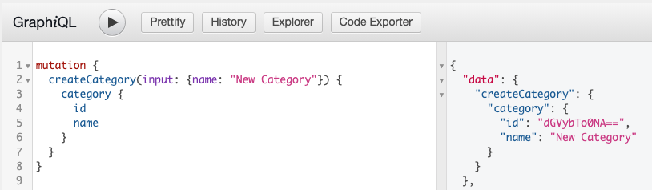

**Unsuccessful Mutation**

If the user executing the mutation is not authenticated, or does not have proper capabilities to create a Category, no data will change in WordPress and an error will be returned.

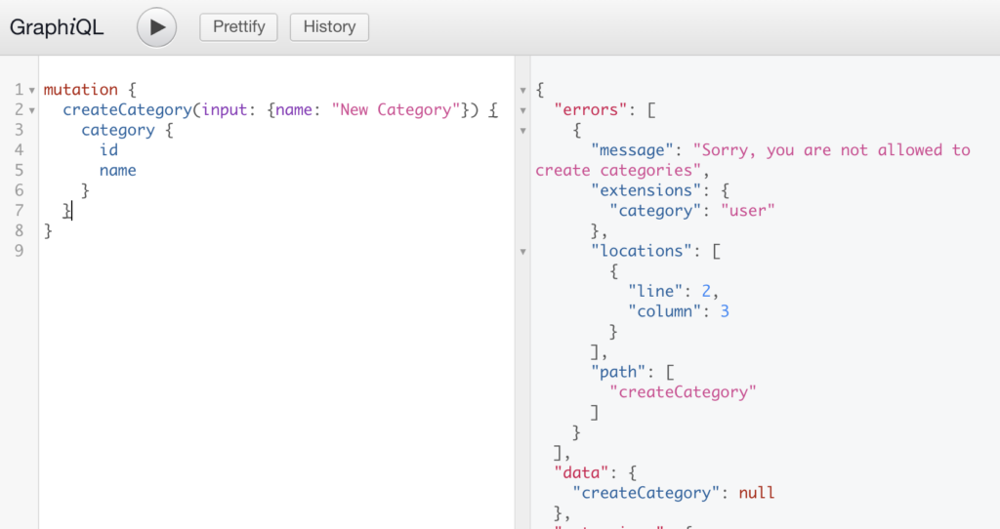

## Update Category

Below is an example of a GraphQL Mutation to update a Category. In order to update a Category, the ID of the Category must be known and provided to the input.

```graphql
mutation {
  updateCategory(input: {id: "dGVybTo0NA==", description: "New description..."}) {
    category {
      id
      name
      description
    }
  }
}
```

**Successful Mutation**

If the user making the request is authenticated and has proper capabilities to update the Category term, the term will be updated and the specified fields will be returned in the response.

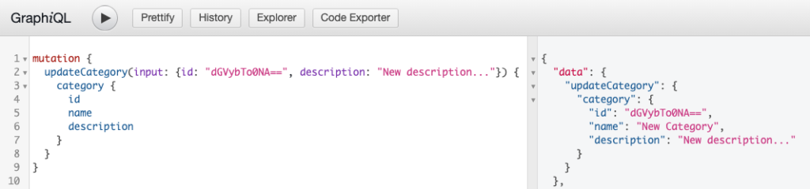

**Unsuccessful Mutation**

If the user making the request is not authenticated, or does not have proper capabilities to update Category terms, no data will change in WordPress and an error will be returned.

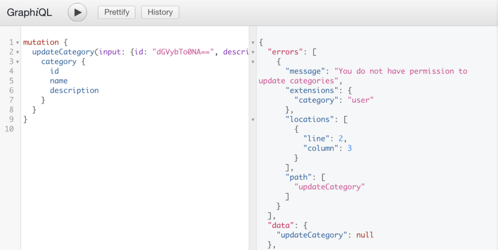

### Delete Category

Below is an example of a GraphQL Mutation to delete a Category term. In order to delete a Category term, the ID of the Category term must be known and provided to the input.

```graphql
mutation {
  deleteCategory(input: {id: "dGVybTo0NA=="}) {
    category {
      id
      name
      description
    }
  }
}
```

**Successful Mutation**

If the user making the request is authenticated and has proper capabilities to delete the Category term, the term will be deleted from WordPress and the specified fields will be returned in the response.

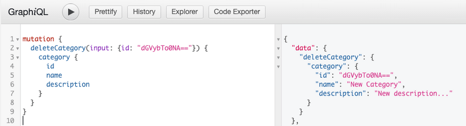

**Unsuccessful Mutation**

If the user making the request is not authenticated, or does not have proper capabilities to delete Category terms, no data will change in WordPress and an error will be returned.

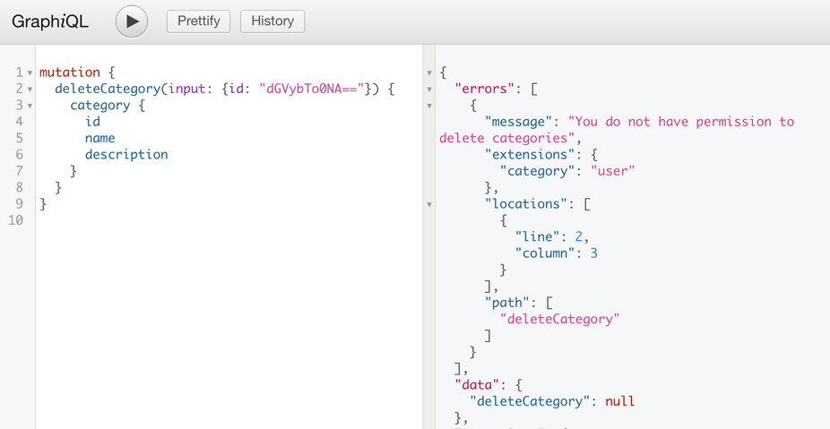
