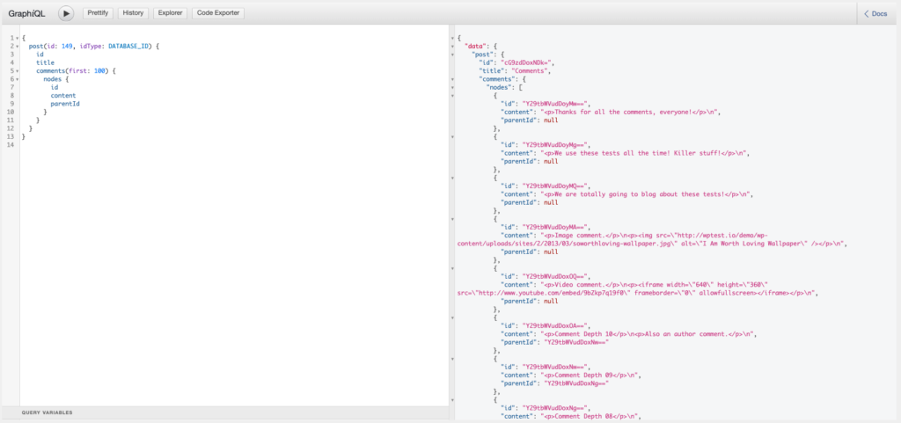
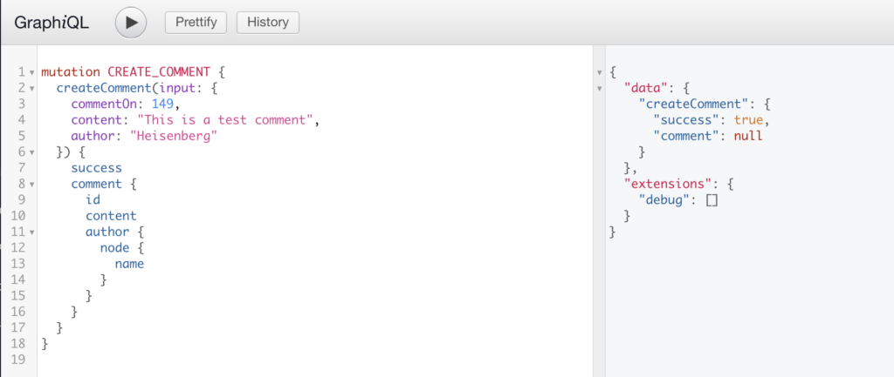
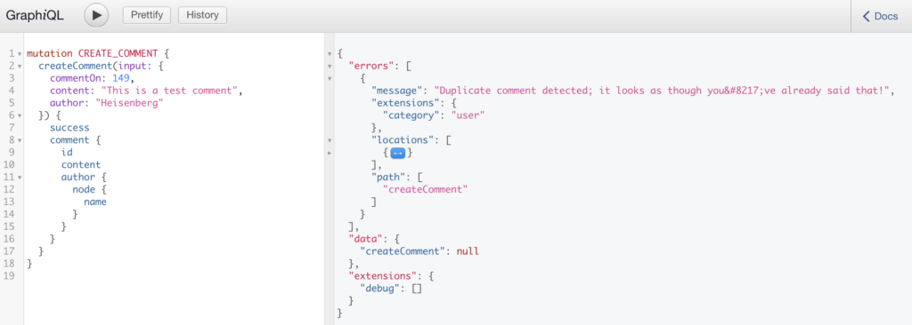
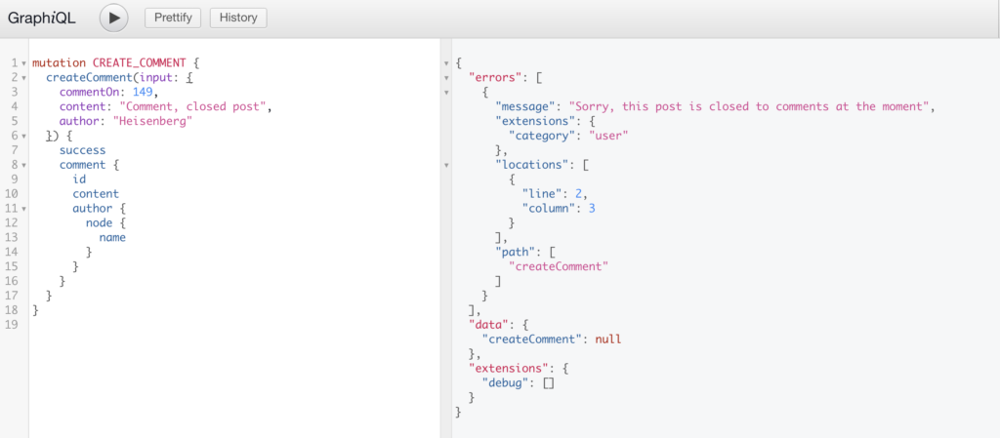
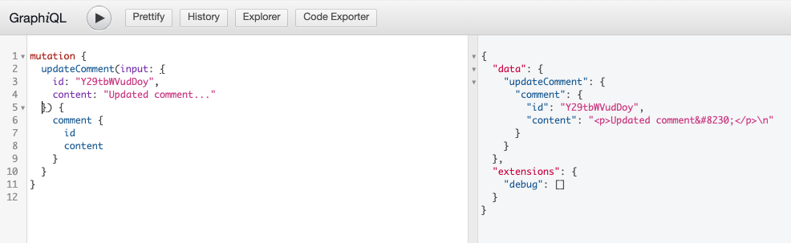
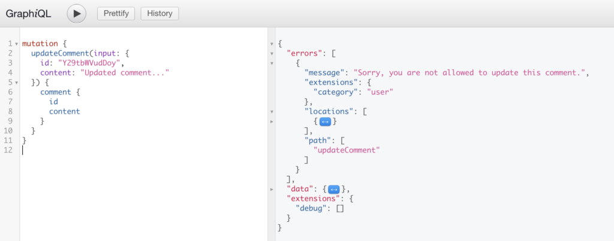
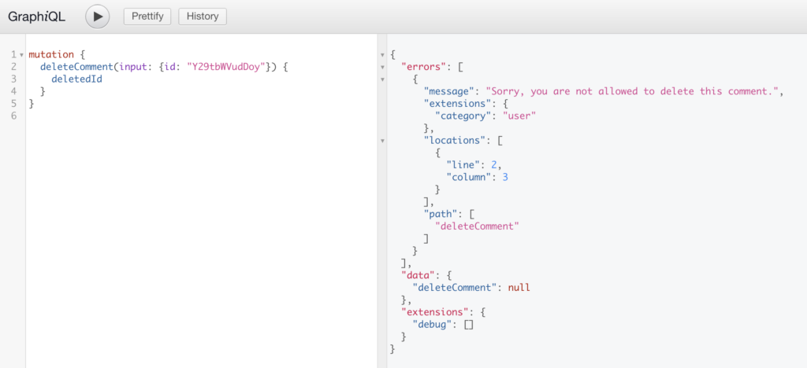
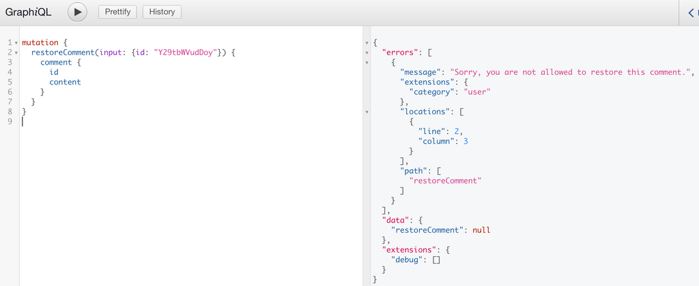

This page will be most useful for users what are familiar with [GraphQL Concepts](/docs/intro-to-graphql/) and understand the basics of [writing GraphQL Queries](/docs/intro-to-graphql/#queries-and-mutation).

## Querying Comments

WPGraphQL provides support for querying Comments in various ways.

## Comments of a Post

Below is an example of querying a list of comments of a specific post. 

```graphql
{
  post(id: 149, idType: DATABASE_ID) {
    id
    title
    comments(first: 100) {
      nodes {
        id
        content
        parentId
      }
    }
  }
}
```



## Hierarchical Data

Comments are one of many types of hierarchical data in WordPress. By that, we mean that there can be root-level comments on a post, but also replies to those comments, replies to the replies, and so on. WPGraphQL returns comments in a flat-list by default, meaning root-level comments as well as their replies, and the replies to the replies, will all be returned in one flat-list by default. 

There's a good chance you'll need to convert the flat list into a hierarchical list in your client application. 

[We've written a guide](/docs/hierarchical-data/) on how to interact with Hierarchical data, and why WPGraphQL returns hierarchical data in flat lists.

## Mutations

WPGraphQL provides Mutations for comments to be created, updated, deleted and restored.

## Create Comment

Below is an example of a GraphQL Mutation to create a comment. The Mutation requires an ID of a ContentNode the comment is in reference to, the content of the comment, and if the comment is from a non-authenticated user, the author name must be provided. If the request is from an authenticated user, their identity will be inferred.

```graphql
mutation CREATE_COMMENT {
  createComment(input: {
    commentOn: 149, 
    content: "This is a test comment, yo", 
    author: "Jason"
  }) {
    success
    comment {
      id
      content
      author {
        node {
          name
        }
      }
    }
  }
}
```

**Successful Mutation from public user**

Public users can submit comments. Below is a screenshot of a successful `createComment` mutation from a public user. The mutation executes and the comment is placed in Moderation, so the comment is not returned in the Mutation, however a `success:true` value is returned so the client knows the comment mutation succeeded.



**Unsuccessful Mutation: Duplicate Comment**

WordPress protects against submitting duplicate comments. If the exact same mutation were executed again, the comment would not be created, and an error would be returned.



**Unsuccessful Mutation: Comments closed**

If comments are closed for a Post, a `createComment` Mutation will not create a comment, and will return an error. 



## Update Comment

Below is an example of a GraphQL Mutation to update a comment. 

```graphql
mutation {
  updateComment(input: {
    id: "Y29tbWVudDoy", 
    content: "Updated comment..."
  }) {
    comment {
      id
      content
    }
  }
}
```

**Successful Mutation**

If the user executing the Mutation is authenticated and has proper capabilities to update comments, the comment of the ID provided will be updated and the fields requested in response will be returned. 



**Unsuccessful Mutation**

If the user executing the Mutation is not authenticated, or does not have proper capabilities to update comments, the comment will not be modified in WordPress and an error will be returned. 



## Delete Comment

Below is an example Mutation to delete a comment. The ID of the comment must be provided to delete a comment. 

```graphql
mutation {
  deleteComment(input: {id: "Y29tbWVudDoy"}) {
    deletedId
  }
}
```

**Successful Mutation**

If the user executing the request is authenticated and has proper capabilities to delete comments, the comment will be deleted and the fields requested will be returned.


**Unsuccessful Mutation**

If the user executing the Mutation is not authenticated or does not have capabilities to delete comments, the comment will not be deleted from WordPress and an error will be returned.



## Restore Comment

Comments that have been deleted can be restored using the `restoreComment` mutation.

```graphql
mutation {
  restoreComment(input: {id: "Y29tbWVudDoy"}) {
    comment {
      id
      content
    }
  }
}
```

**Successful Mutation**

If the user executing the request is authenticated and has proper capabilities to moderate comments, the deleted comment will be restored and the fields requested will be returned.


**Unsuccessful Mutation**

If the user executing the mutation is not authenticated or does not have proper capabilities to moderate comments, the comment will not be restored and an error will be returned.


