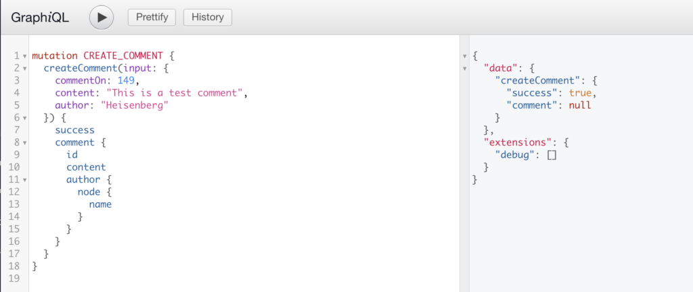
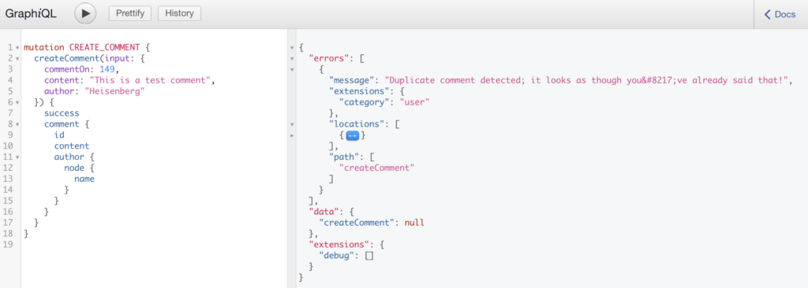
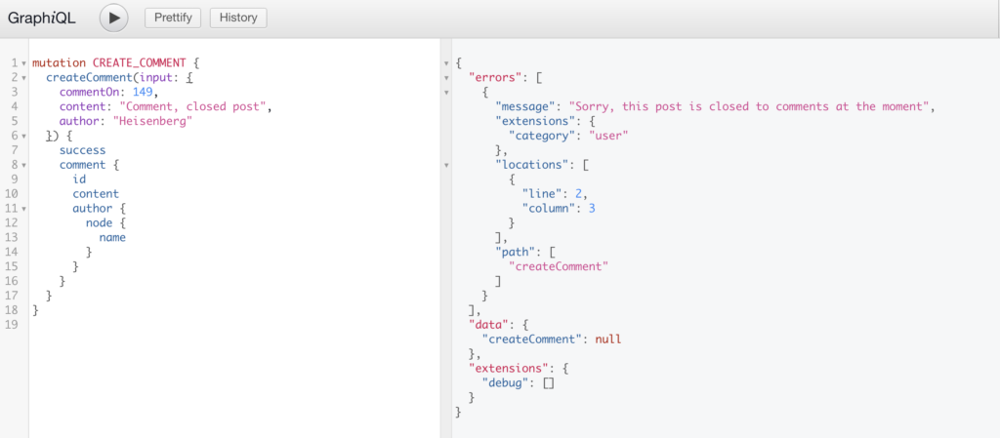
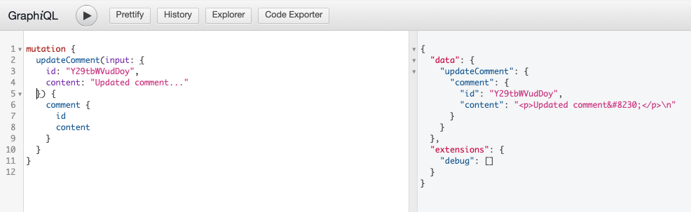
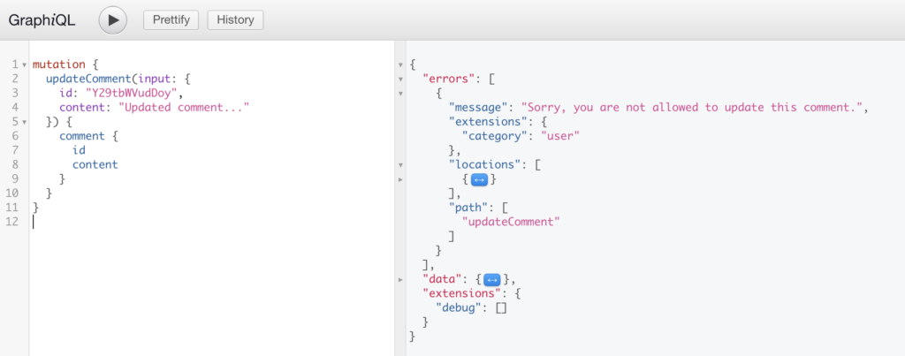
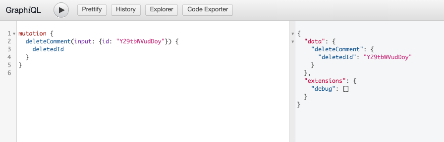
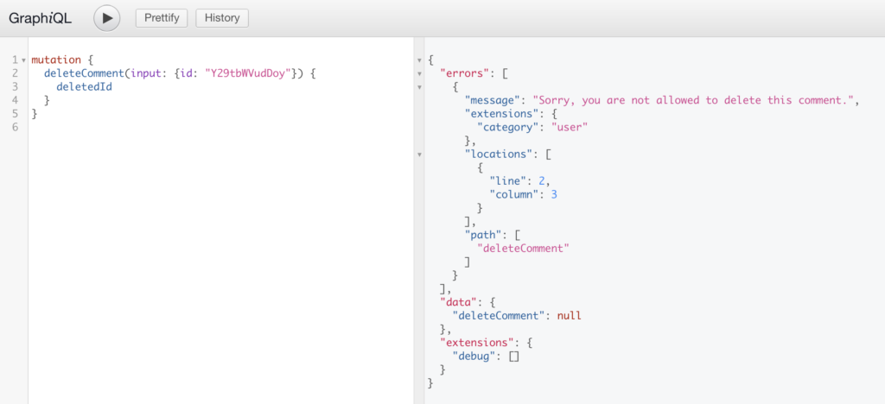
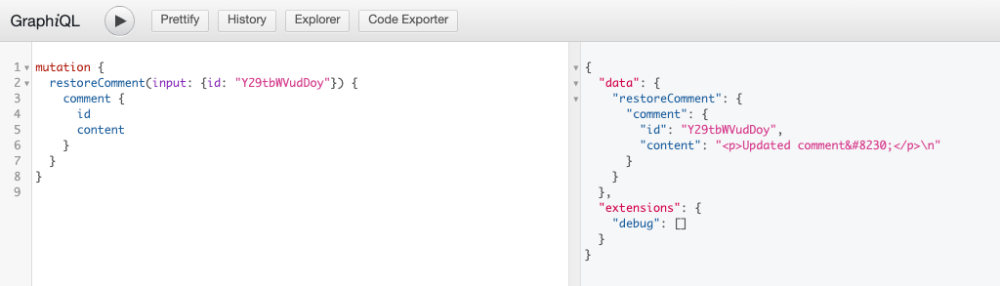

This page will be most useful for users what are familiar with [GraphQL Concepts](/docs/intro-to-graphql/) and understand the basics of [writing GraphQL Queries](/docs/intro-to-graphql/#queries-and-mutation).

## Querying Comments

WPGraphQL provides support for querying Comments in various ways.

## Comments of a Post

Below is an example of querying a list of comments of a specific post.

```graphql
{
  post(id: 149, idType: DATABASE_ID) {
    id
    title
    comments(first: 100) {
      nodes {
        id
        content
        parentId
      }
    }
  }
}
```


## Hierarchical Data

Comments are one of many types of hierarchical data in WordPress. By that, we mean that there can be root-level comments on a post, but also replies to those comments, replies to the replies, and so on. WPGraphQL returns comments in a flat-list by default, meaning root-level comments as well as their replies, and the replies to the replies, will all be returned in one flat-list by default.

You can query the hierarchical structure using the `parent` and `replies` fields:

```graphql
query GetPostWithComments {
  post(id: 123, idType: DATABASE_ID) {
    comments {
      nodes {
        id
        title
        comments {
          nodes {
            id
            content
            parentDatabaseId
            parentId
          }
        }
      }
    }
  }
}
```

### Example Response

```json
{
  "data": {
    "post": {
      "comments": {
        "nodes": [
          {
            "id": "Y29tbWVudDoy",
            "content": "<p>reply to comment 1. The parentId or parentDatabaseId can be used to associate it as a child to comment 1.</p>",
            "parentDatabaseId": 1,
            "parentId": "Y29tbWVudDox"
          },
          {
            "id": "Y29tbWVudDox",
            "content": "<p>comment 1. This is a root level comment.</p>",
            "parentDatabaseId": 0,
            "parentId": null
          }
        ]
      }
    }
  }
}
```

When querying comments in this way, both top level comments and their replies are included in a flat list. 

In many cases, you would want to convert the flat list into a hierarchical list. [We've written a guide](/docs/hierarchical-data/) on how to interact with Hierarchical data, and why WPGraphQL returns hierarchical data in flat lists.

### Querying Replies

If you need to query replies directly, you can do that. 

Here's an example of a query for a specific comment and its replies:

```graphql
query GetCommentReplies {
  comment(id: "Y29tbWVudDox") {
    replies {
      nodes {
        id
        content
        parentId
        parentDatabaseId
        author {
          name
        }
      }
    }
  }
}
```

## Filtering Comments

WPGraphQL provides several ways to filter comments when querying them.

### Filter by Status

You can filter comments by their status using the `statusIn` argument, which accepts one or more values of the CommentStatusEnum Type:

#### Query for approved comments only

```graphql
query GetComments {
  comments(where: { statusIn: APPROVE }) {
    nodes {
      id
      content
      status
      date
    }
  }
}
```

#### Query for Trashed and Spam comments:

```graphql
query GetTrashAndSpamComments {
  comments(where: { statusIn: [ TRASH, SPAM ] }) {
    nodes {
      id
      content
      status
      date
    }
  }
}
```

### Status Permissions

Only users with the appropriate capabilities (like administrators and editors) can view comments with statuses other than "APPROVE". 

The available statuses are:

- `APPROVE` - Comment is approved and visible
- `SPAM` - Comment is marked as spam
- `TRASH` - Comment is in trash
- `HOLD` - Comment is pending moderation

If a query filters by a status that the user does not have capabilities to view, no matching comments will be returned to that user.

```graphql
query GetTrashAndSpamComments {
  comments(where: { statusIn: [ TRASH, SPAM ] }) {
    nodes {
      id
      content
      status
      date
    }
  }
}
```

For example, the above query would return null for public (non-authenticated) users, but would return comment nodes for authenticated admin users.

## Comment Meta

WordPress allows storing additional metadata with comments. However, WPGraphQL requires explicit registration of meta fields before they can be queried.

### Registering Comment Meta Fields

To make comment meta queryable, you need to register the fields using `register_graphql_field`. Here's an example:

```php
add_action( 'graphql_register_types', function() {
  register_graphql_field( 'Comment', 'rating', [
    'type' => 'Float',
    'description' => __( 'Rating value stored in comment meta', 'your-textdomain' ),
    'resolve' => function( $comment ) {
      return (float) get_comment_meta( $comment->commentId, 'rating', true );
    }
  ]);
});
```

After registering the field, you can query it like this:

```graphql
{
  comments {
    nodes {
      id
      content
      rating
    }
  }
}
```

### Meta Field Considerations

- Meta fields must be explicitly registered to be queryable
- WPGraphQL doesn't support filtering by meta out of the box
- Consider performance implications when exposing meta fields
- Use proper data types when registering fields (String, Int, Float, etc.)

## Filtering Comments by Comment Meta

While WPGraphQL doesn't support meta filtering out of the box, you can add this functionality. Here's an example of adding a custom meta filter:

```php
// Register the input field to the comments connection
add_action( 'graphql_register_types', function() {
    register_graphql_field( 'RootQueryToCommentConnectionWhereArgs', 'ratingValue', [
        'type' => 'Float',
        'description' => __( 'Filter comments by rating value', 'your-textdomain' ),
    ]);
});

// Filter the comment connection
add_filter( 'graphql_comment_connection_query_args', function( $query_args, $source, $args, $context, $info ) {
    if ( isset( $args['where']['ratingValue'] ) ) {
        $query_args['meta_query'] = [
            [
                'key' => 'rating',
                'value' => $args['where']['ratingValue'],
                'compare' => '=',
                'type' => 'NUMERIC',
            ]
        ];
    }
    return $query_args;
}, 10, 5 );
```

After adding these filters, you can query comments by their rating:

```graphql
{
  comments(where: { ratingValue: 5 }) {
    nodes {
      id
      content
      rating
    }
  }
}
```

> [!NOTE]  
> When implementing meta filters, consider:
> - Performance impact of meta queries
> - Data type handling (strings vs numbers)
> - Security implications of exposing meta data
> - Adding appropriate input validation

## Pagination

When querying comments, you can use cursor-based pagination to manage large result sets.

> [!IMPORTANT]
> Fetching large datasets without pagination can lead to performance issues and poor user experience. It's recommended to use pagination for larger sets of comments. Fetching all comments at once can impact performance, memory usage, and caching effectiveness. Read more about [Connection Pagination](/docs/connections#problem-pagination).

WPGraphQL follows the Relay specification for cursor-based pagination. Here's a basic example:

```graphql
{
  comments(first: 10) {
    pageInfo {
      hasNextPage
      endCursor
    }
    nodes {
      id
      content
      date
    }
  }
}
```

To get the next page of results, use the `endCursor` from the previous query:

```graphql
{
  comments(first: 10, after: "your-end-cursor") {
    pageInfo {
      hasNextPage
      endCursor
    }
    nodes {
      id
      content
      date
    }
  }
}
```

You can also paginate backwards using `last` and `before`:

```graphql
{
  comments(last: 10, before: "your-start-cursor") {
    pageInfo {
      hasPreviousPage
      startCursor
    }
    nodes {
      id
      content
      date
    }
  }
}
```

> [!TIP]
> The cursor is an opaque string that represents a comment's position in the list. You should not try to generate cursors manually - always use the cursors returned in the `pageInfo` object.

## Mutations

WPGraphQL provides Mutations for comments to be created, updated, deleted and restored.

## Create Comment

Below is an example of a GraphQL Mutation to create a comment. The Mutation requires an ID of a ContentNode the comment is in reference to, the content of the comment, and if the comment is from a non-authenticated user, the author name must be provided. If the request is from an authenticated user, their identity will be inferred.

```graphql
mutation CREATE_COMMENT {
  createComment(input: {
    commentOn: 149, 
    content: "This is a test comment, yo", 
    author: "Jason"
  }) {
    success
    comment {
      id
      content
      author {
        node {
          name
        }
      }
    }
  }
}
```

### Successful Mutation from public user

Public users can submit comments. Below is a screenshot of a successful `createComment` mutation from a public user. The mutation executes and the comment is placed in Moderation, so the comment is not returned in the Mutation, however a `success:true` value is returned so the client knows the comment mutation succeeded.




## Comment Status Transitions

Comments in WordPress can have different statuses (APPROVE, SPAM, TRASH, etc.). WPGraphQL allows you to transition comments between these statuses using the `updateComment` mutation.

```graphql
mutation UpdateCommentStatus($id: ID!, $status: CommentStatusEnum!) {
  updateComment(input: {
    id: $id
    status: $status
  }) {
    comment {
      id
      status
      content
      date
    }
  }
}
```

### Status Permissions

Only users with the appropriate capabilities (like administrators and editors) can change comment statuses. The available statuses are:

- `APPROVE` - Comment is approved and visible
- `SPAM` - Comment is marked as spam
- `TRASH` - Comment is in trash
- `HOLD` - Comment is pending moderation

### Example Response

```json
{
  "data": {
    "updateComment": {
      "comment": {
        "id": "Y29tbWVudDoy",
        "status": "SPAM",
        "content": "This is the comment content",
        "date": "2023-04-01T12:00:00"
      }
    }
  }
}
```

### Unsuccessful Mutation: Duplicate Comment

WordPress protects against submitting duplicate comments. If the exact same mutation were executed again, the comment would not be created, and an error would be returned.



### Unsuccessful Mutation: Comments closed

If comments are closed for a Post, a `createComment` Mutation will not create a comment, and will return an error.



## Update Comment

Below is an example of a GraphQL Mutation to update a comment.

```graphql
mutation {
  updateComment(input: {
    id: "Y29tbWVudDoy", 
    content: "Updated comment..."
  }) {
    comment {
      id
      content
    }
  }
}
```

### Successful Mutation

If the user executing the Mutation is authenticated and has proper capabilities to update comments, the comment of the ID provided will be updated and the fields requested in response will be returned.



### Unuccessful Mutation

If the user executing the Mutation is not authenticated, or does not have proper capabilities to update comments, the comment will not be modified in WordPress and an error will be returned.



## Delete Comment

Below is an example Mutation to delete a comment. The ID of the comment must be provided to delete a comment.

```graphql
mutation {
  deleteComment(input: {id: "Y29tbWVudDoy"}) {
    deletedId
  }
}
```

### Successful Mutation

If the user executing the request is authenticated and has proper capabilities to delete comments, the comment will be deleted and the fields requested will be returned.



### Unuccessful Mutation

If the user executing the Mutation is not authenticated or does not have capabilities to delete comments, the comment will not be deleted from WordPress and an error will be returned.



## Restore Comment

Comments that have been deleted can be restored using the `restoreComment` mutation.

```graphql
mutation {
  restoreComment(input: {id: "Y29tbWVudDoy"}) {
    comment {
      id
      content
    }
  }
}
```

### Successful Mutation

If the user executing the request is authenticated and has proper capabilities to moderate comments, the deleted comment will be restored and the fields requested will be returned.



### Unuccessful Mutation

If the user executing the mutation is not authenticated or does not have proper capabilities to moderate comments, the comment will not be restored and an error will be returned.


