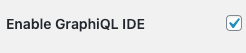
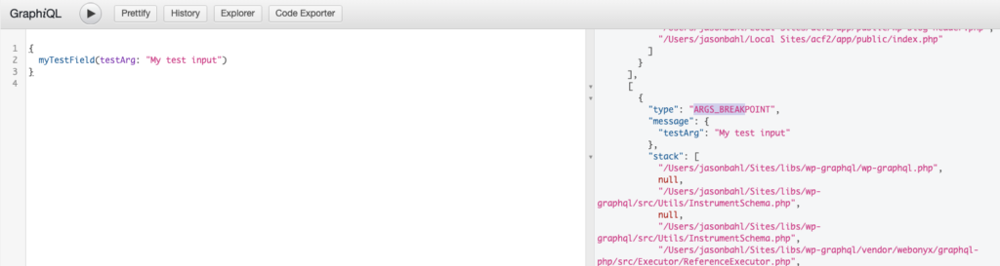
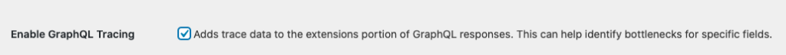
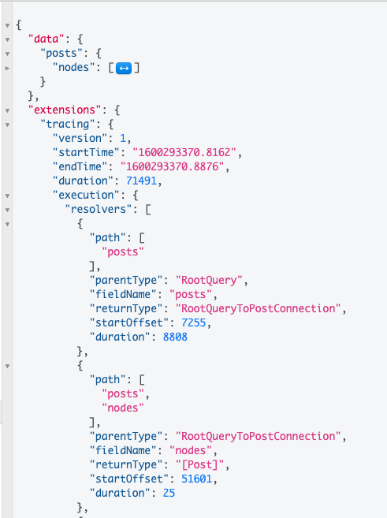
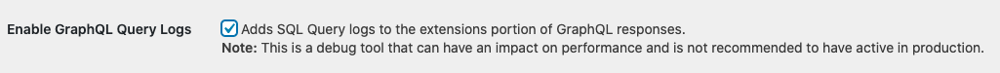
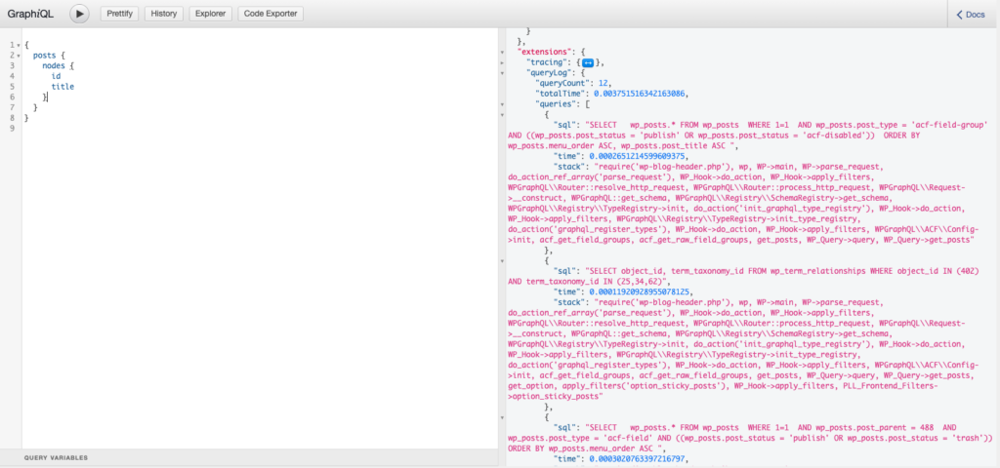
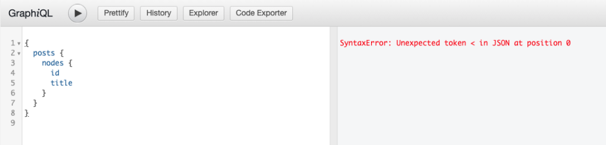
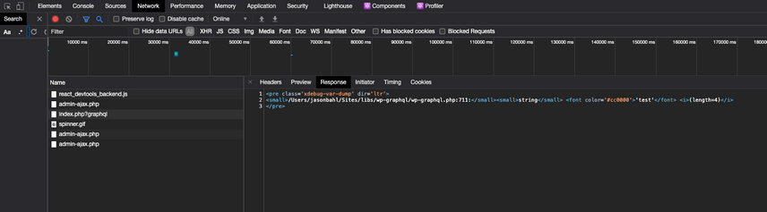
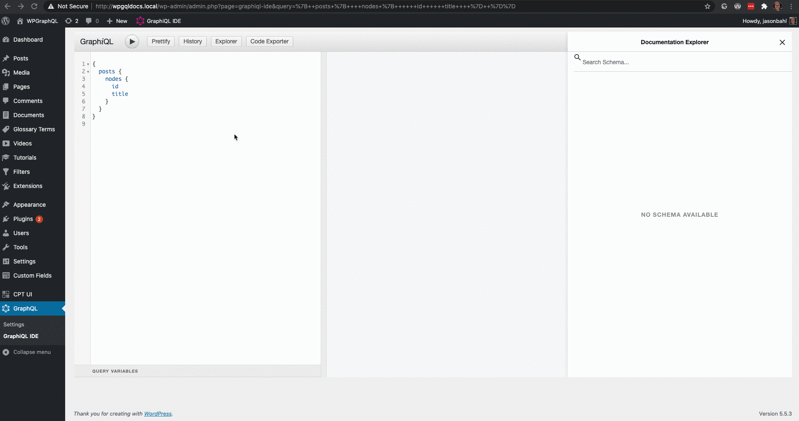

This guide is intended to help developers working with WPGraphQL debug when things don’t seem to be working as expected. This guide will be most useful for developers with experience working with PHP and WordPress. 

## WPGraphQL Debug Mode

WPGraphQL can be run in "Debug" mode, which can provide added information to requests to help debug. 

When WPGraphQL is in Debug Mode it will show debug logs (if there are any), and will show more descriptive errors than "Internal Server Error".

### Enabling Debug Mode

There are two ways to enable GraphQL Debug Mode:

**Enable GraphQL Debug Mode from the settings page:**

- Visit the GraphQL Settings page from the WordPress Admin Menu.
- Check the box labeled "Enable Debug Mode" and save the settings.



GraphQL requests will now execute in Debug Mode. 

**Enable GraphQL Debug Mode with Code:**

If you want to force-enable GraphQL Debug Mode, so that users cannot uncheck the setting from the Settings page, you can do so with code. 

Add the following line to your WordPress install's wp-config.php file: 

```php
define( 'GRAPHQL_DEBUG', true );
```

It should be added to the wp-config.php file, above the line that says: 

```php
/* That's all, stop editing! Happy blogging. */
```

This force-enables debug mode, and the setting on the settings page will now be disabled and show that it's been enabled with code.



## graphql_debug()

If you've already [enabled debug mode](#enabling-debug-mode), the function `graphql_debug()` can be used to output debug info to the WPGraphQL debug log.

This can be super helpful for breakpoint debugging. Think of it like `console.log()` for WPGraphQL.

Take this for example:

```php
add_action( 'graphql_register_types', function( ) {

   register_graphql_field( 'RootQuery', 'myTestField', [
      'type' => 'String',
      'args' => [ 'testArg' => [ 'type' => 'String' ] ],
      'resolve' => function( $root, $args ) {
           graphql_debug( $args, [ 'type' => 'ARGS_BREAKPOINT' ] );
           return 'default string value';
       }
   ] );

});
```

This adds a `myTestField` root query field with a String input argument named `testArg`.

The function `graphql_debug( $args, [ 'type' => 'ARGS_BREAKPOINT' ] );` was added to the resolver, and in the debug log we can see the value of the arguments in the log.


Various breakpoints can be added throughout resolution and tagged with a Type or other meta to help filter the logs and identify how things are resolving.

This can add a lot of value to developer workflows.

## Internal Server Error

If you see the error "Internal Server Error" this means there was an error that *might* not be safe to show details of to public users. It might expose some implementation details, and so it is masked as "Internal Server Error". You can [enable debug mode](#enabling-debug-mode) to show more detailed errors. 

One common reason for seeing this error is when a field or Type is registered with missing information. 

Take the following example:

**Invalid Field (missing **type**)**

Registering a field without a type would throw an `Internal Server Error` 

```php
add_action( 'graphql_register_types', function() {
  register_graphql_field( 'Post', 'invalidField', [
    'description' => __( 'Invalid field with no Type', 'your-textdomain' ),
  ] );
});
```

**Valid Field** **(includes type)**

Adding the type would cause the error to go away.

```php
add_action( 'graphql_register_types', function() {
  register_graphql_field( 'Post', 'validField', [
    'type' => 'String',
    'description' => __( 'Valid field with a Type defined', 'your-textdomain' ),
  ] );
});
```

## Tracing

WPGraphQL allows you to enable GraphQL Tracing. Tracing tracks how long each resolver in a GraphQL request takes to complete and adds the data to the results of the request as an extension. This can be helpful for debugging problematic resolvers that might be slowing down your application.

### Enable Tracing

From the WPGraphQL Settings page, check the box labeled "Enable GraphQL Tracing".



### Trace Data

Next time you execute a request, you will see Trace data in the response, like so: 



The Trace logs include data for the entire request:

- startTime
- endTime
- duration

As well as data for each field within the request:

- path
- parentType
- fieldName
- returnType
- startOffset
- duration

This data can be very helpful when debugging bottlenecks.

Let's take a look at an example.

Executing the following query:

```graphql
{
  posts {
    nodes {
      id
      title
    }
  }
}
```

We would see the following Trace data for the request:

```json
  ...,
  "tracing": {
    "version": 1,
    "startTime": "1600294443.335",
    "endTime": "1600294443.381",
    "duration": 45998,
    "execution": {
      ...
```

The request duration is `45998` microseconds (`0.045998` seconds).

And if we scrolled down, we'd see the following trace data for the `id` field of the first post:

```json
...,
{
  "path": [
    "posts",
    "nodes",
    0,
    "title"
  ],
  "parentType": "Post",
  "fieldName": "title",
  "returnType": "String",
  "startOffset": 27518,
  "duration": 797
},
...
```

Here, we can see that the duration was `797` microseconds (`0.000797 seconds`)

Let's override this field resolver like so:

```php
add_filter( 'graphql_Post_fields', function( $fields ) {

  $fields['title']['resolve'] = function( \\WPGraphQL\\Model\\Post $post ) {

    // Sleep for 1 second to simulate something taking a long time
    sleep(1);
    return $post->titleRendered;
  };

  return $fields;

});
```

Now, if we look at the trace data, we can see:

```json
 "tracing": {
 "version": 1,
 "startTime": "1600294618.1841",
 "endTime": "1600294628.2435",
 "duration": 10059434,
```

The entire request duration is now `10059434` microseconds ( `10.059434` seconds).

Something is clearly wrong! This request used to take well under 1 second, and now it's taking more than 10 seconds! 😱

If we scroll down we will see that the duration of each title field is looking quite long:

```json
...
{
  "path": [
    "posts",
    "nodes",
    0,
    "title"
  ],
  "parentType": "Post",
  "fieldName": "title",
  "returnType": "String",
  "startOffset": 27518,
  "duration": 1000964
},
...
```

The duration for the title field is now `1000964` microseconds (`1.000964` seconds).

Now, we as developers know what field to start troubleshooting.

In our case we know that the title field had a `sleep(1)` in the resolver, so we can remove that and we're back to super speedy execution!

## Query Logs

Query Logs are a super helpful debugging tool. A lot of things happen under the hood to resolve a GraphQL Query, and sometimes it can feel like a mystery.

Enabling Query Logs can give insight into what SQL Queries are being executed, how long they're taking, the raw SQL that is executed and the stacktrace to where in the codebase the query is being executed from.

This can be super helpful when things don't seem to be behaving as you'd expect. Sometimes you get results that you don't expect, and analyzing the raw SQL queries can help identify *why* things are misbehaving. Sometimes it's a rogue plugin that's filtering WP_Query args too aggressively, or perhaps a GraphQL input argument isn't properly mapping to WP_Query.

In any case, seeing the raw SQL queries and the path to the code that called it can be a huge time saver when debugging.

### Enabling GraphQL Query Logs

From the WPGraphQL Settings page, check the box labeled "Enable GraphQL Query Logs".



### Query Log Data

The Query logs will be output in the "extensions" portion of the GraphQL results under the "queries" key. 

Each SQL Query that is executed for the request, including Queries used to bootstrap WordPress before GraphQL execution begins, is logged and output with the following information: 

- **sql**: The raw SQL query that was executed against the database
- **time**: The time the query took to complete
- **stack**: The callstack leading up to the query



## Unexpected token < in JSON at position 0

If you execute a Query in GraphiQL and get the following response: 

```
SyntaxError: Unexpected token < in JSON at position 0
```



This means that WPGraphQL was unable to return JSON for the query and therefore GraphiQL is unable to present the JSON in the JSON viewer of GraphiQL. 

Typically this means that there's either a server error or some leftover debug code in a plugin that is killing the request before it completes. 

### Replicating the issue

For example, adding this code to a WordPress plugin will cause the response:

```php
add_action( 'graphql_resolve_field', function() {
  
  // Whenever a field resolves, dump this value and stop the request.
  var_dump( 'test' );
  die();

} );
```

### Checking the Response

One way to check what the response is, is to use Google Chrome Developer Tools. 

- With the GraphiQL IDE open, open Chrome Dev Tools (`command + option + i` on Mac). 
- Select the "Network" Tab
- Execute a GraphQL Query clicking the "Play" button in GraphiQL
- Select the GraphQL Request in the Network tab of Dev Tools
- Select the "Response" tab of the selected GraphQL Request. At this point you should be able to see the response from the server and it should help you identify the issue. 



Below is a Gif showing the above steps in action. 


