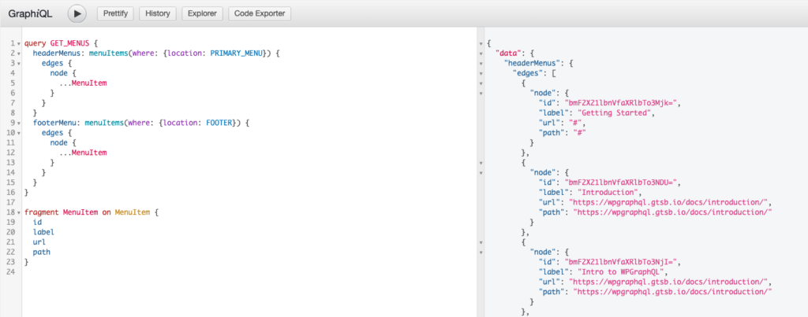

This guide will be most useful for developers that are new to working with GraphQL. This guide isn't a comprehensive deep dive into GraphQL but should help you get a basic understanding of it and provide you with resources to dive deeper.

## What is GraphQL?

[GraphQL](https://graphql.org/) stands for Graph Query Language. Graph, meaning "Application Data Graph". So, GraphQL is a specification for a Query Language for interacting with API data as a data graph.

GraphQL isn't tied to any specific database or back-end technology, instead GraphQL can be used with existing code and data. In the case of WPGraphQL, that existing code and data is WordPress.

The "hello world" of GraphQL Queries might look something like the following:

```graphql
{
  hello
}
```

And in response, one might get the following data:

```json
{
  "data": {
    "hello": "world"
  }
}
```

The request looks much like JSON keys, without the values. And the response is JSON with keys and values, and the data returned matches the shape of the request.

The request asked for the field "hello" and the response provided data with the key and value of the "hello" field.

## How Does GraphQL Work?

At the heart of GraphQL is a Schema. A [GraphQL Schema](https://graphql.org/learn/schema/) is composed of [Types](https://graphql.org/learn/schema/#type-system) and [Fields](https://graphql.org/learn/queries/#fields).

For a "hello world" Schema, one could define a Root Query Type in the Schema with a "hello" field, and declare that the "hello" field will return a value as a string:

```graphql
type Query {
  hello: String
}
```

GraphQL makes no prescription over the shape of the API. There must be a root Query type that has at least one field, and beyond that, the Schema can be designed however the implementor sees fit. It could be as basic as one "hello" field, but in almost all cases it will be more complex and have fields that return values beyond

Additional Types can be defined and referenced by fields in the Schema. For example:

```graphql
type RootQuery {
  me: User
}

type User {
  id: ID!
  name: String
}
```

Here, the field: "me" was added to the RootQuery Type and is set to return the type User. The "User" Type is defined to have 2 fields, "id" and "name".

With this Schema, one could make a query like the following:

```graphql
{
  me {
    name
  }
}
```

Because "me" is a field on RootQuery, we can ask for it in our Query. And because "me" returns the "User" type and the "User" type has fields "id" and "name", we can ask for those fields as selections on the "me" field.

If the server had resolvers configured for these fields, we might get a response like the following:

```json
{
  "data": {
    "me": {
      "name": "Albus Dumbledore"
    }
  }
}
```

### Ask for what you need, get exactly that

One thing you might have noticed is that the "User" type had an "id" field and a "name" field, but the query only asked for the "name" field. This is because with GraphQL, you get to specify exactly what you want, and the server responds with just what you asked for.

As [Eve Porcello's brother describes it](https://twitter.com/eveporcello/status/1300963959307001858?s=20), the GraphQL Schema is like a restaurant menu, and a GraphQL query is like the order.

The GraphQL Schema describes what's *possible* to be asked for. The Query asks for specific fields that are needed. Much like a server at a restaurant takes your order, goes to the kitchen and brings back the specific items you ordered, the GraphQL server takes the Query and returns data matching the fields that were requested.

## GraphQL Concepts

The following sections will introduce some concepts of GraphQL and provide resources to learn more about them.

GraphQL can be implemented in many programming languages as an API for *any* back-end. WPGraphQL is just one implementation of GraphQL using WordPress as the application and data layer.

There are many things that the GraphQL specification doesn't prescribe, such as Schema design, fetching data behind the scenes, and more. These decisions are made by each individual implementation of a GraphQL server. To learn more about specific concepts of the WPGraphQL implementation, you can read about [](/docs/wpgraphql-concepts/">WPGraphQL Concepts page.

Because GraphQL can be implemented in many ways, the following sections will attempt to speak to general GraphQL concepts that apply to *any* GraphQL implementation.

### GraphQL Query Language

The following sections will introduce you to features of the GraphQL Query language and how to compose Queries and Mutations and the features available when interacting with a GraphQL API. This section is more relevant to readers that want to learn more about interacting with GraphQL APIs.

### Queries and Mutation

Queries and Mutations are the primary operations that can be made against a GraphQL server.

Queries allow users to ask for data, while Mutations allow for data to be changed.

> Technically, GraphQL doesn't enforce this, but it's best practice. It is *possible* to have Mutations that don't change underlying data or Queries that *do* change underlying data, but in general, if the intent of an operation is to change data, it should be in the GraphQL Schema as a Mutation.

In this section, we'll break down various features of the GraphQL Query Language. After reading this, you should feel comfortable interacting with just about any GraphQL API you come across.

#### Fields

Fields are at the heart of the GraphQL Query Language. The most basic of GraphQL operations will include fields.

Let's say we had a GraphQL API that supported the following Query:

```graphql
{
  hello
}
```

And returned the following response:

```json
{
  "data": {
     "hello": "World"
  }
}
```

As you can see from the example, when we ask for a field in a GraphQL Query, the response has the same shape as the Query, and the server knows exactly what fields the client is asking for.

Fields in a GraphQL Schema declare a `Type` of data the field will return.

In this case, the field named `hello` was defined to return a String, and as we can see the value returned is `World`.

Fields can be defined to return more complex Types as well. Take the following example:

```graphql
{
  me {
    name
  }
}
```

In this query, I'm asking for the field `me`, but this returns an Object, so I must select which fields of that object I want as well. In this case, I ask for the field `name` and would get something like the following:

```json
{
  "data": {
    "me": {
      "name": "Sarah",
    },
  },
}
```

Fields can also return Lists. For example, we might make the following Query:

```graphql
{
  me {
    name
    friends {
      name
    }
  }
}
```

And we might get the following response:

```json
{
  "data": {
    "me": {
      "name": "Sarah",
      "friends": [
        {
          "name": "Selma"
        },
        {
          "name": "Anya"
        }
      ]
    }
  }
}
```

In this example, the `friends` field returns an array of items. GraphQL Queries look the same for both single items or lists of items, but you can know which to expect based on what's indicated in the Schema.

#### Arguments

Just asking for fields and getting data back in the same shape is already powerful, but GraphQL also supports arguments, allowing fields to have even more granular control over the data being requested.

```graphql
{
  person(id: 123) {
    name
  }
}
```

Here, we can pass an ID to the field and get a specific `Person` in response.

```json
{
  "data": {
    "person": {
      "name": "Jack"
    }
  }
}
```

RESTful APIs allow you to pass a single set of arguments with the request, but in GraphQL, every field in nested objects can have their own set of arguments (if the fields support arguments). This can allow a single GraphQL request to replace many round-trip requests.

```graphql
{
  person(id: 123) {
    name(includeSurname: true)
  }
}
```

```json
{
  "data": {
    "person": {
      "name": "Mr. Jack"
    }
  }
}
```

Arguments can be of many different Types. In the above example, we showed a `Boolean` argument that would accept a `true` or `false` input, but arguments can defined to accept Strings, Integers, Enums, custom Scalars or more complex Input Objects.

#### Aliases

Aliases are a powerful feature of GraphQL that allow you to change the name of a field in the response. This can be helpful when asking for the same field with different arguments, as the response needs to return data in the matching shape. If we asked for 2 fields both named `person`, GraphQL wouldn't quite know how to respond. We can alias like so:

```graphql
{
  person( id: 1 ) {
    name
  }
  anotherPerson: person( id: 2 ) {
    name
  }
}
```

And get the following response:

```json
{
  "data": {
    "person": {
      "name": "Hashim"
    },
    "anotherPerson": {
      "name": "Linda"
    }
  }
}
```

#### Operation Name

In the above examples we've used shorthand syntax to write a query and we've omitted the keyword `query` and the query name. While this is valid, it can be helpful to name your queries by giving them an operation name.

```graphql
query GetPersonById {
  person(id: 123) {
    name(includeSurname: true)
  }
}
```

In this example, `query` is the *operation type* and `GetPersonById` is the *operation name.*

While operation names are not required, they're best practice. Having an operation name can make it easier to identify queries in your codebase or in server side logs of operations, etc. Additionally, operation names are required if you want to pass variables to a query.

#### Variables

Variables allow for arguments to be dynamic, while allowing the Query to be a static string. For example, there might be a text field that allows a user to input a keyword to search for something.

It's not a good idea to concatenate the Query string to accomplish this as that would require run-time alterations to the query and could also make it difficult to diagnose when a query is problematic, as all queries would actually be unique queries.

Instead, GraphQL provides a feature called *variables*.

Let's take the example above that included an argument, and convert it to use a variable:

```graphql
query GetPersonById($id:Int!) {
  person(id: $id) {
    name(includeSurname: true)
  }
}
```

Here, we've added `($id:Int!)` to the operation name, declaring the variable `$id` and telling GraphQL that the input will be a required `Integer` value.

Then, we replaced `id: 123` with `id: $id`, which tells the query to use the `$id` variable when fulfilling the request for the `person` field.

Below is an example of using variables with the `graphql()` function provided by WPGraphQL:

```php
$results = graphql([
  'query' => '
  query GetPostById($id:ID!) {
    post(id:$id idType:DATABASE_ID) {
      id
      title
      date
    }
  }
  ',
  'variables' => [
    'id' => 123
  ]
]);
```

#### Fragments

A Fragment is a piece of code or logic that can be shared between multiple queries and mutations.

Fragments can be really useful when we we need to use or repeat the same field in multiple queries.

Let's look at an example of two queries where we need to get header and footer menus:

```graphql
query GET_MENUS {
  headerMenus: menuItems(where: {location: PRIMARY_MENU}) {
    edges {
      node {
        id
        label
        url
        path
      }
    }
  }
  footerMenu: menuItems(where: {location: FOOTER}) {
    edges {
      node {
        id
        label
        path
      }
    }
  }
}
```

You will notice that we have to repeat the menu fields in both of the queries .

Let's create a fragment for image called `MenuFragment` using the keyword `fragment`. The name `MenuFragment` is a custom name that we have given, and choose to call it something else as well.

Here `MenuItem` is the type, which is constant. We will cover below on how we can find this type for our query.

```graphql
fragment MenuFragment on MenuItem {
    id
    label
    url
    path
}
```

**How to find out the type for Fragment?**

You can use the Doc section of the Graphiql, and search for the query, and then as shown in the gif below, find the type of the field.


Let's put this together and try it in GraphiQL

```graphql
query GET_MENUS {
  headerMenus: menuItems(where: {location: PRIMARY_MENU}) {
    edges {
      node {
        ...MenuItem
      }
    }
  }
  footerMenu: menuItems(where: {location: FOOTER}) {
    edges {
      node {
        ...MenuItem
      }
    }
  }
}
fragment MenuItem on MenuItem {
  id
  label
  url
  path
}
```



So as you can see that with the help of Fragments we can reuse the same piece of logic in both queries and when needed, we only need to make updates at one place.

### Schemas and Types

The following sections will introduce you to concepts related to GraphQL Schemas and Types. This section is more relevant to readers that are curious about how a GraphQL API server is built and how.

At the heart of GraphQL is a Schema that is made up of Types, and Types consist of fields.

The Schema is the contract between the Client and the Server and exposes what is *possible* to be asked for, and the client uses the Schema to ask for exactly what it needs.

GraphQL can be implemented in just about any programming language and can work with just about any data source you could think of.

GraphQL is a specification that defines how Schemas should be constructed and how GraphQL operations sent to a GraphQL API should respond. GraphQL makes almost no prescription over the shape of the Schema, other than the Schema must have at least one Type defined and used as the root of the Schema, and that Type must have at least one field. Beyond that, GraphQL Schemas can be designed any way you can think of.

#### Root Query Type

A very basic GraphQL Schema could be defined like so:

```graphql
type Query {
  hello: String
}

schema {
  query: Query
}
```

> The above snippet is using SDL, or [Schema Definition Language](https://www.prisma.io/blog/graphql-sdl-schema-definition-language-6755bcb9ce51), which is a programming-language agnostic way to describe GraphQL Schemas and Types.

Here we have one Type, named `Query` with one field named `hello` that has declared that it will return a String when queried. And the Schema is defined to have the `query` field use the defined `Query` type.

If this Schema were implemented, the following query would be a valid query.

```graphql
{
  hello
}
```

#### Object Types and Fields

In the above snippet the `Query` type was defined. This is a *GraphQL Object Type* which means it's a Type in the Schema that has fields. Object Types are typically the most common Type in a GraphQL Schema.

On the `Query` type we defined a `hello` field. Fields are how we define what a GraphQL consumer can ask for from the API. In our case, we defined the `hello` field as a `String`, which is the contract between the server and the consumers that when the `hello` field is asked for, a string will be returned.

The `String` type is a Scalar type, which means that something concrete will be resolved at this field and that there can not be sub-selections made against a field that returns a Scalar Type.

#### Lists and Non-Nulls

It's possible to define a field that returns a list. Using the SDL, that might look like so:

```graphql
type Query {
  listOfStrings: [ String ]
}
```

This would allow a user to query like so:

```graphql
{
  listOfStrings
}
```

And in response they might get:

```json
{
  "data": {
    "listOfStrings": [ "String One", "String Two" ]
  }
}
```

However, if there was no data to resolve, or the requesting user didn't have permission to view the data being asked for, the response for the field might be null, like so:

```json
{
  "data": {
    "listOfStrings": null
  }
}
```

Fields can be defined as *non-nullable*, which means that the GraphQL API promises to *always* return a value when the field is asked for. In SDL, the `!` represents non-null.

```graphql
type Query { 
  listOfStrings: [ String ]
  nonNullString: String!
}
```

Given this Schema, any query for the field `nonNullString` will *always* return a String and never a *null*.

> It's important to note, however, that an empty string is still a string.

#### Arguments

Fields in GraphQL can have arguments defined, which allows user input to be provided when the field is asked for, and the input can be used to determine how the field should be resolved.

For example, we could define a field like so:

```graphql
type Query {
  fieldWithArgument( name: String )
}
```

This defines an argument named `name` as an input for the field `fieldWithArgument`.

This field could then be queried like so:

```graphql
{
  fieldWithArgument( name: "JSON Bahl" )
}
```

The argument would be passed to the field's resolver, and could be used to determine how the field should resolve. For example, the input value could be used to filter a database, or really anything you could think of.

#### Query and Mutation Types

At the root of the GraphQL Schema is a Query Type, but there can also be a Mutation Type.

Query and Mutation types are the same as all other Object Types, the difference is that they are at the root of the Schema and serve as the entry point to the API.

Technically, Mutations are almost identical to Queries too. There's nothing in the GraphQL spec that prevents Queries from writing data to a data source, and there's nothing that requires Mutations to write data to an underlying data source, but it's best practice to design a GraphQL Schema to use Queries for r retrieving data, and Mutations for *changing* data.

#### Scalar Types

Above, we saw the `String` Scalar type, but GraphQL has a few built-in Scalar types:

- `Int`: A signed 32‐bit integer.
- `Float`: A signed double-precision floating-point value.
- `String`: A UTF‐8 character sequence.
- `Boolean`:&nbsp;`true`&nbsp;or&nbsp;`false`.
- `ID`: The ID scalar type represents a unique identifier, often used to refetch an object or as the key for a cache. The ID type is serialized in the same way as a String; however, defining it as an&nbsp;`ID`&nbsp;signifies that it is not intended to be human‐readable.

#### Custom Scalars

Most GraphQL implementations ([including WPGraphQL](/functions/register_graphql_scalar/" data-type="functions" data-id="1730">) provide ways to register custom Scalar types.

For example, you may want to register a `Date` Scalar that behaves similar to a String, but enforces different validation rules.

> As of writing this, WPGraphQL doesn't provide any custom scalars out of the box, but may in the future.

#### Enumeration Types

Typically referred to as *Enum Types*, these are a special kind of Scalar that is limited to a specific set of values.

This allows you to:

1. Validate that any arguments of this type are one of the allowed values
1. Communicate through the type system that a field will always be one of a finite set of values

Here's what an enum definition might look like in the GraphQL schema language:

```graphql
enum Status {
  DRAFT
  PENDING
  PUBLISH
}
```

This means that wherever the `Status` Type is used in the Schema, it would be expected to be exactly one of the allowed values `DRAFT`, `PENDING` or `PUBLISH`.

#### Interfaces

An *Interface* is an abstract type that includes a certain set of fields that a type must include to implement the interface.

For example, if we had a Schema for animals, we might have a `Dog` and `Cat` Type, and they might share an `Animal` Interface, which would declare common fields, such as `name` and `color`.

That might be implemented like so:

```graphql
Interface Animal {
  name: String
  color: String
}
```

Then each Type (`Cat` and `Dog`) could implement the interface, but also define other fields unique to their Type.

```graphql
type Dog implements Animal {
  name: String
  color: String
  barkVolume: Int
}

type Cat implements Animal {
  name: String
  color: String
  meowVolume: Int
}
```

Interfaces are useful when you want to return an object or set of objects, but those might be of several different types. For example, given the following Schema:

```graphql
type Query {
  animals: [ Animal ]
}
```

One could query:

```graphql
{
  animals {
    name
    color
    ...on Dog {
      barkVolume
    }
    ...on Cat {
      meowVolume
    }
  }
}
```

This allows for common fields to be queried together, but for differentiating fields to be asked for only if the return type matches the specified Type.

#### Union Types

Union Types are similar to interfaces, in that they allow different Types to be returned, but they don't require any shared fields between the types.

For example, let's say a Zoo website allowed users to search. When users searched, they might get results from the websites Blog, or from the dictionary of Animals.

You might define a Union like so:

```graphql
union SearchResult = BlogPost | Animal
```

In this case, a query could be executed like so:

```graphql
{
  search(text: "do") {
    __typename
    ...on BlogPost {
      title
      excerpt
    }
    ...on Animal {
      name
      color
    }
  }
}
```

And the results might look like so:

```json
{
  "data": {
    "search": [
      {
        "__typename": "BlogPost",
        "title": "Dogs favorite activities",
        "excerpt": "A blog post about dogs favorite activities",
      },
      {
        "__typename": "Dog",
        "name": "Rufus",
        "color": "Black"
      }
    ]
  }
}
```

The `__typename` field is a hidden field available to be queried on all Types in the GraphQL Schema. It resolves to a String which lets consumers differentiate between the returned Types.

#### Input Types

Input Types allow complex input to be provided to arguments, instead of just Scalars. This is valuable to Mutations where you might want to accept complex input to create an object. It's also valuable when allowing clients to sort or filter collections of data.

For example:

```graphql
type SubmitFormInput {
  name: String
  email: String
}

mutation {
  submitForm(input:SubmitFormInput!) {
    success: Boolean!
    errors: [ String ]
  }
}
```

This Schema would enable a Mutation operation like so:

```graphql
mutation {
  submitForm( input: { 
    name: "Testy McTestface",
    email: "test@example.com"
  }) { 
    success
    errors
  }
}
```

Input Types are similar to Object Types, but Input Types can only be used for input, not for querying. Additionally, while fields of Object Types can have arguments, fields of Input Types cannot. Thus, Input Types and Output Types cannot be shared in the Schema. For example, you could not create one Type and use that Type as an input *and* as a queryable Type.

## Learning More

This page was intended to serve as an introduction to GraphQL, but there's a lot more to learn about GraphQL. Below are some resources that should help in learning more about GraphQL:

- [GraphQL.org](https://graphql.org/learn/): The official website of GraphQL
- [HowToGraphQL.com](https://www.howtographql.com/): A free and open-source tutorial to learn about GraphQL from zero to production
- [Zero to GraphQL in 30 Minutes](https://www.youtube.com/watch?v=UBGzsb2UkeY): A video overview of GraphQL
- [So, what's this GraphQL thing I keep hearing about?](https://www.freecodecamp.org/news/so-whats-this-graphql-thing-i-keep-hearing-about-baf4d36c20cf/): A Blog post on FreeCodeCamp.org
