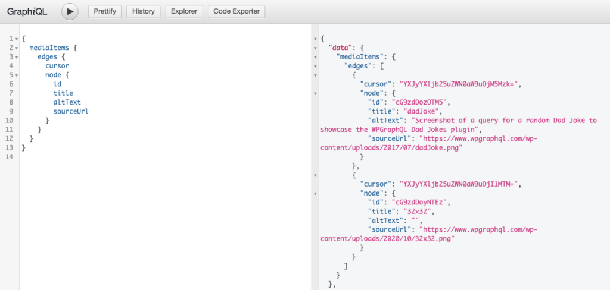
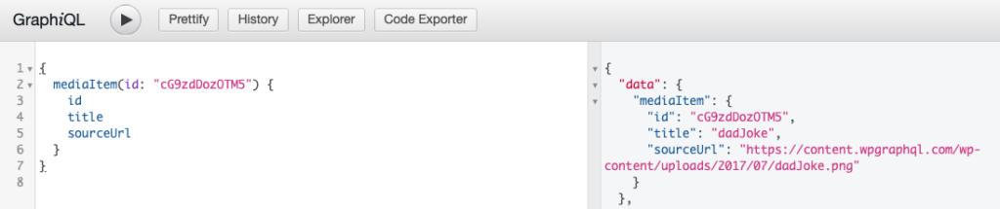
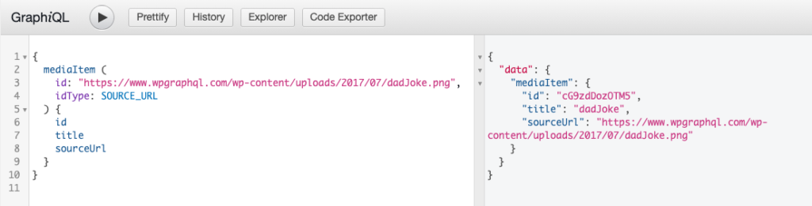
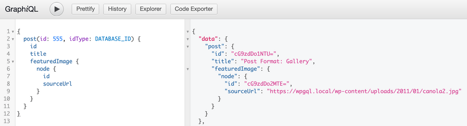

WPGraphQL provides support for querying Media Items, what WordPress calls "attachments".


This page will be most useful for users what are familiar with [GraphQL Concepts](/docs/intro-to-graphql/) and understand the basics of [writing GraphQL Queries](/docs/intro-to-graphql/#queries-and-mutation).

## Querying Media Items

WPGraphQL supports querying Media Items in various ways.


Below are some common examples of querying Media Items with WPGraphQL.

### List of Media Items

Below is an example of querying a list of media items.

```graphql
{
  mediaItems {
    edges {
      cursor
      node {
        id
        title
        altText
        sourceUrl
      }
    }
  }
}
```



### Single Media Item by Global ID

Below is an example of querying a Media Item using its Global ID.

```graphql
{
  mediaItem(id: "cG9zdDozOTM5") {
    id
    title
    sourceUrl
  }
}
```



### Single Media Item by Source Url

If you have the source url for an image in the media library, you can use that as a unique identifier for querying an Media Item.

```graphql
{
  mediaItem (
    id: "/static/9cb15e2b7fddc510b725924a6a491cb9/dadJoke.png", 
    idType: SOURCE_URL
  ) {
    id
    title
    sourceUrl
  }
}
```



### Query a post with it's featured image

Below is an example of querying a Post using its Database ID, and its connected Featured Image.

The connection between the Post and Featured image is a good example of a [one-to-one connection](/docs/connections/).

```graphql
{
  post(id: 555, idType: DATABASE_ID) {
    id
    title
    featuredImage {
      node {
        id
        sourceUrl
      }
    }
  }
}
```



## Mutating Media Items

**NOTE:** WPGraphQL supports mutations for the data stored in the Database for Media Items, but WPGraphQL does not (yet) provide a way to handle the actual uploads of files. [See open issues related to this topic](https://github.com/wp-graphql/wp-graphql/issues?q=is%3Aissue+is%3Aopen+upload+image).
