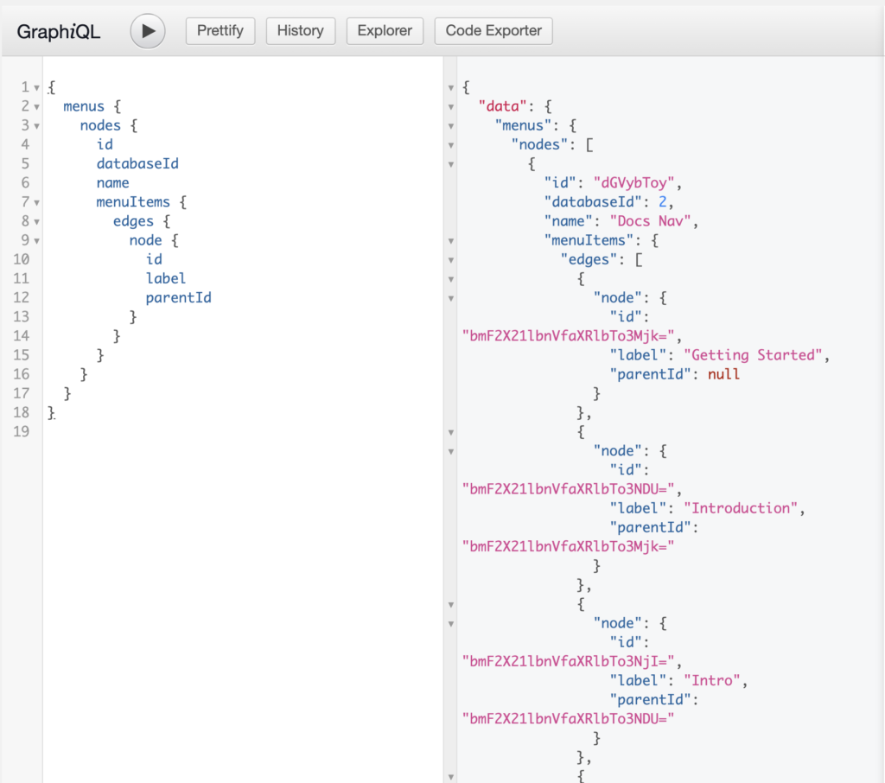
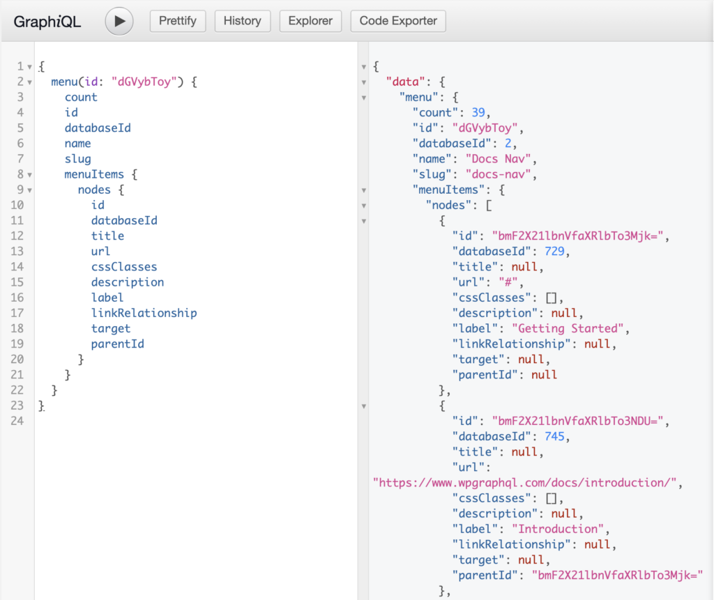
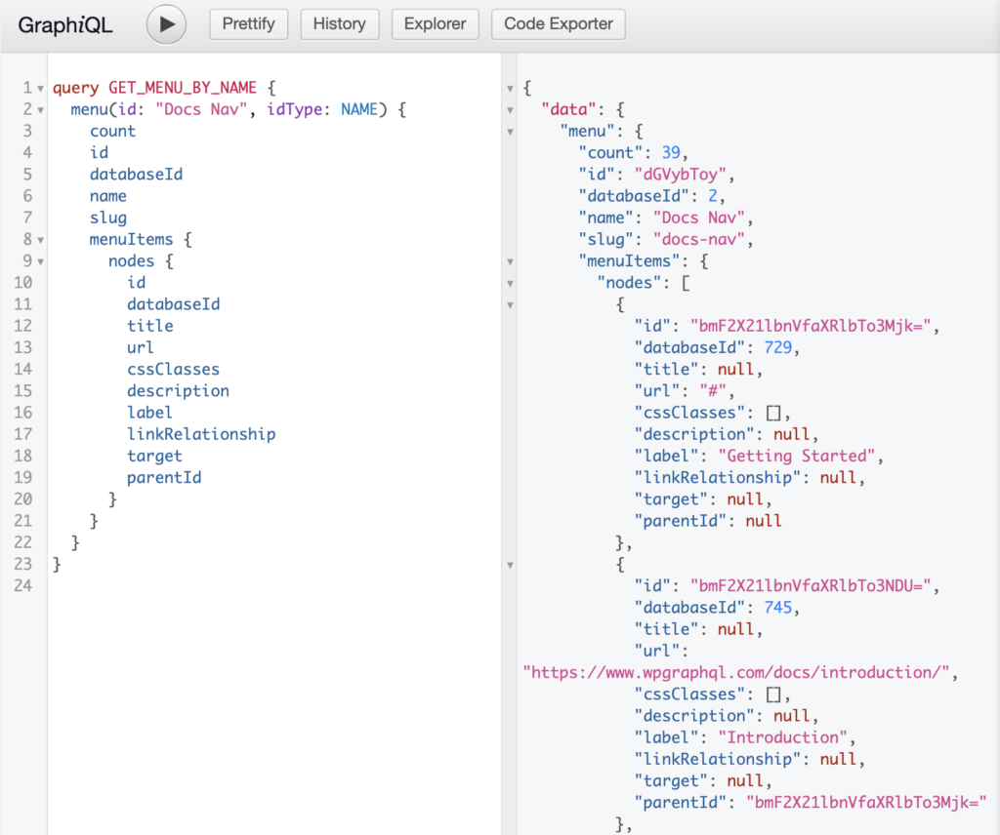
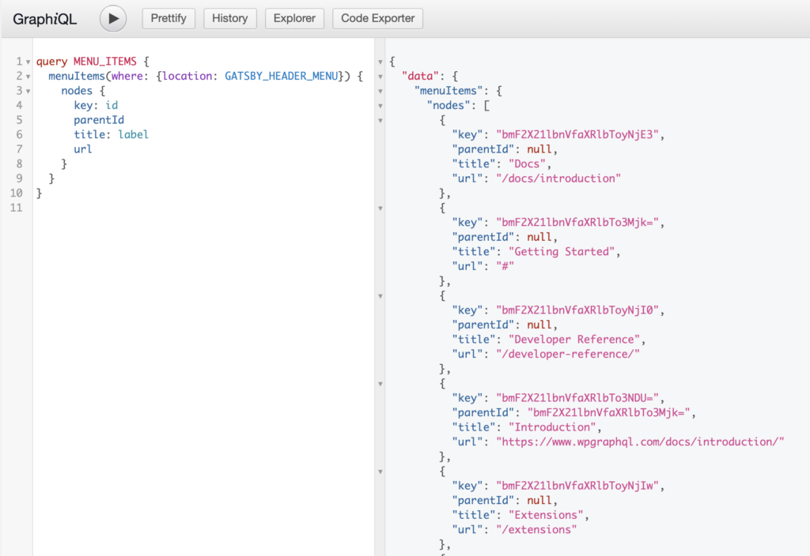

In WordPress, Navigation Menus consist of 2 types of entities: Menus and MenuItems.

- **Menu**: is the entity that groups MenuItems together.
- **MenuItem**: The individual items in a Menu. Each MenuItem can be a custom link, or a reference to a connected object such as a Post, Page, Category, Tag, or other entity. MenuItems can have hierarchical relationships with other MenuItems, meaning MenuItems can be nested with parent/child relationships.

## Access Control

> **NOTE:** Menus and Menu Items in WordPress are not viewable by public requests until they are assigned to a Menu Location. WPGraphQL respects this access control right, so if you are not seeing data in your queries for menus and menu items, make sure the menu is assigned to a location.

## Querying Menus and Menu Items

Below are some examples of querying Menus and Menu Items

### List of Menus

Below is an example query for a list of Menus and the Menu Items associated with the menu.

```graphql
{
  menus {
    nodes {
      id
      databaseId
      name
      menuItems {
        edges {
          node {
            id
            label
            parentId
          }
        }
      }
    }
  }
}
```



### Menu by ID

Below is an example of a GraphQL Query for a specific menu using identified by it's Global ID.

```graphql
query {
  menu {
    count
    id
    databaseId
    name
    slug
    menuItems {
      nodes {
        id
        databaseId
        title
        url
        cssClasses
        description
        label
        linkRelationship
        target
        parentId
      }
    }
  }
}
```



### Menu by Name

Often, it can be inconvenient to query Menus by ID. Since Menu names in WordPress are unique, the name can be used as a unique identifier and we can query for Menus by name using the `idType` argument like so:

```graphql
query GET_MENU_BY_NAME {
  menu(id: "Docs Nav", idType: NAME) {
    count
    id
    databaseId
    name
    slug
    menuItems {
      nodes {
        id
        databaseId
        title
        url
        cssClasses
        description
        label
        linkRelationship
        target
        parentId
      }
    }
  }
}
```



### List of Menu Items

Querying a list of Menu Items with no arguments will return Menu Items associated with *any*> Menu.

It's likely more common that you would want to query Menu Items associated with a specific Menu Location, like so:

```graphql
query MENU_ITEMS {
  menuItems(where: {location: "PRIMARY"}) {
    nodes {
      key: id
      parentId
      title: label
      url
    }
  }
}
```



### Hierarchical Data

One thing you may have noticed is that Menu Items will be returned in a flat-list by default, meaning that hierarchical relationships such as parent, children, grand-child Menu Items, will all be returned together in a flat list.

There's a good chance you might need to convert a flat list into a hierarchical list in the consumer application to be used in a component such as a Checkbox Tree or Dropdown Menu, for example.

> You can see this technique in action in the codebase for the website you're reading [here](https://github.com/wp-graphql/wpgraphql.com/blob/master/src/components/DocsSidebar.js#L8-L26).

Given the query above, we might have a payload of data like so:

```json
{
  "nodes": [
    {
      "key": "bmF2X21lbnVfaXRlbTo2Mjk=",
      "parentId": null,
      "title": "Sample Page",
      "url": "http://acf2.local/sample-page/",
    },
    {
      "key": "bmF2X21lbnVfaXRlbTo2MzA=",
      "parentId": "bmF2X21lbnVfaXRlbTo2Mjk=",
      "title": "Child Page",
      "url": "http://acf2.local/sample-page/child-page/",
    },
    {
      "key": "bmF2X21lbnVfaXRlbTo2MzE=",
      "parentId": "bmF2X21lbnVfaXRlbTo2MzA=",
      "title": "Grandchild",
      "url": "http://acf2.local/sample-page/child-page/grandchild/",
    },
    {
      "key": "bmF2X21lbnVfaXRlbTo1NTE=",
      "parentId": null,
      "title": "test",
      "url": "http://acf2.local/test/",
    },
    {
      "key": "bmF2X21lbnVfaXRlbTo1NTI=",
      "parentId": null,
      "title": "Test Page",
      "url": "http://acf2.local/test-page/",
    }
  ],
}
```

Here we can see that there are some nodes with a null `parentId` value, and some that do have a `parentId` value.

A function like the following could be used to convert the flat list to a hierarchical list.

```js
const flatListToHierarchical = (
    data = [],
    {idKey='key',parentKey='parentId',childrenKey='children'} = {}
) => {
    const tree = [];
    const childrenOf = {};
    data.forEach((item) => {
        const newItem = {...item};
        const { [idKey]: id, [parentKey]: parentId = 0 } = newItem;
        childrenOf[id] = childrenOf[id] || [];
        newItem[childrenKey] = childrenOf[id];
        parentId
            ? (
                childrenOf[parentId] = childrenOf[parentId] || []
            ).push(newItem)
            : tree.push(newItem);
    });
    return tree;
};
```

This could be used like so:

```js
$hierarchicalList = flatListToHierarchical( data.nodes );
```

And the data would be transformed like so:

```json
[
  {
    "key": "bmF2X21lbnVfaXRlbTo2Mjk=",
    "parentId": null,
    "title": "Sample Page",
    "url": "http://acf2.local/sample-page/",
    "__typename": "MenuItem",
    "children": [
      {
        "key": "bmF2X21lbnVfaXRlbTo2MzA=",
        "parentId": "bmF2X21lbnVfaXRlbTo2Mjk=",
        "title": "Child Page",
        "url": "http://acf2.local/sample-page/child-page/",
        "__typename": "MenuItem",
        "children": [
          {
            "key": "bmF2X21lbnVfaXRlbTo2MzE=",
            "parentId": "bmF2X21lbnVfaXRlbTo2MzA=",
            "title": "Grandchild",
            "url": "http://acf2.local/sample-page/child-page/grandchild/",
            "__typename": "MenuItem",
            "children": []
          }
        ]
      }
    ]
  },
  {
    "key": "bmF2X21lbnVfaXRlbTo1NTE=",
    "parentId": null,
    "title": "test",
    "url": "http://acf2.local/test/",
    "__typename": "MenuItem",
    "children": []
  },
  {
    "key": "bmF2X21lbnVfaXRlbTo1NTI=",
    "parentId": null,
    "title": "Test Page",
    "url": "http://acf2.local/test-page/",
    "__typename": "MenuItem",
    "children": []
  }
]
```

## Mutations

> WPGraphQL does not yet support mutations for menus or menu items.
