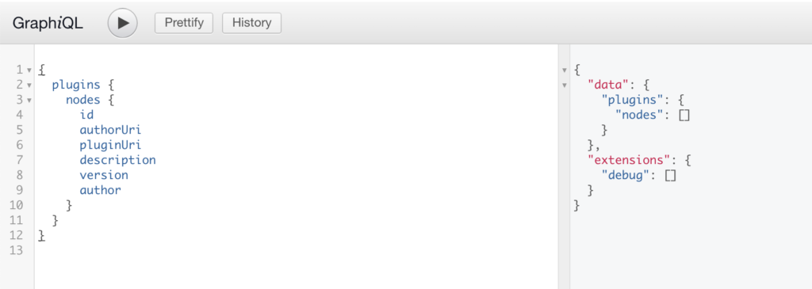
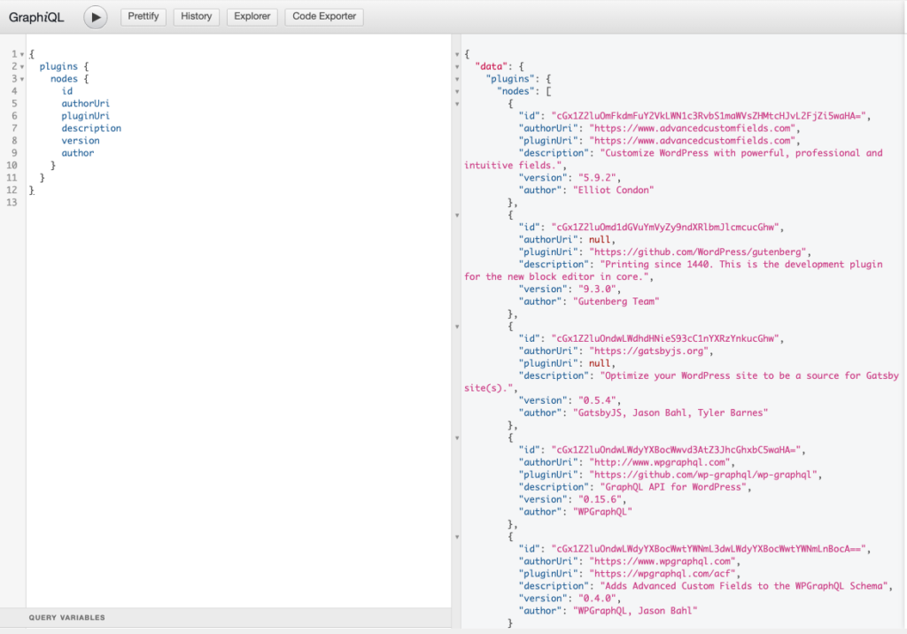
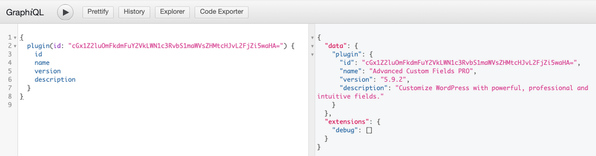
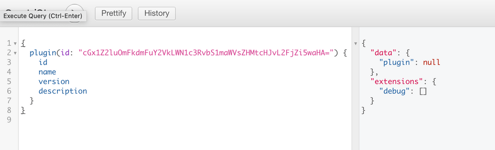

This page will be most useful for users what are familiar with [GraphQL Concepts](/docs/intro-to-graphql/) and understand the basics of [writing GraphQL Queries](/docs/intro-to-graphql/#queries-and-mutation).

## Querying Plugins

WPGraphQL provides support for querying Plugins in various ways.

> Plugins can only be queried by authenticated users with proper capabilities to update plugins.

### List of Plugins

Below is an example query to get a list of plugins.

```
{
  plugins {
    nodes {
      id
      authorUri
      pluginUri
      description
      version
      author
    }
  }
}
```

**Query from Public User**

If a public user queries for plugins, nothing will be returned as Plugins are considered private and require "update_plugins" capability to view.



**Query from Authenticated User**

If an authenticated user with "update_plugins" capabilities queries for plugins, they will get a list of plugins in response. This can be helpful for developers or site administrators that need to get plugin information quickly.



### Plugin by ID

Individual plugins can be queried for using the plugins Global ID.

```graphql
{
  plugin(id: \"cGx1Z2luOmFkdmFuY2VkLWN1c3RvbS1maWVsZHMtcHJvL2FjZi5waHA=\") {
    id
    name
    version
    description
  }
}
```

**Query from Authenticated User**

If an authenticated user with "update_plugins" capabilities queries for a plugin, they be able to see the plugin.



**Query from Public User**

If public user or user without "update_plugins" capabilities queries for a plugin, they will not be able to see plugin data.



## Mutations

> WPGraphQL does not currently support mutations for Plugins.
