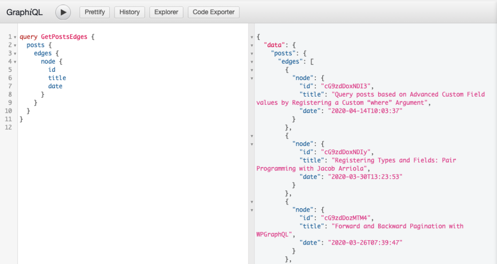

WPGraphQL provides support for querying Posts, Pages and Custom Post Types in various ways.

This page will be most useful for users what are familiar with [GraphQL Concepts](/docs/intro-to-graphql/) and understand the basics of [writing GraphQL Queries](/docs/intro-to-graphql/#queries-and-mutation).

## Querying Posts

WPGraphQL supports querying posts and pages, as well as [Custom Post Types that are registered to show in the GraphQL Schema](/docs/custom-post-types/).

Below are some common examples of querying posts with WPGraphQL. The below examples apply to Posts, Pages and Custom Post Types.

### Lists of Posts

Below is an example of querying a list of posts. In this example we ask for `posts`, and then on the `posts` field we ask for `edges`, `node`, then the `id`, `title` and `date` of each `node` (each post).

```graphql
query GetPostsEdges {
  posts {
    edges {
      node {
        id
        title
        date
      }
    }
  }
}
```



Below is the same query, but asking for the nodes directly, skipping the `edges` field.

```graphql
query GetPosts {
  posts {
    nodes {
      id
      title
      date
    }
  }
}
```


> **Edges? Nodes? Huh?** If you're not yet familiar with GraphQL Connections, edges and nodes will look like a foreign concept. To get a better understanding of Edges, Nodes and other conventions of GraphQL Connections: [Read the GraphQL Connections Guide](/docs/connections/)

### Filtering a List of Posts

Queries for [Connections](/docs/connections/) can be filtered. Below are some examples of filtering using the `where` argument. There are many options available to filter posts, so it's recommended to use a tool such as GraphiQL to get familiar with the options available to filter.

#### Query posts written by a specific author

This example shows querying posts written by a specific author (using the author's DatabaseId)

```graphql
{
  posts(where: {author: 1}) {
    nodes {
      id
      title
      author {
        node {
          name
        }
      }
    }
  }
}
```


#### Query posts by specific title

This example shows querying posts with a specific title.


#### Query posts by specific search keyword

This example shows querying posts using a search keyword.


### Single Post by Global ID

Below is an example of querying a single post using the [GraphQL Global ID](/docs/wpgraphql-concepts/).

```graphql
{
  post( id: "cG9zdDozMzM=" ) {
    id
    databaseId
    title
  }
}
```


### Single Post by Database ID

Below is an example of querying a single post using the Database ID as an identifier. In addition to passing a value for `id`, we also declare the `idType` to be `DATABASE_ID`.

```graphql
{
  post( id: 333, idType: DATABASE_ID ) {
    id
    databaseId
    title
  }
}
```


### Single Post by URI

Below is an example of querying a single post using the URI (the path to the post) as an identifier.


### Single Post by Slug

Below is an example of querying a single post using the `slug` as the ID.

> **NOTE:** Slugs are only unique identifiers for non-hierarchical post-types. Hierarchical post types cannot query single nodes by slug as there can be many items with the same slug. Fore example, you could have `/company/about` and `/products/about` both as Pages with an `about` slug.

```graphql
{
  post(id: "forward-and-backward-pagination-with-wpgraphql", idType: SLUG) {
    id
    databaseId
    title
    uri
  }
}

```


## Mutations

WPGraphQL provides Mutations (the ability to change data through GraphQL) for Posts, Pages and Custom Post Types that are configured to show in the GraphQL Schema.

WPGraphQL adheres to core access control rights, ensuring data can only be created, updated or deleted by users that have proper permission to do so. Learn more in our [WPGraphQL Security guide](/docs/security/).

### Create Post

Below is an example of a GraphQL Mutation to create a post.

There are 2 required input fields to create a post: `clientMutationId` and `title`.

```graphql
mutation CREATE_POST {
  createPost(input: {
    clientMutationId: "CreatePost"
    title: "New Post Title"
  }) {
    post {
      id
      title
      date
    }
  }
}

```

This Mutation will only succeed for users with proper capabilities to create posts (of the post type being created).

#### Successful Mutation

If the user executing the mutation is authenticated and has proper capabilities to create a post, the post will be created and the fields asked for in response will be returned.


#### Unuccessful Mutation

If the user executing the mutation is not authenticated, or does not have proper capabilities to create a post, the post will not be created and an error will be returned.


### Update Post

Below is an example of a GraphQL Mutation to update a post. In order to update a post, the ID of the post must be known and provided to the input.

```graphql
mutation UPDATE_POST {
  updatePost(input: {
    clientMutationId: "UpdatePost",
    id: "cG9zdDoxNzg5",
    title: "New title!"
  }) {
    post {
      id
      title
      date
      slug
    }
  }
}
```

#### Successful Mutation

If the user making the request is authenticated and has proper capabilities to update the post, the post will be updated and the specified fields of the post being updated will be returned in the response.


#### Unuccessful Mutation

If the user executing the mutation is not authenticated, or does not have proper capabilities to create a post, the post will not be created and an error will be returned.


### Delete Post

Below is an example of of a GraphQL Mutation to delete a post. In order to delete a post, the ID of the post must be known and provided to the input.

```graphql
mutation DELETE_POST {
  deletePost(input: {
    clientMutationId:"DeletePost"
    id:"cG9zdDoxNzg5"
  }) {
    deletedId
    post {
      id
    }
  }
}
```

#### Successful Mutation

If the user executing the mutation to delete a post is authenticated and has proper capabilities to delete the post of the provided ID, the post will be deleted from WordPress and the fields asked for will be returned.


#### Unuccessful Mutation

If the user executing the mutation to delete a post is not authenticated or does not have proper capabilities to delete a post, the post will not be deleted from WordPress and an error will be returned.


