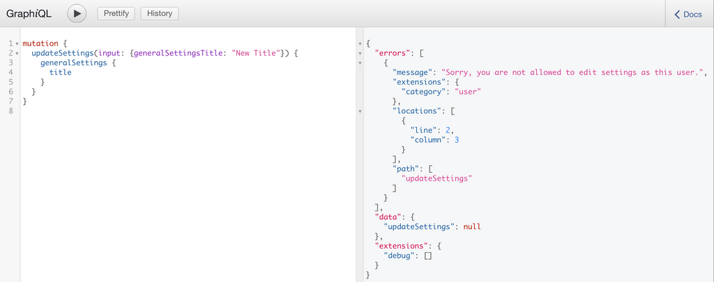
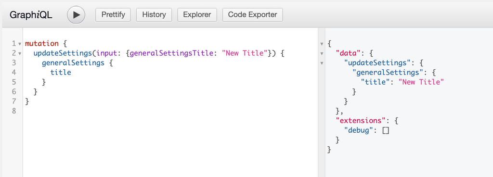
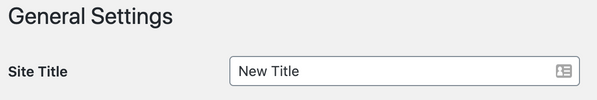

On this page you will find information about using GraphQL to interact with settings that have been registered to WordPress via the `register_settings()` API provided by WordPress.

## Core Settings

WPGraphQL respects settings that have been registered by WordPress core and exposes these settings to the GraphQL API for querying and mutating.

The Schema is created by adding an Object Type to the Schema representing the field group, and registering each field to that GraphQL Object Type.

For example, WordPress core provides a title, description and url field in the "general settings" group, so these settings can be queried like so:

```graphql
{
  generalSettings {
    title
    description
    url
  }
}
```

And you would get a response similar to the following:

```json
{
  "data": {
    "generalSettings": {
      "title": "Name of Your Site",
      "description": "Just another WordPress site",
      "url": "https://example.com"
    }
  }
}
```

## Registering Custom Settings

WordPress provides a `register_settings()` API that allows developers to register settings for their site. Check [here](https://developer.wordpress.org/reference/functions/register_setting/) for more information on how these settings are registered by group and name. In WordPress you could register a custom setting like so:

```php
/**
 * Registers a text field setting for WordPress 4.7 and higher.
 **/
function register_my_setting() {
    $args = [
      'type' => 'string',
      'sanitize_callback' => 'sanitize_text_field',
      'default' => NULL,
      'show_in_graphql' => true, // This tells WPGraphQL to show this setting in the Schema
    ];
    register_setting( 'my_options_group', 'my_option_name', $args );
}

add_action( 'init', 'register_my_setting' );
```

Since we set the `show_in_graphql` parameter to true the setting will now appear in the GraphQL schema under it's group name.

This could now be queried like so:

```graphql
{
  myOptionsGroupSettings {
    myOptionName
  }
}
```

> **NOTE: **If a setting is registered without a group defined it will appear under `generalSettings`.

## Querying Settings

### All Settings

Site settings can be queried in two different ways. As mentioned before, you register your own setting group, say `catGifSettings`, and you would see your setting group and fields appear in the GraphQL schema. You can query this data in two different ways. First, by accessing all of the site setting groups at once using the `allSettings` root query field which will return all of the settings fields with the setting group name prepended.

```graphql
{
  allSettings {
    generalSettingsDateFormat
    generalSettingsDescription
    generalSettingsLanguage
    generalSettingsStartOfWeek
    generalSettingsTimeFormat
    generalSettingsTimezone
    generalSettingsTitle
    generalSettingsUrl
    readingSettingsPostsPerPage
    discussionSettingsDefaultCommentStatus
    discussionSettingsDefaultPingStatus
    writingSettingsDefaultCategory
    writingSettingsDefaultPostFormat
    writingSettingsUseSmilies
  }
}
```

Would return results similar to the following:

```json
{
  "data": {
    "allSettings": {
      "generalSettingsDateFormat": "F j, Y",
      "generalSettingsDescription": "Just another WordPress site",
      "generalSettingsLanguage": "",
      "generalSettingsStartOfWeek": 0,
      "generalSettingsTimeFormat": "g:i a",
      "generalSettingsTimezone": "America/Denver",
      "generalSettingsTitle": "Example Site Title",
      "generalSettingsUrl": "http://example.com",
      "readingSettingsPostsPerPage": 10,
      "discussionSettingsDefaultCommentStatus": "open",
      "discussionSettingsDefaultPingStatus": "open",
      "writingSettingsDefaultCategory": 1,
      "writingSettingsDefaultPostFormat": "",
      "writingSettingsUseSmilies": true
    }
  }
}
```

### Site Settings by Settings Group

Site settings can *also* be queried by setting group name. Field names will be the camel case version of the setting, no longer prepended by the group name since you are using it to query with.

For example, fields in the General Settings group can be accessed like so:

```graphql
{
  generalSettings {
    dateFormat
    description
    language
    startOfWeek
    timeFormat
    timezone
    title
    url
  }
}
```

And that will return data similar to:

```json
{
  "data": {
    "generalSettings": {
      "dateFormat": "F j, Y",
      "description": "Just another WordPress site",
      "language": "",
      "startOfWeek": 0,
      "timeFormat": "g:i a",
      "timezone": "America/Denver",
      "title": "Example Site Title",
      "url": "http://example.com"
    }
  }
}
```

## Mutations

Settings can be updated using GraphQL through a mutation. Custom settings would follow the `allSettings` naming conventions where the group name is prepended before the setting field name.

Here's an example of a Mutation to update the Site's title:

```graphql
mutation {
  updateSettings(input: {generalSettingsTitle: "New Title"}) {
    generalSettings {
      title
    }
  }
}
```

**Unsuccessful Mutation**

If the user executing the Mutation is not authenticated or does not have the capability to edit the setting, the setting will not be updated and an error will be returned:



**Successful Mutation**

If the user executing the Mutation is authenticated and has proper capabilities to update the setting, the setting will be updated in WordPress and the specified fields will be returned.



After the mutation succeeds, we can confirm the change on the WordPress General Settings page:


