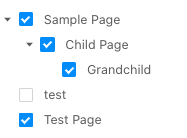
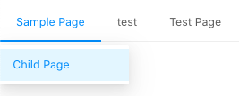

import GraphiQL from "../../src/components/GraphiQL"
import Note from "../../src/components/Note"

In WordPress, Navigation Menus consist of 2 types of entities: Menus and MenuItems.

- **Menu**: is the entity that groups MenuItems together.
- **MenuItem**: The individual items in a Menu. Each MenuItem can be a custom link, or a reference
to a connected object such as a Post, Page, Category, Tag, or other entity. MenuItems can have hierarchical
relationships with other MenuItems, meaning MenuItems can be nested with parent/child relationships.

## Queries

Below are some examples of querying Menus and Menu Items.

### Menu by ID
If you know the ID of a Menu, you can query like so:

<GraphiQL
	withDocs={false}
	query="
  query GET_MENU( $id: ID! ){
      menu(id: $id) {
        count
        id
        databaseId
        name
        slug
        menuItems {
          nodes {
            id
            databaseId
            title
            url
            cssClasses
            description
            label
            linkRelationship
            target
            parentId
          }
        }
      }
  }"
	variables={{
		id: "dGVybTo0",
	}}
/>

### Menu by Name

Often, it can be inconvenient to query Menus by ID. Since Menu names in WordPress are unique the name
can be used as a unique identifier and we can query for Menus by name using the `idType` argument like so:

<GraphiQL
	withDocs={false}
	query="
  query GET_MENU( $id: ID! ){
      menu(id: $id, idType: NAME) {
        count
        id
        databaseId
        name
        slug
        menuItems {
          nodes {
            id
            databaseId
            title
            url
            cssClasses
            description
            label
            linkRelationship
            target
            parentId
          }
        }
      }
  }"
	variables={{
		id: "Primary Nav",
	}}
/>


### Menus

If you are looking for a list of all menus that exist, you can query a list of menus like so:

<GraphiQL
	query="
    {
      menus {
        nodes {
          id
          databaseId
          name
          menuItems {
            edges {
              node {
                id
                label
                parentId
              }
            }
          }
        }
      }
    }"
/>

<Note title="Privacy of Menus">
In WordPress, Nav Menus that are associated with a Menu Location are considered public. Menus that
are not assigned to a location are only accessible in the WordPress Admin and require authentication
to interact with. WPGraphQL respects this Access Control. So a Query for a menu or a list of menus
will only return menus that are considered public. To retrieve Menus that are not assigned a
location, the GraphQL request needs to be authenticated and the authenticated user must have proper
capabilities to see the Menus.
</Note>


### Menu Item

If you have the ID of a MenuItem, you can query it directly like so:

<GraphiQL
	withDocs={false}
	query="
     query GET_MENU_ITEM( $id: ID! ){
       menuItem( id: $id ) {
         id
         databaseId
         title
         url
         connectedObject {
            __typename
         }
         cssClasses
         description
         label
         linkRelationship
         target
       }}"
	variables={{
		id: "bmF2X21lbnVfaXRlbToxMDQ2",
	}}
/>

### Menu Item by Database ID

If you have the Database ID of a MenuItem, you can query it directly like so:

<GraphiQL
	withDocs={false}
	query="
     query GET_MENU_ITEM( $id: ID! ){
       menuItem( id: $id idType:DATABASE_ID ) {
         id
         databaseId
         title
         url
         connectedObject {
            __typename
         }
         cssClasses
         description
         label
         linkRelationship
         target
       }}"
	variables={{
		id: 1046,
	}}
/>

### Menu Items

Querying a list of Menu Items with no arguments will return Menu Items associated with _any_ Menus.

It's likely more common that you would want to query Menu Items associated with a specific Menu
Location, like so:

<GraphiQL
	withDocs={false}
	query="
	query MENU_ITEMS( $location: MenuLocationEnum ) {
      menuItems( where: { location: $location } ) {
        nodes {
         key: id
         parentId
         title: label
         url
        }
      }
    }
	"
	variables={
	    {
	        location: "PRIMARY"
	    }
	}
/>

#### Converting a Flat List to Hierarchical List

One thing you may have noticed is that Menu Items will be returned in a flat-list by default,
meaning that hierarchical relationships such as parent, children, grand-child Menu Items, will all be
returned together in a flat list.

There's a good chance you might need to convert a flat list into a hierarchical list in the consumer
application to be used in a component such as a Checkbox Tree or Dropdown Menu, for example.

Given the query above, we might have a payload of data like so:

```json
{
  "nodes": [
    {
      "key": "bmF2X21lbnVfaXRlbTo2Mjk=",
      "parentId": null,
      "title": "Sample Page",
      "url": "http://acf2.local/sample-page/",
    },
    {
      "key": "bmF2X21lbnVfaXRlbTo2MzA=",
      "parentId": "bmF2X21lbnVfaXRlbTo2Mjk=",
      "title": "Child Page",
      "url": "http://acf2.local/sample-page/child-page/",
    },
    {
      "key": "bmF2X21lbnVfaXRlbTo2MzE=",
      "parentId": "bmF2X21lbnVfaXRlbTo2MzA=",
      "title": "Grandchild",
      "url": "http://acf2.local/sample-page/child-page/grandchild/",
    },
    {
      "key": "bmF2X21lbnVfaXRlbTo1NTE=",
      "parentId": null,
      "title": "test",
      "url": "http://acf2.local/test/",
    },
    {
      "key": "bmF2X21lbnVfaXRlbTo1NTI=",
      "parentId": null,
      "title": "Test Page",
      "url": "http://acf2.local/test-page/",
    }
  ],
}
```

Here we can see that there are some nodes with a null `parentId` value, and some that do have a
`parentId` value.

A function like the following could be used to convert the flat list to a hierarchical list.

```js
const flatListToHierarchical = (
    data = [],
    {idKey='key',parentKey='parentId',childrenKey='children'} = {}
) => {
    const tree = [];
    const childrenOf = {};
    data.forEach((item) => {
        const newItem = {...item};
        const { [idKey]: id, [parentKey]: parentId = 0 } = newItem;
        childrenOf[id] = childrenOf[id] || [];
        newItem[childrenKey] = childrenOf[id];
        parentId
            ? (
                childrenOf[parentId] = childrenOf[parentId] || []
            ).push(newItem)
            : tree.push(newItem);
    });
    return tree;
};
```

This could be used like so:

```js
$hierarchicalList = flatListToHierarchical( data.nodes );
```

And the data would be transformed to the following:

```json
[
  {
    "key": "bmF2X21lbnVfaXRlbTo2Mjk=",
    "parentId": null,
    "title": "Sample Page",
    "url": "http://acf2.local/sample-page/",
    "__typename": "MenuItem",
    "children": [
      {
        "key": "bmF2X21lbnVfaXRlbTo2MzA=",
        "parentId": "bmF2X21lbnVfaXRlbTo2Mjk=",
        "title": "Child Page",
        "url": "http://acf2.local/sample-page/child-page/",
        "__typename": "MenuItem",
        "children": [
          {
            "key": "bmF2X21lbnVfaXRlbTo2MzE=",
            "parentId": "bmF2X21lbnVfaXRlbTo2MzA=",
            "title": "Grandchild",
            "url": "http://acf2.local/sample-page/child-page/grandchild/",
            "__typename": "MenuItem",
            "children": []
          }
        ]
      }
    ]
  },
  {
    "key": "bmF2X21lbnVfaXRlbTo1NTE=",
    "parentId": null,
    "title": "test",
    "url": "http://acf2.local/test/",
    "__typename": "MenuItem",
    "children": []
  },
  {
    "key": "bmF2X21lbnVfaXRlbTo1NTI=",
    "parentId": null,
    "title": "Test Page",
    "url": "http://acf2.local/test-page/",
    "__typename": "MenuItem",
    "children": []
  }
]
```

This could then be passed to a component that renders data hierarchically.

For example:

**A Checkbox Tree**



**A Dropdown Menu**


