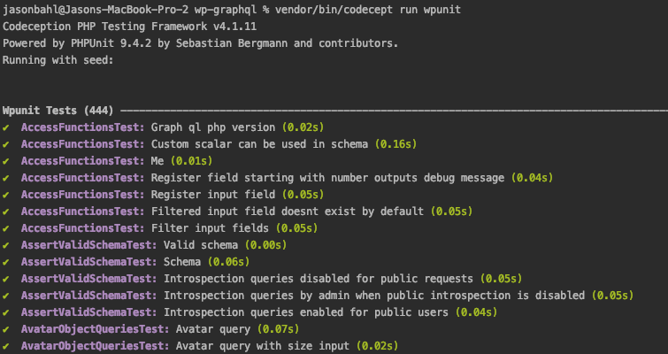

This document will be most useful for developers that want to contribute to WPGraphQL and want to run tests locally.

In order to run tests, you must [clone the plugin from GitHub](https://github.com/wp-graphql/wp-graphql). Downloading from Composer or Packagist will not include the dev dependencies needed to run tests.

## Testing with `wp-env`

The easiest way to run tests is to use the included `wp-env` setup. This uses Docker to create a local WordPress environment with WPGraphQL installed as a plugin.

### Prerequesites

- Node.js 20.x (LTS) and npm >= 8 (NVM recommended)
- Docker
- Git

### Installation

1. Clone the repository:

   ```shell
   git clone git@github.com:wp-graphql/wp-graphql.git
   ```

2. Change into the project folder and install the NPM dependencies:

   ```shell
   ## If you're using nvm, make sure to use the correct Node.js version:
   nvm install && nvm use

   ## Then install the NPM dependencies:
   npm install
   ```

3. Start the `wp-env` environment to download and set up the Docker containers for WordPress:

   (If you're not using `wp-env` you can skip this step.)

   ```shell
   npm run wp-env start
   ```

   When finished, the WordPress development site will be available at http://localhost:8888 and the WP Admin Dashboard will be available at http://localhost:8888/wp-admin/. You can log in to the admin using the username `admin` and password `password`.

   However, before the plugin will work, you need to install the Composer dependencies and build the plugin.

4. Install the Composer dependencies and build the plugin:

   ```shell
   ## To install Composer dependencies inside the Docker container:
   npm run wp-env:cli -- composer install

### Custom Test Environments

If you need to customize the `wp-env` environment (for example to add additional plugins, or change PHP versions), you can do so by creating a `.wp-env.override.json` file in the root of the plugin.

For example:

```jsonc
{
  "core": "WordPress/WordPress#6.5", # To use a specific version of WordPress
  "phpVersion": "8.1", # To use a specific PHP version
}
```

For more information on using and overriding `wp-env` settings, see the [`@wordpress/env` package documentation](https://www.npmjs.com/package/@wordpress/env).

### Running the Tests

To access Codeception and run tests inside the `wp-env` Docker container, use the following command:

```shell
npm run test:codecept -- <suites> [options]

## With coverage
npm run test:codecept:coverage -- <suites> [options]
```

This is functionally the same as running `vendor/bin/codecept` directly, but it runs the command inside the Docker container where WordPress and WPGraphQL are installed.

For example:

```shell
## WPUnit tests
npm run test:codecept -- run wpunit
## with coverage
npm run test:codecept:coverage -- run wpunit

## Just a single test file
npm run test:codecept -- run tests/wpunit/AccessFunctionsTest.php

## Or a single test within a file
npm run test:codecept -- run tests/wpunit/AccessFunctionsTest.php:testCustomScalarCanBeUsedInSchema

## Functional tests with verbose debugging
npm run test:codecept -- functional -vvv

## To clean up old test outputs
npm run test:codecept:clean
```

## Testing Locally with Codeception

On some machines, running tests directly with Codeception may be faster than using Docker. If for performance or any other reasons you want to run tests directly on your machine, you can follow the instructions below.

### Pre-requisites

- Command line access
- PHP 7.4+ installed and running on your machine
- MySQL installed and running on your machine
- Composer

### Install WordPress Test Environment

WPGraphQL includes a script to install a local test environment, using the environment variables you provide in a `.env` file.

1. Copy the `.env.dist` file to a new file named `.env` in the root of the WPGraphQL plugin, and update variables to match your local database setup.

2. Run the test environment setup script:

   ```shell
   composer install-test-env
   ```

   The script will download and install a local WordPress installation in the provided directory, set up the database, and install WPGraphQL.
```

### Configure Test Suites

Within the `/tests/` directory of WPGraphQL are the Codeception `.yml` configuration files.

To run tests locally, copy the `.yml` file for the test suite you want to run and rename it without the `.dist`.

For example:

- copy: `wpunit.suite.dist.yml` to `wpunit.suite.yml`

Then update the details of the `.yml` file to point to your local database by changing the fields:

- dbName
- dbHost
- dbUser
- dbPassword

The other fields should be able to remain the same, but update as necessary.

### Install Composer Dependencies

Run the following script from the root of the WPGraphQL plugin:

```shell
composer install
```

This installs the dev dependencies needed to run the tests.

### Run the tests

To run the tests, run the following commands (you can use `control + c` to exit):

```shell
vendor/bin/codecept run wpunit
```

This will run _all_ of the tests of the `wpunit` suite.

To run an individual test file, you can specify the file like so:

```shell
vendor/bin/codecept run tests/wpunit/AccessFunctionsTest.php
```

Or you can specify one specific test like so:

```shell
vendor/bin/codecept run tests/wpunit/AccessFunctionsTest.php:testCustomScalarCanBeUsedInSchema
```

The tests should start running and you should see something similar to the following:


