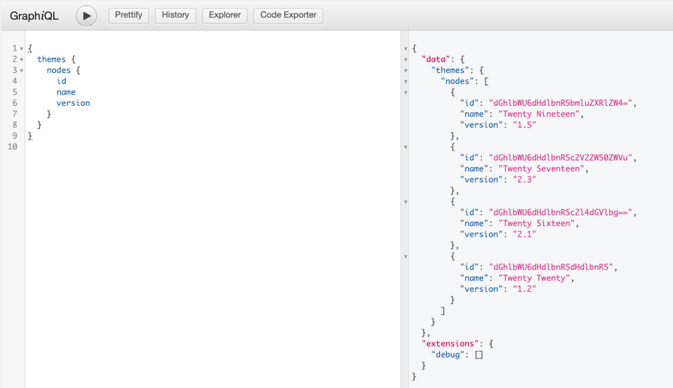
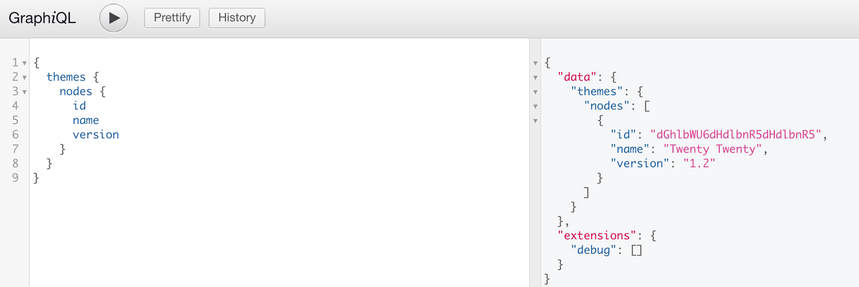

This page will be most useful for users what are familiar with [GraphQL Concepts](/docs/intro-to-graphql/) and understand the basics of [writing GraphQL Queries](/docs/intro-to-graphql/#queries-and-mutation).

## Querying Themes

WPGraphQL provides support for querying Themes in various ways.

### List of Themes

Below is an example of querying a list of Themes.

```graphql
{
  themes {
    nodes {
      id
      name
      version
    }
  }
}
```

#### Query from Authenticated User

Authenticated users with the "edit\_themes" capability can query a list of Themes and see all available themes for the site.



#### Query from Public User

A public user or a user without "edit\_themes" capability can make the same query and only the active theme will be returned.

The active theme is considered a public entity in WordPress and can be publicly accessed and WPGraphQL respects this access control right.



## Content Templates

WPGraphQL exposes page templates assigned to content through the `template` field on content types that implement the `NodeWithTemplate` interface.

### Querying Templates

```graphql
{
  pages {
    nodes {
      title
      template {
        templateName
      }
    }
  }
}
```

For a page using the default template, this returns:

```json
{
  "data": {
    "pages": {
      "nodes": [
        {
          "title": "Sample Page",
          "template": {
            "templateName": "Default"
          }
        }
      ]
    }
  }
}
```

### Classic Themes vs Block Themes

WordPress supports two types of themes, and template behavior differs between them:

#### Classic Themes (e.g., Twenty Twenty-One)

Classic themes use PHP template files placed in the theme directory. These templates:

- Are PHP files with a `Template Name` header comment
- Are recognized by WordPress via `get_page_templates()`
- Appear in WPGraphQL as distinct `ContentTemplate` types

**Example PHP template file (`my-template.php`):**

```php
<?php
/**
 * Template Name: My Custom Template
 */
```

When this template is assigned to a page, WPGraphQL exposes it:

```graphql
{
  page(id: "example-page", idType: URI) {
    template {
      __typename      # Returns "MyCustomTemplate"
      templateName    # Returns "My Custom Template"
    }
  }
}
```

#### Block Themes (e.g., Twenty Twenty-Five)

Block themes (also called Full Site Editing or FSE themes) use a different template system:

- Templates are HTML files with block markup in the `templates/` directory
- Template registration is handled via `theme.json`
- PHP template files in the theme root are **not recognized** as page templates

**Important:** If you're using a block theme and place a PHP template file in your theme directory, WordPress will not recognize it as a page template. This is WordPress core behavior, not a WPGraphQL limitation.

### Template Type Names

WPGraphQL generates GraphQL type names from template names by:

1. Removing special characters
2. Converting to PascalCase
3. Prefixing with `Template_` if the name starts with a number or contains only non-ASCII characters

| Template Name | GraphQL Type |
|---------------|--------------|
| Default | `DefaultTemplate` |
| My Custom Template | `MyCustomTemplate` |
| Full Width | `FullWidthTemplate` |
| 2 Column Layout | `Template_2ColumnLayout` |

### Introspecting Available Templates

You can query the schema to see all registered template types:

```graphql
{
  __type(name: "ContentTemplate") {
    possibleTypes {
      name
    }
  }
}
```

## Mutations

> WPGraphQL does not currently support mutations for themes.
