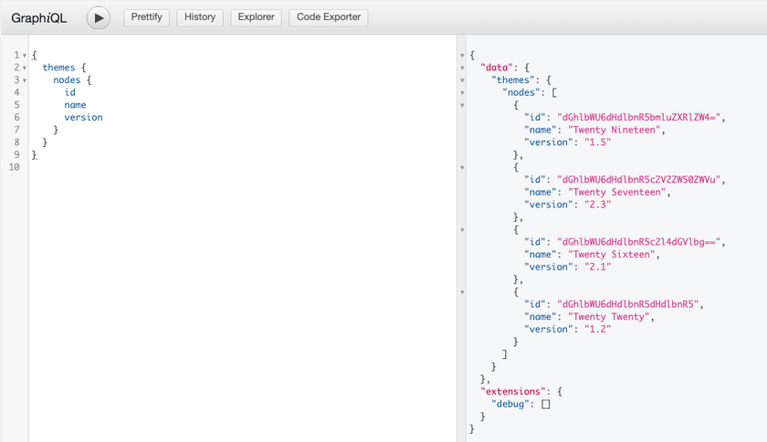
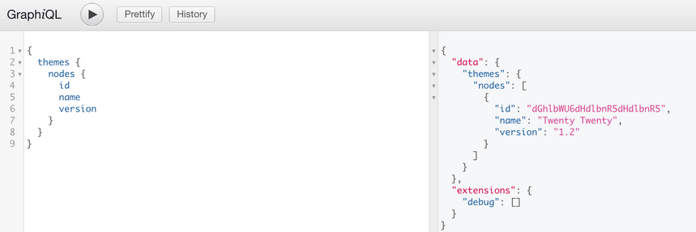

This page will be most useful for users what are familiar with [GraphQL Concepts](/docs/intro-to-graphql/) and understand the basics of [writing GraphQL Queries](/docs/intro-to-graphql/#queries-and-mutation).

## Querying Themes

WPGraphQL provides support for querying Themes in various ways.

### List of Themes

Below is an example of querying a list of Themes.

```graphql
{
  themes {
    nodes {
      id
      name
      version
    }
  }
}
```

**Query from Authenticated User**

Authenticated users with the "edit_themes" capability can query a list of Themes and see all available themes for the site.



**Query from Public User**

A public user or a user without "edit_themes" capability can make the same query and only the active theme will be returned.

The active theme is considered a public entity in WordPress and can be publicly accessed and WPGraphQL respects this access control right.



## Mutations

> WPGraphQL does not currently support mutations for themes.
