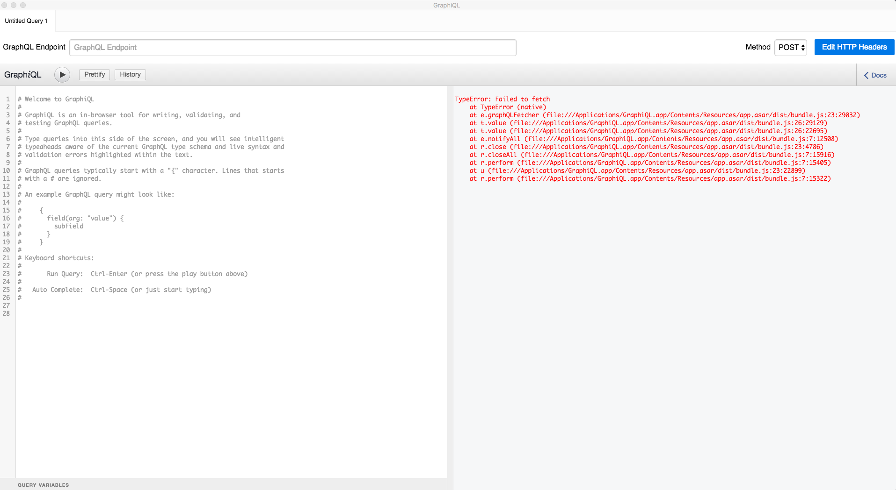
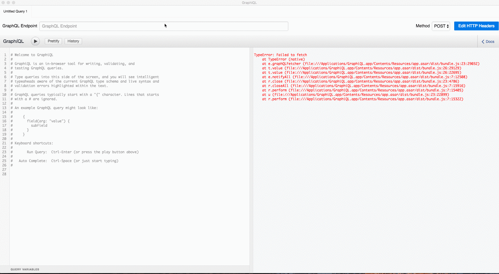
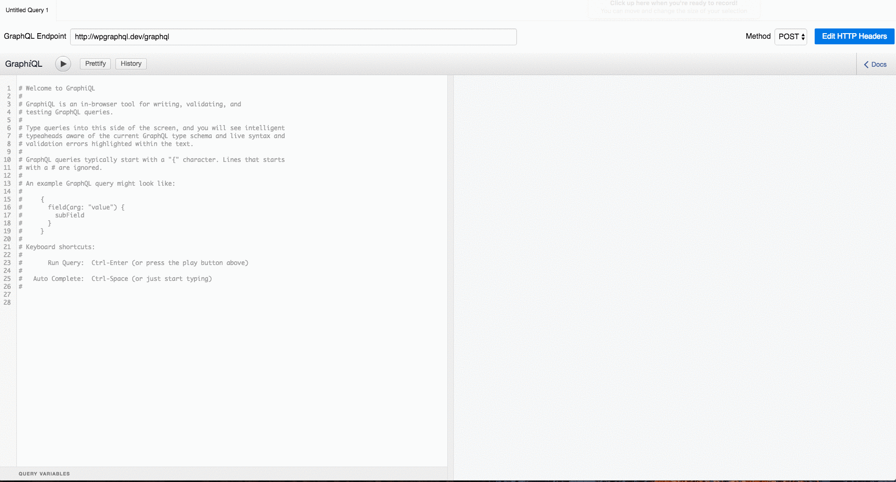
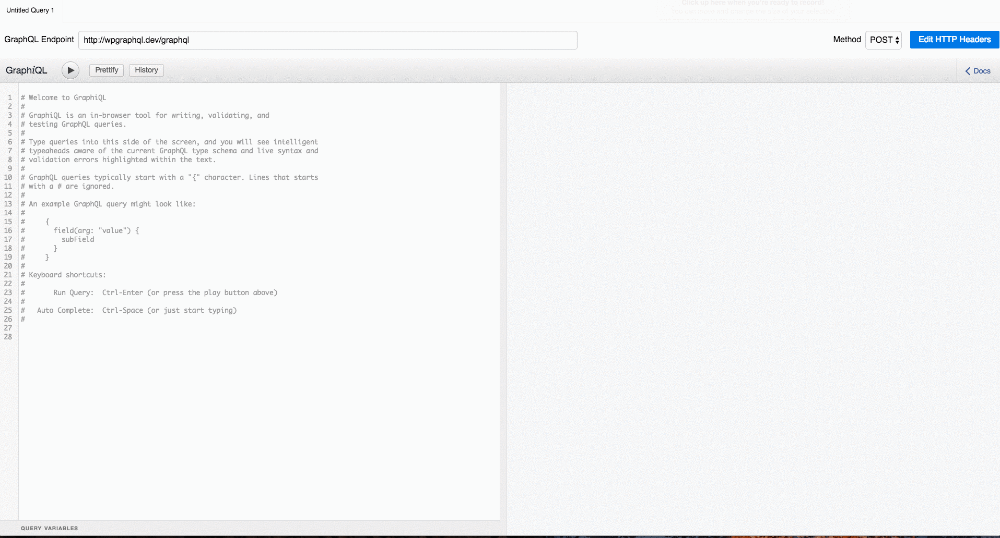
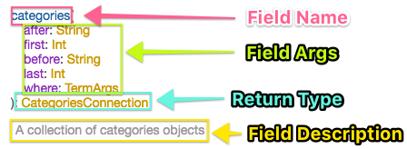
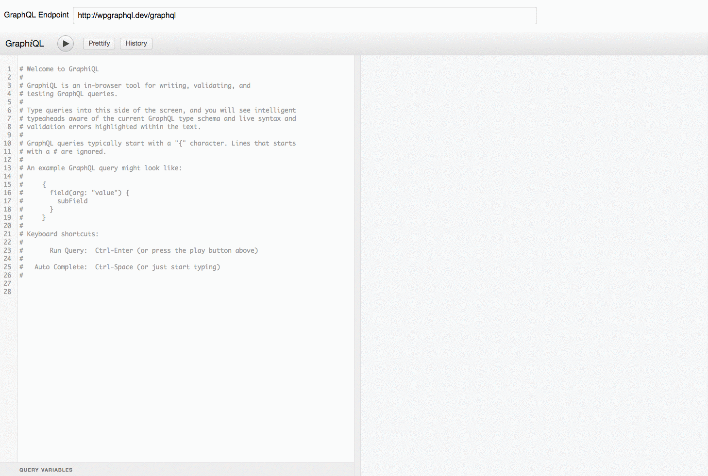

# Exploring WPGraphQL

In this Tutorial, we will be exploring GraphQL using GraphiQL.

## GraphiQL

[GraphiQL](https://github.com/graphql/graphiql) is the de-facto tool for interacting with a GraphQL Schema. It's an open source graphical interactive in-browser GraphQL IDE. 

It allows users to explore a GraphQL Schema's documentation, and execute GraphQL queries and mutations and see the response in real time.

GraphiQL itself is a React component, so to use it, you need to either implement the React component, or use something that implements it already.

## GraphiQL Tools / Apps
Below is a (non-comprehensive) list of tools that implement GraphiQL that you can use to explore and experiment with your WPGraphQL API.

* **[GraphiQL Desktop App](https://github.com/skevy/graphiql-app):** GraphiQL as an Electron desktop app
* **[WPGraphiQL](https://github.com/wp-graphql/wp-graphiql):** WordPress plugin that adds GraphiQL to the WordPress admin dashboard 
* **[GraphQL Playground](https://github.com/graphcool/graphql-playground/releases):** Desktop App from the folks at Graph.Cool.
* **[GraphQL IDE](https://github.com/andev-software/graphql-ide):** Desktop App that supports multiple endpoint configurations
* **[Altair](https://chrome.google.com/webstore/detail/altair-graphql-client/flnheeellpciglgpaodhkhmapeljopja?hl=en):** Chrome Extension
* **[ChromiQL](https://chrome.google.com/webstore/detail/chromeiql/fkkiamalmpiidkljmicmjfbieiclmeij?hl=en):** Chrome Extension

!!! info "This Guide References the GraphiQL Desktop App"
    Throughout this guide, for screenshots, etc we use [GraphiQL Desktop App](https://github.com/skevy/graphiql-app). Any specific info on using GraphiQL will be referring to that specific App, but should be generally applicable to any of them.
    Feel free to use the same one we use, explore the others, or even build your own!

## Configure GraphiQL

Once you have a WordPress install setup with the [WPGraphQL plugin installed and activated](../install-and-activate.md) 
and the GraphiQL Desktop App (or other GraphiQL tool) [installed](https://github.com/skevy/graphiql-app#installation), 
the first thing you will want to do is point it at your WPGraphQL endpoint.

When the app is first opened, you may notice a blank right pane, or an error showing that GraphiQL failed to fetch. 



This is because GraphiQL isn't pointed to a valid GraphQL endpoint.

### Point it at your endpoint

Toward the top of the App is a "GraphQL Endpoint" text field where you can paste in a URL to your WPGraphQL endpoint.

I have a local WordPress install running at `wpgraphql.dev`, so my endpoint is `http://wpgraphql.dev/graphql`

When I paste in my WPGraphQL url, the error goes away. This is because the App went and fetched my GraphQL schema and populated the GraphQL Documentation pane.



## Explore your Schema Docs

At this point, GraphiQL has fetched your WPGraphQL Schema and generated documentation that you can browse. 

At the top left of GraphiQL, you should see a "< Docs" link.

Clicking that expands the Documentation panel.



!!! note
    You can adjust the width of the Documentation panel to your liking by selecting the left border of the panel and dragging and dropping.
    
From the Documentation panel, you can see that at the root of the WPGraphQL Schema is `query: RootQuery` and `mutation: RootMutation`. 

These are the root entry points to the WordPress Application Data Graph.

You can click into either to explore the capabilities nested below. 

For example, clicking `RooyQuery` displays the fields that are available as part of the root. You can scroll through the list to see what's available. what the description is, what Type will be returned, and what arguments the field accepts.



When looking at the GraphQL Docs, it might be overwhelming trying to understand what everything is that you're seeing. 

Here's an annotated breakdown of what is displayed in the Documentation panel as you explore the docs.



### Search the Docs

In addition to clicking to explore the GraphQL Schema Docs, you can also search the documentation. Let's say you wanted to 
know how to use GraphQL to query for pages. You could search "page" in the Search field in the Documentation pane, and 
you would see all results in the Schema where "page" was mentioned. This can help understand all the entry points where "pages"
can be queried. 


We can see here that there is a "pages" field on the RootQuery. Next, Let's try to query for pages!

## Write Some Queries

We know we can query "pages" on the RootQuery, because we saw it in the docs, but how do we do that?

Well, writing GraphQL Queries in GraphiQL is super intuitive. As you start typing, GraphiQL suggests fields that you might
be looking for and will complete them for you if you press Tab on the highlighted suggestion.

Let's write a query to get a list of pages. 

GraphiQL has some helper text explaining how to write queries. We can select it all and remove it.

Then, since `pages` is a RootQuery field, we can simply start our query with an opening `{` bracket, then start typing `page` and we will see the autoselect pop-up.

We can arrow-down to select `pages`, then press `tab` and it will autocomplete. 

Then we need to make a Selection on the `pages` field. We can use the Documentation explorer to see what's available to query, or
we can just start typing to see what the Typeahead suggest tells us.

Once ready, click the Play button to execute the query.

Below, you can see using the Typeahead feature to help build a query and see what fields are available. You can also see how GraphiQL shows helpers 
when the syntax is broken by highlighting things red. 



### Queries to try

Here are some queries to try. Since GraphQL queries are static strings, you can simply copy these and paste them into your GraphiQL explorer.

#### Get a List of Posts

```graphql
{
  posts {
    edges {
      node {
        id
        title
        date
        content
      }
    }
  }
}
```

#### Get a List of Posts with Author info

This is a pretty neat example of the power of GraphQL. Posts and Users are stored in different tables in WordPress and 
getting Post Data and User data typically requires multiple queries. 

You would typically first use `WP_Query` to get a list of posts, then while looping through the posts, you would get the author data by querying for that.

GraphQL drastically simplifies that, allowing you to just declare what fields you want from each post, and what fields you want from each Post's author. And, 
behind the scenes, WPGraphQL is doing some cool stuff to optimize the queries to make sure the fewest possible queries are run
to get the needed data. [Learn More](../reference/deferred-resolvers.md)

```graphql
{
  posts {
    edges {
      node {
        id
        title
        date
        author {
          id
          name
          username
          description
        }
      }
    }
  }
}
```

#### Get a List of Users

```graphql
{
  users {
    edges {
      node {
        id
        name
        username
      }
    }
  }
}
```

#### Get a List of Users with their Recent Posts

We saw earlier how we can query for Author data on posts, but we can also get to posts from the user as well.

Here we are going to query for a list of users, then ask for each users posts, and for each post ask for the author. 

That makes my head spin, but it's really not _that_ uncommon of a need.

Try executing this and see what you get. 

```graphql
{
  users {
    edges {
      node {
        id
        name
        username
        posts {
          edges {
            node {
              id
              title
              date
              author {
                id
                name
                username
                description
              }
            }
          }
        }
      }
    }
  }
}
```
You should see a list of users, and on each user you should see a list of posts, if that user has any, or empty post.edges if they don't. Then the posts should have an author field with the same author data as the user node.

Pretty neat!

## Exploring Aliases

GraphQL has a subtle but very powerful feature called Aliasing. You can set aliases on fields as you query, and the fields will
be returned to you using the specified Alias. 

This really puts a lot of power in the clients hands.

Lets try a simple query with Aliases.

```graphql
{
  recentPosts: posts {
    items: edges {
      post: node {
        globalId: id
        id: postId
        articleTitle: title
        articleDate: date
      }
    }
  }
}
```

Now run that query and see how the fields are returned with the Aliases set as the key in the response. Wow!

## Exploring Variables

Variables are a very powerful feature of GraphQL.  

!!! warning "Coming Soon"
    Until we have time to write more info on this, you can learn more [here](http://graphql.org/learn/queries/#variables)


## Keep Exploring

At this point, you should be familiar enough with GraphiQL to continue exploring what kind of data you can access.

## Debugging Requests

!!! info "Disclaimer" 
    This section applies particularly to the [GraphiQL Desktop App](https://github.com/skevy/graphiql-app) as it's an Electron app.

Since the GraphiQL Desktop App is an Electron App, it's built on Chromium, which means we can open up Chrome developer tools `Command + Option + I`

Then in Developer tools, navigate to the `Network` tab.

With the `Network` tab open, execute a GraphQL Query.

You can see the requests that are sent and the payloads that are returned. You can explore the headers and the formatting that GraphiQL uses to send requests, etc.

Using the Network tab can be helpful for debugging when something goes wrong and no response is rendered in the GraphiQL response pane.

!!! warning "More info coming soon"
    This section needs more info...