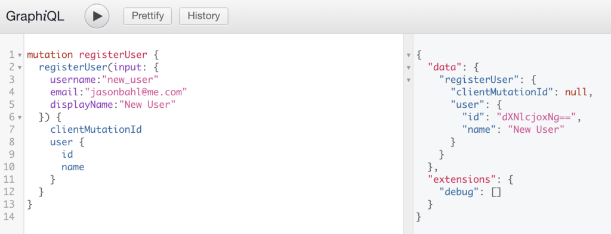

WPGraphQL provides support for querying Users in various ways.

This page will be most useful for users that are familiar with [GraphQL Concepts](/docs/intro-to-graphql/) and understand the basics of [writing GraphQL Queries](/docs/intro-to-graphql/#queries-and-mutation).

## Querying Users

### List of Users

Below is an example of querying a list of users. In this example, we ask for 'users' and then on the 'users' field we ask for 'nodes', then the 'id' and 'name' of each user node.

```graphql
{
  users {
    nodes {
      id
      name
    }
  }
}
```


### Single User by Global ID

Below is an example of querying a single User by their global ID.

```graphql
{
  user(id:\"dXNlcjo4\") {
    id
    name
  }
}
```


### Sensitive Data

WPGraphQL follows WordPress access control rights, and only exposes data publicly that WordPress already exposes publicly. Users that have published posts are considered public entities in WordPress. Users that have not published posts are considered private and will not be included in public GraphQL requests, but will be included in GraphQL requests made by authenticated users with proper capabilities to see the users.

Fields, such as user email addresses, are also protected by WPGraphQL and only exposed to authenticated requests by users with proper capabilities to see the data.

[Read more about WPGraphQL Security](/docs/security/).

## User Mutations

WPGraphQL provides mutations (the ability to change data through GraphQL) for Users.

WPGraphQL adheres to core access control rights, ensuring data can only be created, updated or deleted by users that have proper permission to do so. Learn more in our [WPGraphQL Security guide](/docs/security/).

### Register User

Below is an example Mutation to register a new user. This mutation is intended to be used by public users on sites that have user registration turned on.

```graphql
mutation registerUser {
  registerUser(input: {
    username:\"new_user\"
  }) {
    clientMutationId
    user {
      name
      slug
    }
  }
}
```

#### Unsuccessful Mutation

If user registration is *turned off* for the site (under "Settings > General" in the WordPress dashboard) then no user will be registered and an error will be returned with the mutation.


#### Successful Mutation

If user registration is *turned on* for the site (under "Settings > General" in the WordPress dashboard) then a user will be registered and the fields requested in response will be returned.



This will also kick off some other actions in WordPress, such as sending the new user the new user email.


### Create User

The createUser mutation is intended to be used by users that have proper capabilities to create new users. This mutation will only execute if the user making the request is authenticated and has proper capabilities to create new users.

Below is an example of a mutation to create a user. A username and email address must be provided.

```graphql
mutation {
  createUser(input: {
    \"username\": \"anotherNewUser\",
    \"email\": \"another_new_user@example.com\"
  }) {
    user {
      id
      name
    }
  }
}
```

#### Unsuccessful Mutation

If the user making the request is not authenticated or does not have proper capabilities to create a user, no user will be created in WordPress and an error will be returned.


#### Successful Mutation

If the user making the request is authenticated and has proper capabilities to create a new user, a new user will be created in WordPress, a new user email will be sent to that new user, and the data asked for in response to the mutation will be returned.


### Update User

Below is an example of a GraphQL Mutation to update a user.

The users ID must be provided as input on the mutation.

#### Successful Mutation

If the user making the request is authenticated and has proper capabilities to update the user, the user's data will be updated in WordPress and the specified fields will be returned in response.


#### Unsuccessful Mutation

If the user making the request is not authenticated or does not have proper capabilities to update the user, no data will be changed in WordPress and an error will be returned.


### Delete User

Below is an example of a GraphQL Mutation to delete a user. In order to delete a user, the ID of the user must be known and provided to the input.

```graphql
mutation {
  deleteUser(input: {
    id: \"dXNlcjoxNw==\"
  }) {
    deletedId
    user {
      id
      name
    }
  }
}
```

#### Successful Mutation

If the user making the request to delete a user is authenticated and has proper capabilities to delete the user, the user will be deleted and the fields requested will be returned.


#### Unsuccessful Mutation

If the user making the request to delete a user is not authenticated or does not have proper capabilities to delete the user, the user will not be deleted and an error will be returned.


### Send Password Reset Email

When a user needs to reset their password, they will need to have a "Reset Password" email sent.

The 'sendPasswordResetEmail' mutation can be used for this.

Below is an example of using this mutation:

```graphql
mutation {
  sendPasswordResetEmail(input: {
    username: \"your_username\"
  }) {
    user {
      id
      email
    }
  }
}
```

This mutation could be used to create an interface like the Reset Password screen in WordPress.


### Reset User Password

When a user requests a Reset User Password email, the email that is sent contains a unique key that grants the user access to reset the password.

When using a decoupled front-end, when a user clicks the link in the email they will be taken to the decoupled front-end and the key needs to be be passed from the decoupled front-end back to WordPress to process the reset.

This mutation can be used for this case, to provide users with a reset password form.


Below is an example of this Mutation.

```graphql
mutation RESET_USER_PASSWORD {
  resetUserPassword(input: {
    key: \"theKeyFromTheEmail\",
    login: \"username\",
    password: \"password\"
  }) {
    user {
      id
    }
  }
}
```

#### Successful Mutation

If the key and username combo are valid, the provided password will be used to reset the users password.

#### Unsuccessful Mutation

If the key or username is invalid or the key doesn't match the username, the password will not be reset and an error will be returned.


