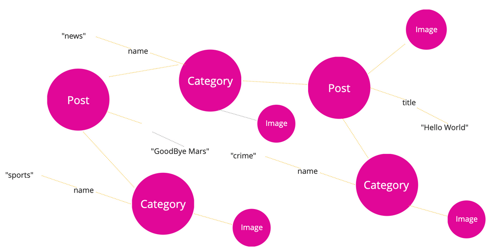

This is an advanced guide that will be most useful for developers with experience with PHP and MySQL.

## Overview

WordPress can do a lot of things with [Custom Post Types](/docs/custom-post-types/) and [Custom Taxonomies](/docs/custom-taxonomies/), but sometimes you need to use Custom Database Tables.

In this guide, we will look into how to use data from Custom Database Tables with WPGraphQL.

After reading this guide, you should be familiar with how WPGraphQL handles data and have a better understanding of WPGraphQL APIs to [register object types](/functions/register_graphql_object_type/), [register connections](/functions/register_graphql_connection/), create custom Data Loaders and custom Connection Resolvers.

## Thinking in Graphs

WPGraphQL treats WordPress data like an application data graph. What that means, is that each post, page, term, comment, user or other object that can be uniquely identified is considered a "Node".

Each Node can have properties. For example, a Post can have a Title, such as "Hello World"

