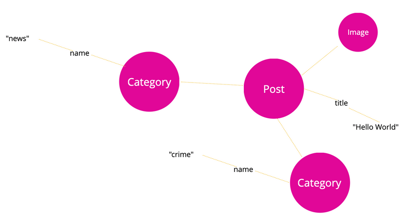
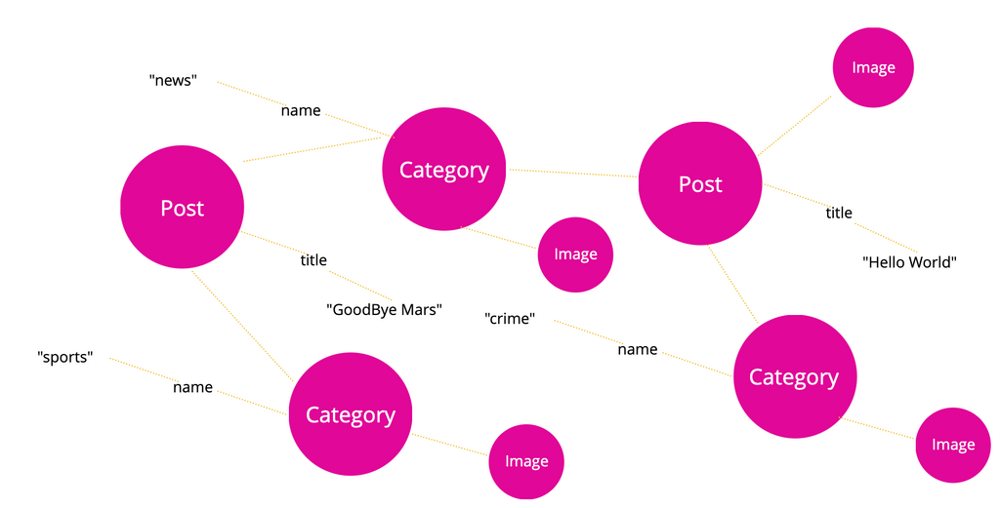

WPGraphQL treats WordPress data like an [application data graph](https://en.wikipedia.org/wiki/Graph_theory).

What this means, is that every uniquely identifiable object is considered a "node". 

Posts, Pages, Comments, Terms, Users are all considered nodes. And Nodes can have fields that resolve to concrete data. 

For example a "Post" node might have a "title" that resolves to the value "Hello World". 


The post might have connections to other Nodes in the Graph. For example, it might have a connection to a Featured Image node and some Category Term nodes.


And each Category node might have fields, such as a name. 



And those category nodes might have other connections to other nodes, with connections to other nodes, and so on. 



An application data graph doesn't have a beginning or an end. It has nodes with fields, and WPGraphQL provides entry points to pluck nodes out of the Graph using GraphQL Queries. 

Take the following query, for example.

```graphql
{
  post(id: \"cG9zdDo2NTY4\") {
    id
    title
    categories {
      nodes {
        name
      }
    }
  } 
}
```

This Query enters the Graph at a specific node, asks for the `id` and `title` of that node, and the `categories` associated with it and their `name`.

The Query would return results like the following:

```graphql
{
  data: {
    post: {
      id: \"cG9zdDo2NTY4\",
      title: \"Hello World\"
      categories: {
        nodes: [
          {
            name: \"news\"
          },
          {
            name: \"crime\"
          }
        ]
      }
    }
  }
}
```


Which, visually represented would look like the following, where the Post is returned, the 2 connected categories, and their names, but the request stops there, as it did not ask to traverse any deeper connections to the categories, or other connections of the Post, such as the connected Image.
