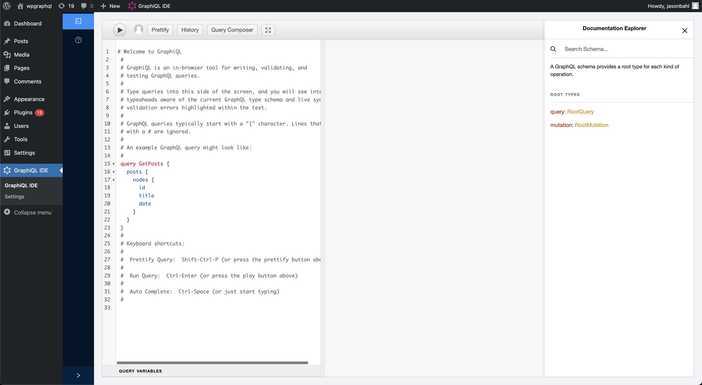
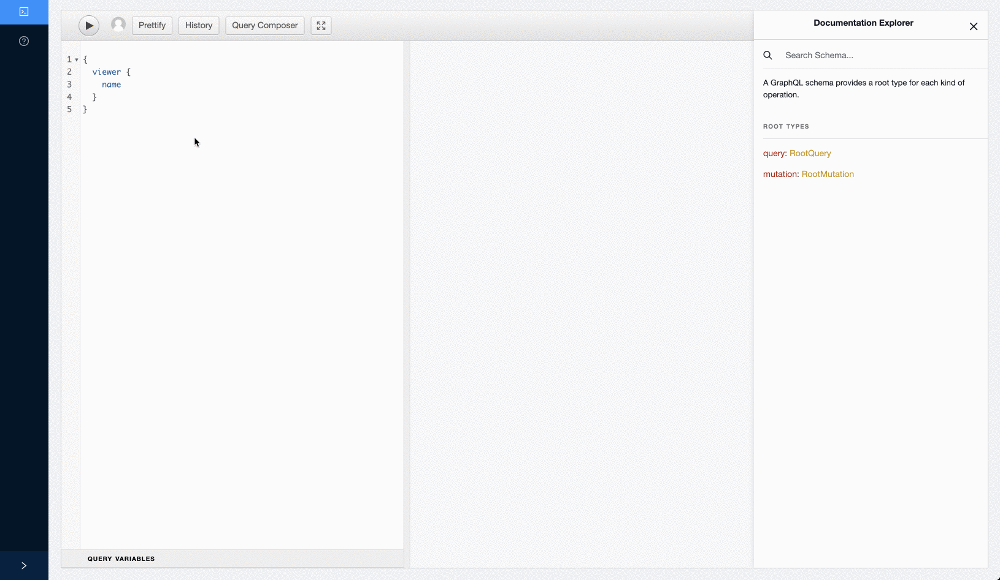
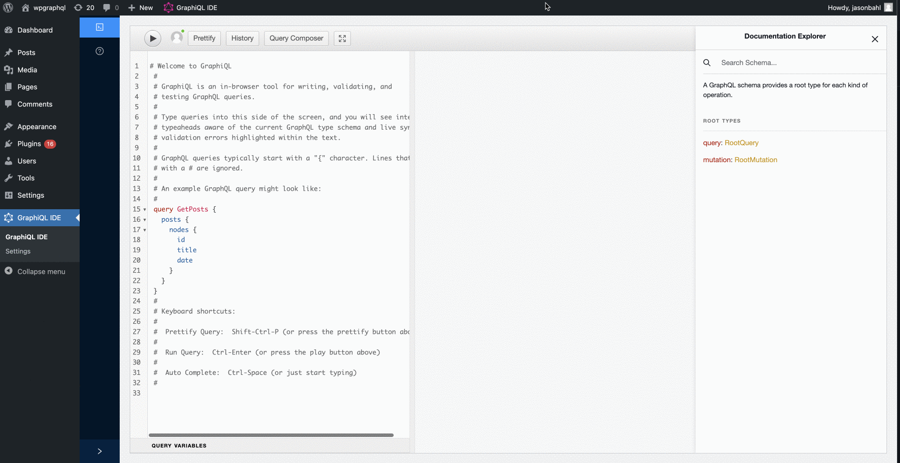
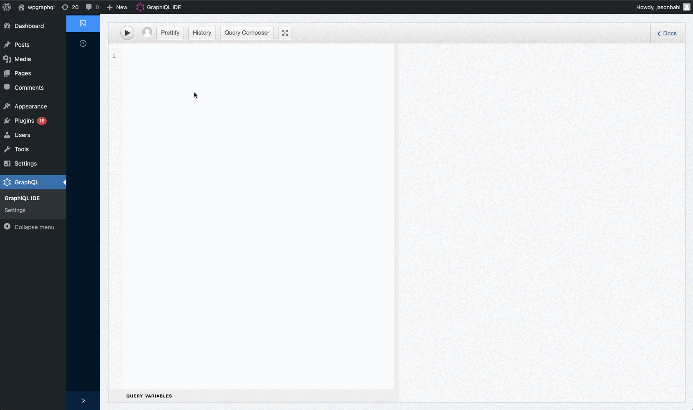

In this document, you will find information about developer APIs available to extend and customize
WPGraphiQL.

When the word "WPGraphiQL" is referenced, it is referring to the tooling provided by WPGraphQL in
the WordPress dashboard for interacting with the WPGraphQL Schema.

Central to this tooling, is the [GraphiQL IDE](https://github.com/graphql/graphiql) (pronounced
Graphical).

WPGraphiQL brings the GraphiQL IDE into the WordPress dashboard, providing users with a Graphical
User Interface to interact with their WPGraphQL Schema and test operations.

WPGraphiQL does not only bring the GraphiQL IDE into the WordPress dashboard, but it also provides
additional tooling around GraphiQL, and provides extension APIs for WordPress plugin developers to customize
the experience.

## GraphiQL Enhancements

Below are some of the enhancements to the GraphiQL IDE that are provided by WPGraphiQL.

### Toggle Between Public and Authenticated Requests

When using WPGraphiQL, you can toggle between executing the request as the authenticated user in the
WordPress dashboard, or as a public, non-authenticated user.

Not all data that *can* be queried will be returned. Data such as draft posts, previews, etc are often
restricted to users that are authenticated (logged in) and have authorization (proper capabilities) to
have the data returned to them.

This feature can help identify when certain data in the Graph is considered public, private or
somewhere in between (i.e. users with certain capabilities might be able to see something,
but other users might not).

Below is a GIF screen recording showing this feature in action.

In the screen recording we see a GraphQL query for the root "viewer" field being made and a `null` value is
returned. A public user will get a `null` response for data they cannot access.

Then, the button to "switch to executing as an authenticated user" is clicked, and the query is
executed again, showing the viewer data being returned instead of a `null` response.

### Full Screen Mode

WPGraphiQL provides a button that allows you to interact with the GraphiQL IDE while covering the
full browser window.

This arguably should be called "full-browser-window" than "full-screen" mode. Please forgive us.
Naming is hard.

> **NOTE:** This feature was built using the extension APIs outlined below!\*

Below is a GIF showing this feature in action.

When the GraphiQL IDE is loaded, we see the WordPress admin bar, the WordPress dashboard menu, etc.

Clicking the "Fullscreen Toggle" button in the GraphiQL IDE Toolbar changes the IDE to cover the full
browser window. Clicking the button toggles the IDE back to it's nested position within the app.

### Query Composer

WPGraphiQL provides a "Query Composer" feature that allows users to compose GraphQL operations using
a checkbox-based UI.

This is a rewrite of the [GraphiQL Explorer](https://github.com/OneGraph/graphiql-explorer) from
[Sean Grove](https://github.com/sgrove).

Much of the code is the same as the original GraphiQL Explorer, but some refactoring was done to
provide extension APIs for 3rd party plugin developers to hook into and modify the experience.

Below is a GIF showing this feature in action:

In the screenshot, we see the button labeled "Query Composer" being clicked. When the button is
clicked, a panel opens on the left with a list of fields. When the fields are clicked, they are added
to the GraphQL Document. Then the document is executed by clicking the "play" button.

This feature allows users to explore the GraphQL Schema in a visual way and compose Queries (and Mutations 😀).

## Extending WPGraphiQL

Are you a WordPress plugin developer with ideas to make the GraphiQL experience better or customized
for your users experience?

Good news! WPGraphiQL was build with developer APIs for extending the user interface. If you're interested

in providing custom functionality, read the [Customizing WPGraphiQL Docs](https://www.wpgraphql.com/docs/customizing-wpgraphiql)
