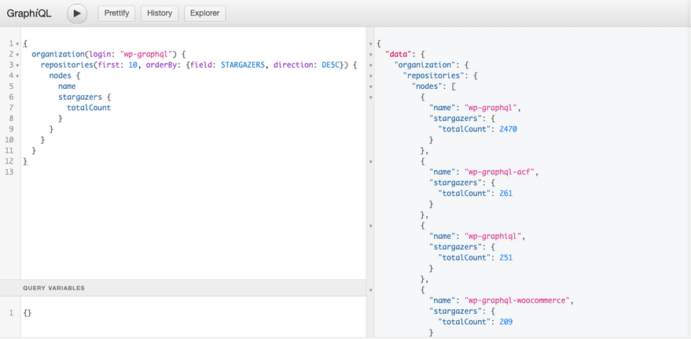
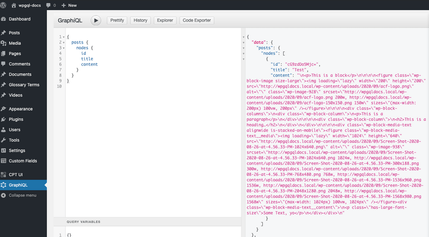
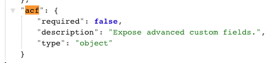
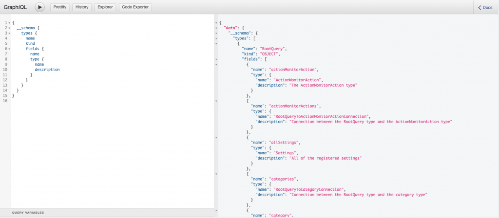
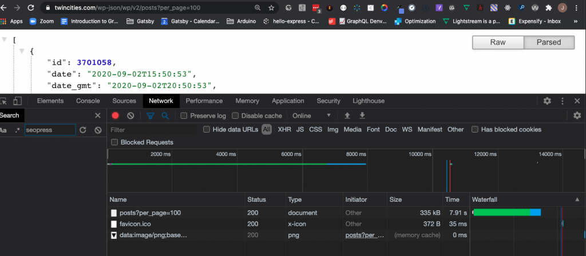
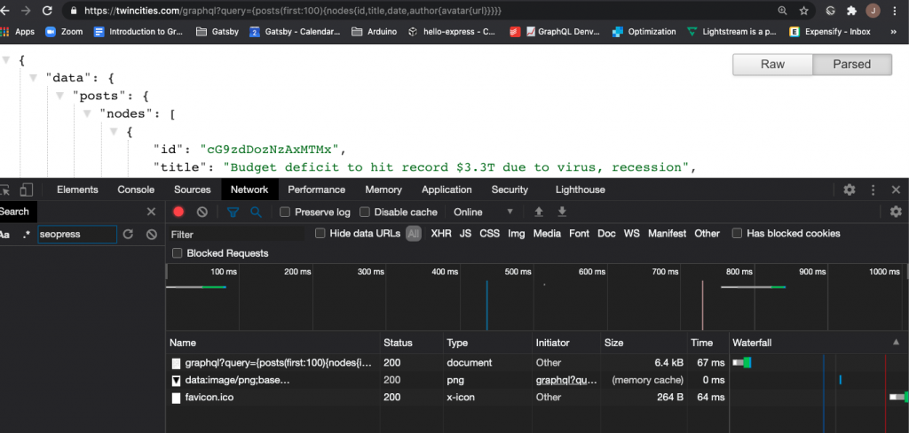
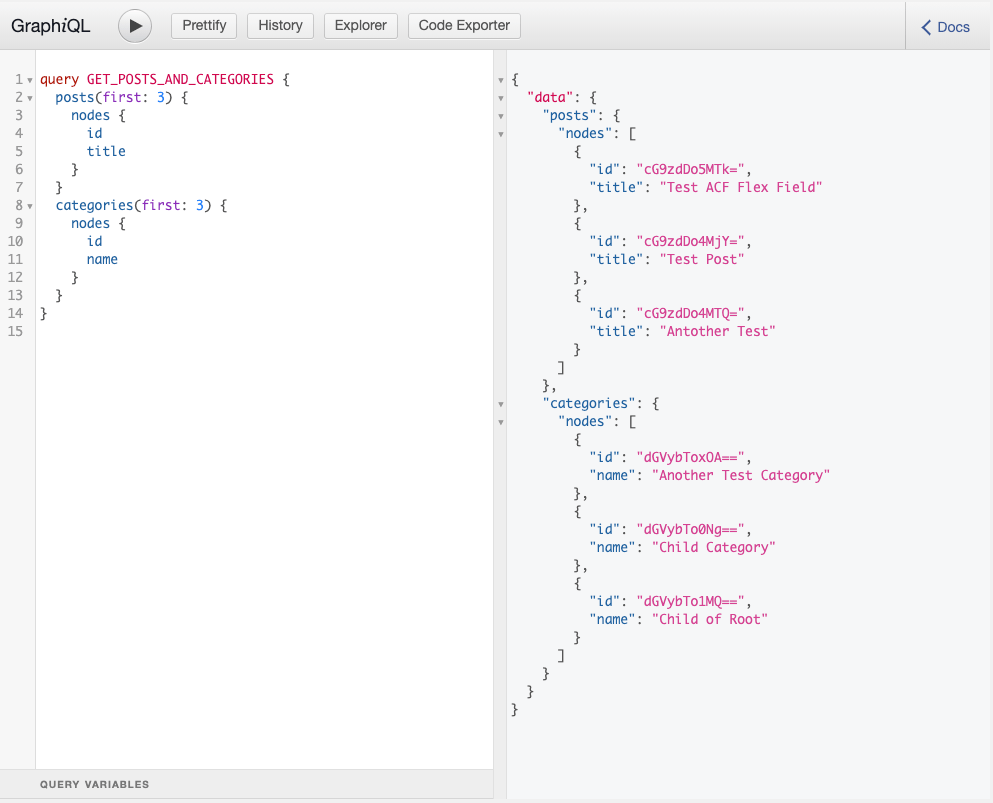
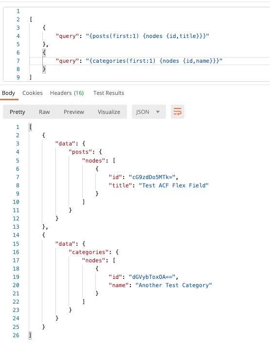

This guide should be useful to developers or organizations looking to compare and contrast features and benefits of the WordPress REST API and WPGraphQL. This guide will be most useful if you have a general understanding of what the WP REST API is and how it works. If you want to learn more about the WP REST API, check out the [WP REST API Handbook](https://developer.wordpress.org/rest-api/).

## Benefits of the GraphQL Specification

RESTful APIs, including the WP REST API have no official specification. REST is a set of conventions, but there's no official way to implement a RESTful API. What that means is that the way the WP REST API behaves is different than how the Github REST API behaves, or Google's REST API, or just about any other RESTful API on the web.

This means that as a developer interacting with an API, each REST API you interact with requires you to learn entire new paradigms, use different tooling, etc.

GraphQL on the other hand, is a [specification](https://spec.graphql.org/June2018/) for building APIs that all behave the same. This means that interacting with the [Github GraphQL API](https://developer.github.com/v4/explorer/), [Yelp's GraphQL API](https://www.yelp.com/developers/graphql/guides/intro) or GraphQL for WordPress via WPGraphQL, or any other GraphQL API that follows the specification, things work the same.

### Improved Tooling

A benefit of the GraphQL specification is that you can use tools such as [GraphiQL](https://github.com/graphql/graphiql), [GraphQL Playground](https://github.com/prisma-labs/graphql-playground) or [GraphQL Voyager](https://github.com/APIs-guru/graphql-voyager) (and so many others) with *any* GraphQL API.

To get an idea of how helpful this is, below is a screenshot of using GraphiQL to query the Github GraphQL API for Repositories and using the same tool in the WordPress admin for querying Posts from a WPGraphQL API.





### Strongly Typed Schema & Introspection

GraphQL enables tooling (like GraphiQL pictured above) because it's centered around a strongly typed schema. What this means is that every field in a GraphQL API declares what type of data it will return. Whether it's a String, Integer, Float, Boolean or another GraphQL Type, the type of data that can be returned is known ahead of time.

The WP REST API supports registering fields and endpoints to a schema, but it doesn't enforce a schema. It's possible (and common) for WordPress plugins to register endpoints and fields to the WP REST API without registering them to the REST API schema or to register fields to the schema but not adhere to it. This can make it very difficult to build applications that interact with the API.

Take for example using Advanced Custom Fields and the Advanced Custom Fields to REST API plugin.

The plugin registers an "acf" field to the WP REST API Posts endpoint and declares it as an "object" Type.



This tells consumers that the "acf" field can return an object of any shape, but there's no further reference in the WP REST API schema hinting at what fields will be returned or what types of data they will return. Without knowing what can or will be returned, it's difficult to build applications with the data.

Let's take a look at how the data is returned for posts and why this is problematic.

On one post, we have the following data returned.

```json
"acf": {
  "text": "test",
  "flex_field": null
}
```

But on another post we have this data returned:

```json
"acf": {
"text": "Some text value",
"flex_field": [
  {
    "acf_fc_layout": "layout_one",
    "text": "Example Text"
  },
  {
    "acf_fc_layout": "layout_two",
    "image": {
      "ID": 661,
      "id": 661,
      "title": "Screen Shot 2020-07-01 at 3.51.11 PM",
      "filename": "Screen-Shot-2020-07-01-at-3.51.11-PM.png",
      "filesize": 65925,
      "url": "http://acf2.local/wp-content/uploads/2020/07/Screen-Shot-2020-07-01-at-3.51.11-PM.png",
      "link": "http://acf2.local/2020/09/01/test-acf-flex-field/screen-shot-2020-07-01-at-3-51-11-pm/",
      "alt": "",
      "author": "1",
      "description": "",
      "caption": "",
      "name": "screen-shot-2020-07-01-at-3-51-11-pm",
      "status": "inherit",
      "uploaded_to": 919,
      "date": "2020-07-01 21:55:19",
      "modified": "2020-09-01 19:34:34",
      "menu_order": 0,
      "mime_type": "image/png",
      "type": "image",
      "subtype": "png",
      "icon": "http://acf2.local/wp-includes/images/media/default.png",
      "width": 1009,
      "height": 340,
      "sizes": {
        "thumbnail": "http://acf2.local/wp-content/uploads/2020/07/Screen-Shot-2020-07-01-at-3.51.11-PM-150x150.png",
        "thumbnail-width": 150,
        "thumbnail-height": 150,
        "medium": "http://acf2.local/wp-content/uploads/2020/07/Screen-Shot-2020-07-01-at-3.51.11-PM-300x101.png",
        "medium-width": 300,
        "medium-height": 101,
        "medium_large": "http://acf2.local/wp-content/uploads/2020/07/Screen-Shot-2020-07-01-at-3.51.11-PM-768x259.png",
        "medium_large-width": 580,
        "medium_large-height": 196,
        "large": "http://acf2.local/wp-content/uploads/2020/07/Screen-Shot-2020-07-01-at-3.51.11-PM.png",
        "large-width": 580,
        "large-height": 195,
        "1536x1536": "http://acf2.local/wp-content/uploads/2020/07/Screen-Shot-2020-07-01-at-3.51.11-PM.png",
        "1536x1536-width": 1009,
        "1536x1536-height": 340,
        "2048x2048": "http://acf2.local/wp-content/uploads/2020/07/Screen-Shot-2020-07-01-at-3.51.11-PM.png",
        "2048x2048-width": 1009,
        "2048x2048-height": 340,
        "post-thumbnail": "http://acf2.local/wp-content/uploads/2020/07/Screen-Shot-2020-07-01-at-3.51.11-PM.png",
        "post-thumbnail-width": 1009,
        "post-thumbnail-height": 340,
        "twentytwenty-fullscreen": "http://acf2.local/wp-content/uploads/2020/07/Screen-Shot-2020-07-01-at-3.51.11-PM.png",
        "twentytwenty-fullscreen-width": 1009,
        "twentytwenty-fullscreen-height": 340,
        "web-stories-poster-portrait": "http://acf2.local/wp-content/uploads/2020/07/Screen-Shot-2020-07-01-at-3.51.11-PM.png",
        "web-stories-poster-portrait-width": 696,
        "web-stories-poster-portrait-height": 235,
        "web-stories-poster-square": "http://acf2.local/wp-content/uploads/2020/07/Screen-Shot-2020-07-01-at-3.51.11-PM.png",
        "web-stories-poster-square-width": 928,
        "web-stories-poster-square-height": 313,
        "web-stories-poster-landscape": "http://acf2.local/wp-content/uploads/2020/07/Screen-Shot-2020-07-01-at-3.51.11-PM.png",
        "web-stories-poster-landscape-width": 928,
        "web-stories-poster-landscape-height": 313,
        "web_stories_thumbnail": "http://acf2.local/wp-content/uploads/2020/07/Screen-Shot-2020-07-01-at-3.51.11-PM.png",
        "web_stories_thumbnail-width": 150,
        "web_stories_thumbnail-height": 51,
        "woocommerce_thumbnail": "http://acf2.local/wp-content/uploads/2020/07/Screen-Shot-2020-07-01-at-3.51.11-PM.png",
        "woocommerce_thumbnail-width": 450,
        "woocommerce_thumbnail-height": 152,
        "woocommerce_single": "http://acf2.local/wp-content/uploads/2020/07/Screen-Shot-2020-07-01-at-3.51.11-PM.png",
        "woocommerce_single-width": 600,
        "woocommerce_single-height": 202,
        "woocommerce_gallery_thumbnail": "http://acf2.local/wp-content/uploads/2020/07/Screen-Shot-2020-07-01-at-3.51.11-PM-100x100.png",
        "woocommerce_gallery_thumbnail-width": 100,
        "woocommerce_gallery_thumbnail-height": 100,
        "shop_catalog": "http://acf2.local/wp-content/uploads/2020/07/Screen-Shot-2020-07-01-at-3.51.11-PM.png",
        "shop_catalog-width": 450,
        "shop_catalog-height": 152,
        "shop_single": "http://acf2.local/wp-content/uploads/2020/07/Screen-Shot-2020-07-01-at-3.51.11-PM.png",
        "shop_single-width": 600,
        "shop_single-height": 202,
        "shop_thumbnail": "http://acf2.local/wp-content/uploads/2020/07/Screen-Shot-2020-07-01-at-3.51.11-PM-100x100.png",
        "shop_thumbnail-width": 100,
        "shop_thumbnail-height": 100
      }
    }
  }
]
}
```

As you can see, the data returned from the WP REST API for the "acf" field has significant differences, and because it doesn't adhere to a schema the server can change the shape of the data at any time, and client applications using the data could break without warning.

### GraphQL Schema Introspection

With GraphQL, Types and Fields are exposed to a schema which allows developers and tools to understand what data is possible to be returned before even asking for the data.

This is enabled because GraphQL schemas themselves can be queried too!



Tooling such as GraphiQL uses introspection queries to get information about the GraphQL schema to build user interfaces that allow users to search the schema and compose queries & mutations against the schema. Tooling like this is a big win for developer productivity and confidence.

Let's take a look at the benefits of GraphiQL in action.

Using the same Advanced Custom Fields field group as we did for the REST API example above, we can use GraphiQL to search the schema and see what Types and Fields are possible to ask for from the WPGraphQL API.


Then, still using GraphiQL, we can compose queries to ask for exactly what fields are needed, even in the case of ACF Flex Fields where it feels like the data should be unpredictable.

In this case, we specify that we want the "flexField" field within the "acfPostFieldGroup", and we use an inline fragment to specify what fields we want for each flex field layout that *could* be returned from the flex field.

And in response, we get exactly the fields we asked for.


Because of GraphQL's enforcement of a schema and the introspection capabilities, developers using WPGraphQL can build applications faster, with more confidence, and with less bugs than when using the WP REST API.

## Performance

In this section we will look at how performance compares between the WP REST API and WPGraphQL.

Let's start by looking at an example, and then we'll break it down.

Below are screenshots of the same WordPress site asking for 100 posts from the WP REST API and 100 posts from WPGraphQL with the Chrome network tab open.

**REST:**

- Download size: 335 kb
- Time: 7.91s

**WPGraphQL**

- Download size: 6.4 kb
- Time: 67 ms





### Breaking down the differences

There are many things that factor into the performance of WPGraphQL, but some of the main reasons WPGraphQL is often faster than the WP REST API are:

- Get the exact data you asked for, nothing more, nothing less
- Fewer functions executing
- Less data downloading
- More efficient data loading
- Multiple resources in a single request

Let's examine how this works.

### Get the exact data you need, nothing more, nothing less

With REST, you ask for data by hitting an endpoint for a resource, or a list of that resource, and the server determines what data to return for each resource.

This way of consuming data often leads to the problem of simultaneous over & under-fetching. Let's take a look at what this means.

Let's say you needed to build an interface that needed the following data:

- A list of 5 posts, each with the following fields:
- Title
- Date
- Author
- Author's Name
- Author's Avatar Url

With the WP REST API, we would need to request the '/posts' endpoint to get a list of posts.

This would include the posts' Title, Date and Author ID, but it would *also* include much more data than we need, such as the posts' category IDs, tag IDs, content, excerpt and more. So, not only is the server executing functions to gather the data you don't need, but you also have to wait for the extra unneeded data to be downloaded.

So now you have more data than you need (content, excerpt, etc) but you also have less data than you need as you're still missing the Author's name and avatar.

It's now your responsibility to loop through the 5 posts, get the Author ID, then for each author ID hit another '/user/$id' endpoint to get the users' avatar. And this endpoint will return the user's name and avatar, but also a lot more information that you don't need.

So now, instead of making a single request to get your data, you're making 6 requests: 1 for the posts, waiting for the response, then 5 more requests for each of the 5 authors.

With GraphQL, on the other hand, you specify exactly what data you need, and get exactly that data in response.

Below is a GraphQL query getting exactly what we need in 1 request. Nothing more, nothing less.


#### Fewer Functions Executing

> The fastest code is the code that never runs.
> \-- [Robert Galanakis](https://news.ycombinator.com/item?id=10979240#:~:text=Robert%20Galanakis%3A%20%E2%80%9CThe%20fastest%20code,code%20that%20was%20never%20written.%E2%80%9D)

With GraphQL, since you ask for the exact fields you need, this means that behind the scenes fewer functions are executing to get the data. For example, if you don't ask for the post's content, filters such as 'the\_content' (which can be expensive for some sites) don't execute and this has real impact on processing time.

#### Less Data to Download

Another result of specifying exactly what data you want in return is that less data needs to be returned by the server to the client. This means significantly less data to download.

In the screenshots above, we saw that the REST endpoint for 100 posts was returning 335kb of data while GraphQL query specifying certain fields returned just 6.4kb. I'm no mathematician, but that's something like 5,234% more data being downloaded from the REST endpoint.

### Nested Relationships

As seen in the image above, not only does GraphQL allow for you to specify the exact fields that you need for individual resources, it also allows you to follow connections to related resources.

Instead of having to make round-trip requests to get the Author Avatar's *after* getting the Posts, we can ask for the Posts, the Post's Author and the Author's Avatar in a single GraphQL query.

This reduces the number of HTTP requests which reduces latency and server processing.

### DataLoader and the n+1 problem

Another reason why WPGraphQL can be faster than the WP REST API is that it uses the "DataLoader" pattern to load resources.

What this means, is that when you ask for a resource, instead of loading the full resource right away, it places the ID of the resource in a temporary buffer, then comes back later and loads all resources in the buffer at once.

Let's take a look at what this means using our example query from above:

```graphql
query {
  posts( first: 5 ) {
    id
    title
    date
    author {
      name
      avatar {
        url
      }
    }
  }
}
```

This query will end up executing a WP\_Query to get 5 posts. Then it will loop through the 5 posts and instead of getting the Author object immediately, it places the Author ID from the Post in a temporary buffer.

Then, one WP\_User\_Query is made to get all 5 Authors of the 5 posts.

So, instead of:

- SQL Query to get 5 (n) posts
- SQL Query to get Author of Post 1
- SQL Query to get Author of Post 2
- SQL Query to get Author of Post 3
- SQL Query to get Author of Post 4
- SQL Query to get Author of Post 5

It becomes:

- SQL Query to get 5 (n) posts
- SQL Query to get Authors 1, 2, 3, 4, 5

With GraphQL, the amount of SQL connections needed to resolve data is much less than in typical ways WordPress data is consumed.

You can even [use WPGraphQL to fetch data in your PHP plugins and themes](/docs/use-with-php/) and speed up your internal queries.

### Multiple Root Resources

WPGraphQL also enables multiple root resources to be fetched at the same time.

Let's say you needed a list of Posts *and* a list of Categories. With the WP REST API you would need to hit 2 endpoints: /posts and /categories.

With WPGraphQL, you can ask for both resources in a single request:

```graphql
query GET_POSTS_AND_CATEGORIES {
  posts {
    nodes {
      id
      title
    }
  }
  categories {
    nodes {
      id
      name
    }
  }
}
```



### Batch Queries

WPGraphQL also supports batch queries. What this means is that multiple separate queries can be sent to the WPGraphQL server to be processed at the *same time*. Client tools such as [Apollo Link Batch HTTP](https://www.apollographql.com/docs/link/links/batch-http/) allow for different components to declare their data dependencies, and if the components are used on the same screen, the queries can be batched to one HTTP request and WPGraphQL can process them and return the results at once.

Below is a screenshot showing this concept in action.

When an array of GraphQL Queries is sent to WPGraphQL, they are processed and returned in the same order they were sent.

This allows for components in applications to declare their data needs with a GraphQL Query, without sacrificing server processing efficiency.


