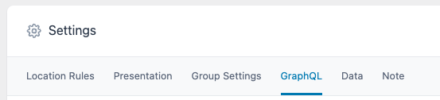
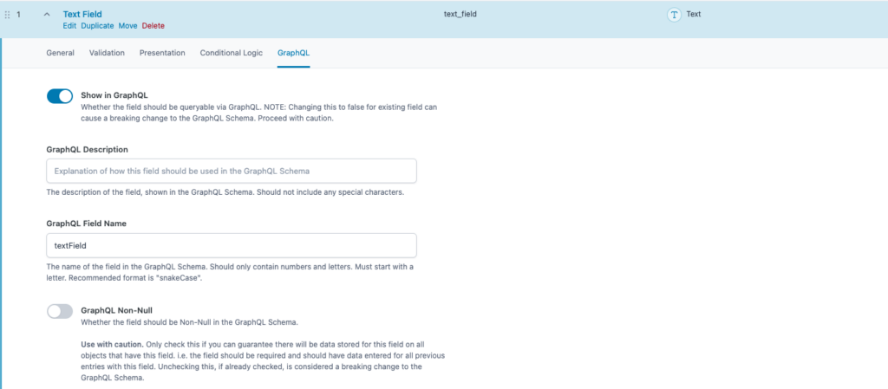

On this page, you will find documentation about how to add ACF Fields to the WPGraphQL Schema.

In order to follow along with the documentation below, you should have the latest versions of each of the following plugins [installed and activated](/installation-and-activation/):

-   WPGraphQL for ACF
-   WPGraphQL
-   ACF (FREE or PRO)

## Creating an ACF Field Group

In order to add ACF Fields to the GraphQL Schema

Advanced Custom Fields provides 3 ways to create Field Groups:

-   [Graphical User Interface (GUI)](https://www.advancedcustomfields.com/resources/creating-a-field-group/)
-   [PHP](https://www.advancedcustomfields.com/resources/register-fields-via-php/)
-   [JSON](https://www.advancedcustomfields.com/resources/local-json/)

Each of these methods is supported when using WPGraphQL for ACF to expose your ACF Field Groups to the GraphQL Schema.

### ACF Field Group Settings

With WPGraphQL for ACF active, each ACF Field Group will have a “GraphQL” settings tab:

Within this tab are the following settings that impact how the field group is added (or not added) to the GraphQL Schema:

-   **Show in GraphQL (show\_in\_graphql):** Checked (`true`), if the field group should be shown in the GraphQL Schema. Unchecked (`false`) if the field group should not be shown in the GraphQL Schema.
    -   **NOTE**: Field Groups that are “inactive” but set to Show in GraphQL will be exposed to the Schema. i.e. inactive field groups that are then used to “[clone](/field-types/clone-field/)” onto other field groups.
-   **GraphQL Type Name** (**graphql\_type\_name):** The Type name that should be used in the GraphQL Schema to represent the field group. This must be unique across the entire GraphQL Schema. The Type cannot be already be present in the GraphQL Schema. It’s recommended to use Pascal casing to name the type (i.e. MyFieldGroupTypeName). This will also serve as the field name (with a lowercase first letter) to access the fields from.
-   **Manually Set GraphQL Types for Field Group (map\_graphql\_types\_from\_location\_rules**): Checked (true) to use the “graphql\_types” value to add the field group to the Schema. Unchecked (false) to let WPGraphQL for ACF map the Field Group to the Schema based on the Location Rules (read more about how [location rules](#location-rules) work below)
-   **GraphQL Types (graphql\_types):** Array of Type Names the ACF Field Group should be accessible from in the Schema.
    -   The type(s) should correspond with the location rules for the field group. For example, if the ACF Field Group is shown on pages in the admin, the field group should be associated with the “Page” type in GraphQL.

## ACF Field Settings

When an ACF Field Group is set to “show\_in\_graphql” each field within the field group will also be shown in the GraphQL Schema, unless the field is not a supported post type, or if the field’s “show\_in\_graphql” setting is set to “false”.

Each ACF Field has its own “GraphQL” settings tab.

Each [field type](/field-types/) might have different settings, but the most common GraphQL Settings for each field type are:

-   **Show in GraphQL (show\_in\_graphql)**: Whether the field should show in the GraphQL Schema. If the Field Group is not shown in the GraphQL Schema, the individual fields will also not be. If the Field Group is shown in the GraphQL Schema, fields are default to “true” and will be shown in the schema unless disabled.
-   **GraphQL Description (graphql\_description):** This is how the field is documented in the Schema and will show in tools such as the GraphiQL IDE.
-   **GraphQL Field Name (graphql\_field\_name):** The name of the field shown in the Schema. The field _must_ start with a letter. Recommended to use “snakeCase”. The Field Name must be unique across the field group. (i.e. you cannot have multiple fields in the same field group with the same “graphql\_field\_name”).
-   **GraphQL Non-Null** **(graphql\_non\_null):** Whether the field should be Non-Null in the Schema. If checked and the field doesn’t have a value, errors will be thrown when the field is queried for. Also changing this value in the future can cause breaking changes, so use with caution.

## ACF Field Group Location Rules

WPGraphQL for ACF attempts to automatically map the Field Group to the GraphQL Schema based on the Location Rules.

For example, if a field group had the location rule of “Post Type is equal to page”, then the field group would be mapped to the GraphQL Schema on the “Page” type.

Some Location Rules are easily mapped to the GraphQL Schema, but some are not. In the cases where the location rules are not easily mapped to the Schema, you might need to manually configure which “graphql\_types” the Field Group should be exposed to in the Schema.

Take the following Location Rules as an example:

-   “Post Author is equal to `${Name of Author}`”

In the WordPress admin, this rule will conditionally hide/show the ACF Field Group if the author of a post is not a specific author.  
  
However in the GraphQL Schema, this type of context about a particular object (post in this case) isn’t known at Schema generation time, so this rule cannot automatically map to the GraphQL Schema.

The GraphQL Schema needs to represent the ACF Field Group in association with a GraphQL type (or multiple Types). It isn’t known at Schema generation time what post type(s) an Author might be an author of. Is it just posts? Is it posts and pages? Just pages? Is it just a custom post type? There’s not enough information to automatically map to the Schema, so this type of rule might require manual mapping of “graphql\_types”.

Or consider another rule such as:

-   “Taxonomy Term Slug is equal to `${term-slug}`”  
      
    Again, this rule requires context that is available in the WordPress admin and the field group can show/hide, but it’s not available when the GraphQL Schema is generated. What type of term? Category? Tag? This would be another rule that would require manual assigning of “graphql\_types” the ACF Field Group should show on.

If you’ve created an ACF Field Group and have set it to “Show in GraphQL” but you’re not seeing the field type in the Schema, the location rules and manual mapping of “graphql\_types” is a common place to troubleshoot.

If you have ideas on how to better handle automatic mapping of ACF Field Groups to the GraphQL Schema, [let us know](https://github.com/wp-graphql/wp-graphql/issues)!

### Manually Mapping ACF Field Groups to the Schema

When ACF Location Rules cannot be automatically mapped to the Schema, based on complex rules as described above, you can manually map an ACF Field Group to the GraphQL Schema.

In the GUI, you can use the following UI to select the GraphQL Type(s) that the ACF Field Group should be accessible from.

Each Type mapped here will be given a field that corresponds with the ACF Field Group, allowing access to the fields of the Field Group.

If using PHP or JSON, the mapping can be done by defining the types in the `graphql_types` field.
