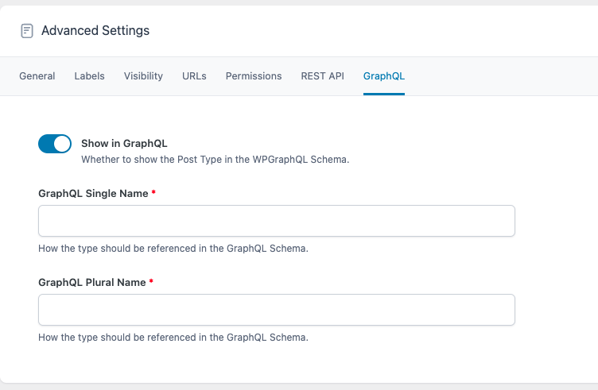

Advanced Custom Fields v6.1 introduced the ability to [register Custom Post Types and Custom Taxonomies](https://www.advancedcustomfields.com/resources/post-types-and-taxonomies/).

WPGraphQL for ACF extends the UI for the ACF Post Type and Taxonomy registration screens allowing you to configure how they should show in the GraphQL Schema.

## GraphQL Settings

When registering a Custom Post Type or Custom Taxonomy using ACF, there’s a “GraphQL” settings tab under “Advanced Settings” that can be used to control the mapping to the GraphQL Schema.

These fields correspond to the core WPGraphQL settings for mapping a [custom post type](https://www.wpgraphql.com/docs/custom-post-types#using-custom-post-types-with-wpgraphql) or [custom taxonomy](https://www.wpgraphql.com/docs/custom-taxonomies#using-custom-taxonomies-with-wpgraphql) to the schema.

The following settings are present within the “GraphQL” settings tab:

-   **Show in GraphQL (show\_in\_graphql):** Whether the post type or taxonomy should show in the GraphQL Schema
-   **GraphQL Single Name** **(graphql\_single\_name):** The singular name that the post type or taxonomy should use in the GraphQL Schema
-   **GraphQL Plural Name (graphql\_plural\_name):** The plural name that the post type or taxonomy should use in the GraphQL Schema

With these fields populated, the Post Type or Taxonomy will be mapped to the GraphQL Schema and will be queryable by client applications interacting with your GraphQL endpoint.

**NOTE:** Changing a post type or taxonomy to no longer show in graphql, or changing the single/plural name after it’s already shown in the Schema can lead to breaking changes for applications already querying for that post type or taxonomy, so make changes with caution.
