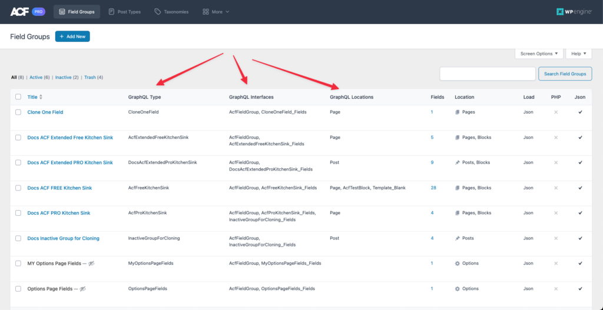
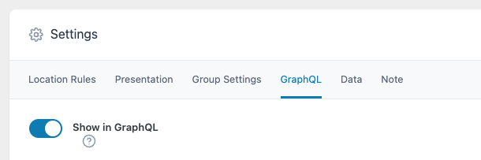
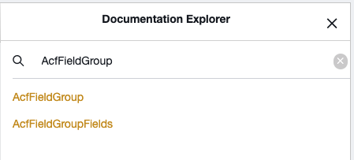

In this guide, we will show how to get started using WPGraphQL for Advanced Custom Fields.

_If you are upgrading from another version, we recommend heading over to the [Upgrade Guide](./upgrade-guide.md)._

In order to use [WPGraphQL for ACF,](https://wordpress.org/plugins/wpgraphql-acf/) you will need a supported version of [WPGraphQL](https://www.wpgraphql.com/docs/quick-start#install) and [Advanced Custom Fields](https://www.advancedcustomfields.com/resources/getting-started-with-acf/) installed and activated.

## Install from the WordPress Dashboard

-   Log in to your WordPress install
-   From the [Administration Panels](http://codex.wordpress.org/Administration_Panels), click on the [Plugin](http://codex.wordpress.org/Administration_Panels#Plugins) Menu
-   Under Plugins, click the “Add New” sub menu
-   Search for “WPGraphQL ACF”
-   Click the “Install Now” button on the WPGraphQL for ACF plugin (will likely be the first search result)

## Install with Composer

Installing plugins with [Composer](https://getcomposer.org/), a PHP dependency manager, allows you to avoid committing plugin code into your project’s version control.

WPGraphQL for ACF is available for installing with Composer from [wpackagist.org](https://wpackagist.org/search?q=wpgraphql-acf&type=any&search=).

Follow the instructions on [wpackagist.org](https://wpackagist.org/) to setup your composer.json file to install wpackagist plugins.

Then either modify your composer.json to add WPGraphQL for ACF as a requirement, or run `composer require wpackagist-plugin/wpgraphql-acf`

## Installing a .zip from Github

If you want to install the plugin using a .zip file from Github, you will need to download the .zip from the Github releases page, and NOT by downloading the main .zip from the repo.

WPGraphQL for ACF is developed in the [WPGraphQL monorepo](https://github.com/wp-graphql/wp-graphql), and releases are published on [the monorepo releases page](https://github.com/wp-graphql/wp-graphql/releases). Look for releases tagged `wp-graphql-acf`.

Each release has an “assets” section below the release notes where you will find a “wpgraphql-acf.zip” asset that can be downloaded and installed in your WordPress site.

You can either Upload the .zip file to your WordPress dashboard under the “Plugins > Add New” page, or you can unzip the plugin into your WordPress install’s `wp-content/plugins` directory on your server.

## Verifying Installation

After installation, there will be added User Interface elements on your “ACF > Field Groups” page in the WordPress dashboard where you can see the GraphQL Type that will represent each ACF Field Group in the Schema, the GraphQL Interfaces the Type implements, and the GraphQL Location (the Type(s) in the Schema that have access to the Field Group).  

Each ACF Field Group will also have a “GraphQL” tab under “Settings”.

In addition to the UI changes in the WordPress dashboard, your GraphQL Schema should now have the “AcfFieldGroup” Type in the Schema which you can verify by searching the Schema Docs using the GraphiQL IDE in your WordPress dashboard.

If you do not see these additional UI elements in your WordPress dashboard, and/or the “AcfFieldGroup” Type in your GraphQL Schema, double check that you have installed and activated the plugin correctly, and have the appropriate dependencies installed and active.
