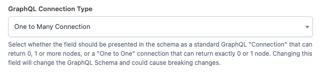

This guide is intended to help users using [WPGraphQL for ACF ~v0.6.\*](https://github.com/wp-graphql/wp-graphql-acf/releases/) that want to update their site(s) to use [WPGraphQL for ACF v2.0+](https://github.com/wp-graphql/wp-graphql/releases) (yes, we skipped v1.0 altogether).

In this guide you will find details about breaking changes between versions and how we recommend you update your sites to work with the new version.

## Recommended Upgrade Steps

[WPGraphQL for ACF v2.0](https://github.com/wp-graphql/wp-graphql/releases) is a complete re-architecture of the old [WPGraphQL for ACF](https://github.com/wp-graphql/wp-graphql-acf/releases) v0.6.

The new version of the plugin is a **_replacement_** of [the old one](https://github.com/wp-graphql/wp-graphql-acf) and is **_not intended to be active alongside the old one_**.

Because of this, there needs to be some intentional steps to migration.

Our recommended steps for migration are as follows:

-   Clone your WordPress site running WPGraphQL and WPGraphQL for ACF to a staging server
-   Determine all the GraphQL Operations (queries and mutations) your application(s) are executing
-   With the old WPGraphQL for ACF version active, test all of the GraphQL operations – either with automated testing (if you have a testing workflow) or manually testing with the GraphiQL IDE – to make sure they’re working as expected before you begin migration.
-   Once you’ve verified all your queries are working as expected:
    -   De-activate the old WPGraphQL for ACF
    -   Activate the new WPGraphQL for ACF v2.0+
-   Test your GraphQL operations again and refactor any operations that are now broken due to the Schema changes. The GraphiQL IDE should be able to help you determine things like field name changes in the Schema.
-   Once you have all your GraphQL Operations refactored and your application tested against your GraphQL API on your staging WordPress install:
    -   De-activate the old WPGraphQL for ACF in your production WordPress install
    -   Activate the new WPGraphQL for ACF in your production WordPress install
    -   Deploy your client application to production with the refactored GraphQL operations

Below you will find more information about specific changes and how you can refactor your GraphQL Queries.

## Field and Type Name Changes

Even with the most simple ACF Field Groups, updating from the old WPGraphQL for ACF to the new WPGraphQL for ACF might lead to some Field and Type name changes in the Schema.

### Field Group names cannot start with a number or other special character

Fields and Field Groups cannot have a “graphql\_field\_name” or “graphql\_type\_name” that starts with a number or other special character.

In the old WPGraphQL for ACF, you might have been able to “get away” with this because of the way ACF Field Groups were prefixed (i.e. “Page\_$FieldGroupName” or “Template\_$FieldGroupName”). Because the new version no longer prefixes Acf Field Groups based on their parent location in the Schema, you will need to make sure your field groups do not start with a number or other special character because [that’s not valid in any GraphQL Schema](https://spec.graphql.org/draft/#sec-Names).

### Identifying Field and Type Name Changes

To determine if your ACF Field Groups have been impacted by any name changes, we recommend exploring your Schema in the GraphiQL IDE, searching for Types and Fields you were familiar with and seeing how they’ve changed between versions.

But for a more comprehensive way to determine changes, we recommend the following (first on a staging site):

Generate an output of your GraphQL Schema using WP CLI and the `wp graphql generate-static-schema` command to generate a file containing the Schema of your site. Move the generated file somewhere you can reference easily and name it something like “schema-old.graphql”

Without making any other changes to your WordPress site, update WPGraphQL for ACF from the old version to the new version. Then run `wp graphql generate-static-schema` again and move the file somewhere you can easily reference and name it something like: “schema-new.graphql”

Next, run the command \`npx graphql-inspector diff “/path/to/schema-old.graphql” “/path/to/schema-new.graphql”  
  
This will help point out any changes that have been made to your Schema and can help you identify changes you might need to make to your queries.

_You can see type of Schema Diffing in action in the Github Schema Linter Workflow: [https://github.com/wp-graphql/wp-graphql/blob/develop/.github/workflows/schema-linter.yml](https://github.com/wp-graphql/wp-graphql/blob/develop/.github/workflows/schema-linter.yml)_

## Action and Filter Changes

Actions and Filters have been renamed, and in some cases removed.

If you had any code that was extending WPGraphQL for ACF v0.6.\* or earlier, you will need to upgrade your actions and filters to work with the new version of WPGraphQL for ACF.

[You can read about the action and filter changes here](https://github.com/wp-graphql/wpgraphql-acf/pull/67#issue-1818715865).

## GraphQL Types and Fragments

One of the biggest pain points with the previous versions of WPGraphQL for ACF was how it added prefixes to GraphQL Types that were generated in the Schema.

In the old WPGraphQL for ACF, ACF Field Groups would be mapped to the Schema with a Type Name that was prefixed with its parent location.

For example, if we use the [ACF Free Kitchen Sink Field Group](field-groups/kitchen-sink-acf-free.json) ([learn more about the kitchen sink field groups](./kitchen-sink.md)), which is assigned to the following ACF Locations:

-   Post Type is equal to Page
-   Taxonomy is equal to Category
-   User Form is equal to All

Below are the following Types that would have been generated to represent the “ACF Free Kitchen Sink” field group.

<table><tbody><tr><td>v0.6.1</td><td>v2.0.0</td></tr><tr><td>Category_Acffreekitchensink</td><td>AcfFreeKitchenSink</td></tr><tr><td>Category_Acffreekitchensink_Group</td><td>AcfFreeKitchenSink_Fields</td></tr><tr><td>User_Acffreekitchensink</td><td></td></tr><tr><td>User_Acffreekitchensink_Group</td><td></td></tr><tr><td>Page_Acffreekitchensink</td><td></td></tr><tr><td>Page_Acffreekitchensink_Group</td><td></td></tr></tbody></table>

The impact of this simplified mapping of ACF Field Groups to the GraphQL schema is significant.

It leads to fewer Types generated in the Graph which means faster GraphQL Schema generation.

It also means ACF Field Groups can be more easily shared via Fragments.

### OLD: Multiple Fragments for the same ACF Field Group

With the above ACF Free Kitchen Sink field group, you might have queries that looked something like the following:

```
query ContentNode {
  pages {
    nodes {
      id
      acfFreeKitchenSink {
        ...on Page_Acffreekitchensink {
          text
        }
      }
    }
  }
  categories {
    nodes {
      id
      acfFreeKitchenSink {
        ...on Category_Acffreekitchensink {
          text
        }
      }
    }
  }
  users {
    nodes {
      id
      acfFreeKitchenSink {
        ...on User_Acffreekitchensink {
          text
        }
      }
    }
  }
}
```

### NEW: Re-Usable Fragments for the same ACF Field Group

Now, you can use ONE Fragment to represent the ACF Field Group, and re-use that fragment in multiple queries.

```
query ContentNode {
  pages {
    nodes {
      id
      acfFreeKitchenSink {
        ...AcfFreeKitchenSink
      }
    }
  }
  categories {
    nodes {
      id
      acfFreeKitchenSink {
        ...AcfFreeKitchenSink
      }
    }
  }
  users {
    nodes {
      id
      acfFreeKitchenSink {
        ...AcfFreeKitchenSink
      }
    }
  }
}

fragment AcfFreeKitchenSink on AcfFreeKitchenSink {
  text
} 
```

This is a **significant** improvement to the developer experience when creating Component Based applications that consume data from ACF.

## 3rd Party ACF Fields

If you had written custom code to add support for 3rd party ACF Field Types, that code will likely not work with WPGraphQL for ACF v2.0.

To learn how to update your code to be compatible with WPGraphQL for ACF 2.0+, please refer to our new guide on [Adding Support for 3rd Party ACF Field Types](http://localhost:3000/?page_id=196).

## Relationship Fields

Relationship fields have changed to be represented in the Schema as a GraphQL Connection. This means the shape of data to be queried has changed and your queries will need to be updated to reflect.

For ACF fields of the “[relationship](./field-types/relationship.md)“, “[post\_object](./field-types/post-object.md)” and “[page\_link](./field-types/pagelink.md)” field type, there are some general changes that apply to each of these field types.

**Before:**

Changing the field’s “Allow Multiple” or “Select Multiple” setting would lead to a breaking change in the Schema. The Schema would change from `[PostObjectUnion]` to `PostObjectUnion` depending on the value of “Allow Multiple” and this could cause client applications queries to error.

**After:**

Changing the field’s “Allow Multiple” setting **will not** lead to a breaking change in the Schema. The Schema will remain a Connection that can return zero, one or more than one related nodes.

There is a [new _explicit_ “GraphQL Connection Type” setting](https://github.com/wp-graphql/wp-graphql/releases/tag/v2.0.0-beta.6.0.0) that allows you to change how the field type maps to the Schema.



Instead of _implicitly_ making breaking changes based on the value of the the “Allow Multiple” / “Select Multiple” setting, this is a more _explicit_ field setting that allows relationship fields to specify whether to be represented in the Schema as a “One to One Connection” or a “One to Many” connection.

### Relationship Field

**Before:**

The relationship field _used_ to be represented in the Schema as a `[PostObjectUnion]` (list of PostObjectUnion).

Querying looked something like:

```javascript
query GetPageWithRelationshipField {
  page(id: "kitchen-sink", idType: URI) {
    id
    acfFreeKitchenSink {
      ... on Page_Acffreekitchensink {
        relationship {
          __typename
          ... on Post {
            id
            title
          }
        }
      }
    }
  }
}
```

**After:**

Now the Relationship field type is represented as an `AcfContentNodeConnection` and can be queried like so:

```javascript
query ContentNode {
  page(id: "kitchen-sink", idType: URI) {
    id
    acfFreeKitchenSink {
      ... on AcfFreeKitchenSink {
        relationship {
          nodes {
            __typename
            id
            uri
          }
        }
      }
    }
  }
}

```

Page Link Field

**Before**

The Page Link field type used to be represented in the Schema as a `PostObjectUnion` (or `[PostObjectUnion]` if “Select Multiple” was selected.

```javascript
query ContentNode {
  page(id: "kitchen-sink", idType: URI) {
    id
    acfFreeKitchenSink {
      ... on Page_Acffreekitchensink {
        pageLink {
          __typename
          ... on Post {
            id
            title
          }
        }
      }
    }
  }
}
```

**After:**

Now the Page Link field type is represented in the Schema as an `AcfContentNodeConnection` and can be queried like so:

```javascript
query ContentNode {
  page(id: "kitchen-sink", idType: URI) {
    id
    acfFreeKitchenSink {
      ... on AcfFreeKitchenSink {
        pageLink {
          nodes {
            __typename
            id
            uri
          }
        }
      }
    }
  }
}
```

### Post Object Field

**Before**:

The Post Object field type used to be represented in the Schema as a `PostObjectUnion` (or `[PostObjectUnion]` if “Select Multiple” was selected.

```javascript
query ContentNode {
  page(id: "kitchen-sink", idType: URI) {
    id
    acfFreeKitchenSink {
      ... on Page_Acffreekitchensink {
        postObject {
          __typename
          ... on Post {
            id
            title
          }
        }
      }
    }
  }
}
```

**After:**

Now the Post Object field type is represented in the Schema as an `AcfContentNodeConnection` and can be queried like so:

```javascript
query ContentNode {
  page(id: "kitchen-sink", idType: URI) {
    id
    acfFreeKitchenSink {
      ... on AcfFreeKitchenSink {
        postObject {
          nodes {
            __typename
            id
            uri
          }
        }
      }
    }
  }
}
```

## Choice Fields (checkbox / select)

Choice fields (checkbox, select) have different behaviors in the new version of WPGraphQL for ACF.

In the previous version of the plugin, the choice fields would change their Type in the GraphQL Schema change based on the value of “Allow Multiple” / “Select Multiple”.  
  
This behavior of implicitly changing the Schema based on an admin validation setting caused applications to break, so the default for these field types is to now always be shown in the Schema as a `[String]` (list of String) Type.

## Media Fields

Media Fields were refactored to be represented in the GraphQL Schema as a MediaItemConnection.

### Image Field

**Before:**

The fields of the image were queried directly under the “image” field.

```javascript
query ContentNode {
  page(id: "kitchen-sink", idType: URI) {
    id
    acfFreeKitchenSink {
      image {
        __typename
        id
        mediaItemUrl
      }
    }
  }
}
```

**After:**

Now the fields are nested under a “node” field, following the greater Connection patterns in WPGraphQL.

```javascript
query ContentNode {
  page(id: "kitchen-sink", idType: URI) {
    id
    acfFreeKitchenSink {
      image {
        node {
          __typename
          id
          mediaItemUrl
        }
      }
    }
  }
}
```

### File Field

**Before:**

The fields of the “file” were queried for directly under the “file” field.

```javascript
query ContentNode {
  page(id: "kitchen-sink", idType: URI) {
    id
    acfFreeKitchenSink {
      file {
        __typename
        id
        mediaItemUrl
      }
    }
  }
}
```

**After:**

Now the fields are nested under a “node” field, following the greater Connection patterns in WPGraphQL.

```javascript
query ContentNode {
  page(id: "kitchen-sink", idType: URI) {
    id
    acfFreeKitchenSink {
      file {
        node {
          __typename
          id
          mediaItemUrl
        }
      }
    }
  }
}


```

## Oembed Field

**Before:**

Previously fields of the oembed field type would return the URL that was entered into the field.

For example, the following query:

```javascript
query ContentNode {
  page(id: "kitchen-sink", idType: URI) {
    id
    acfFreeKitchenSink {
      ... on Page_Acffreekitchensink {
        oembed
      }
    }
  }
}
```

Might have had a response like so:

```json
{
  "data": {
    "page": {
      "id": "cG9zdDozMw==",
      "acfFreeKitchenSink": {
        "oembed": "https://www.youtube.com/watch?v=dQw4w9WgXcQ"
      }
    }
  }
}
```

**After:**

Now, fields of the oembed field type will be run through WordPress’s oEmbed APIs and return the oEmbed markup from the provider.

Now the following query:

```javascript
query ContentNode {
  page(id: "kitchen-sink", idType: URI) {
    id
    acfFreeKitchenSink {
      ... on AcfFreeKitchenSink {
        oembed
      }
    }
  }
}
```

Might have a response like so:

```xml
{
  "data": {
    "page": {
      "id": "cG9zdDozNTI=",
      "acfFreeKitchenSink": {
        "oembed": "<iframe title=\"Rick Astley - Never Gonna Give You Up (Official Music Video)\" 
width=\"640\" height=\"360\" src=\"https://www.youtube.com/embed/dQw4w9WgXcQ?feature=oembed\" 
frameborder=\"0\" allow=\"accelerometer; autoplay; clipboard-write; encrypted-media; gyroscope; 
picture-in-picture; web-share\" allowfullscreen></iframe>"
      }
    }
  }
}
```
