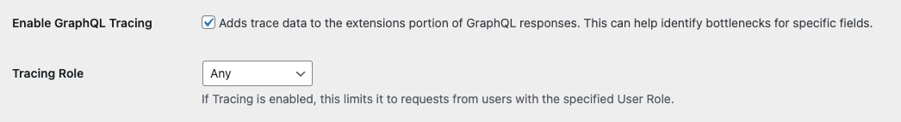
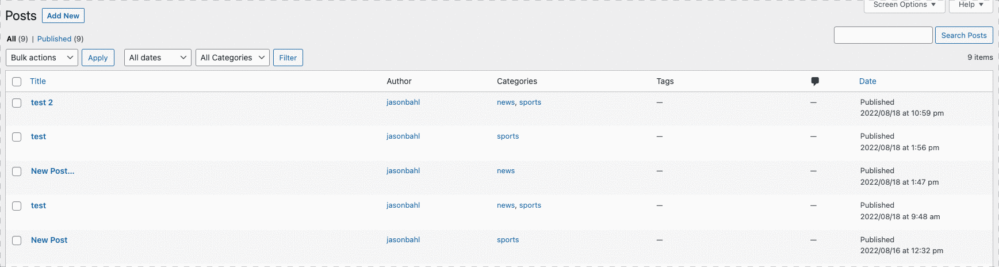
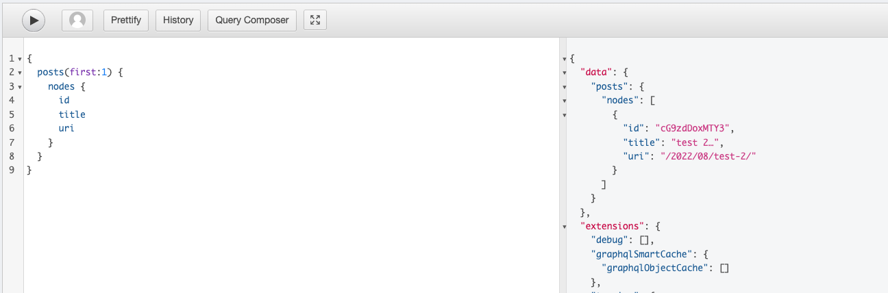

# WPGraphQL Smart Cache

Do you want your API data _fast_ or _accurate_? With WPGraphQL Smart Cache, you can have both.

WPGraphQL Smart Cache is a free, open-source WordPress plugin that provides support for caching and cache invalidation of WPGraphQL Queries.

To get the most out of this plugin, we recommend using GET requests with Network Caching, which requires your WordPress install to be on a [supported host](./docs/network-cache.md#supported-hosts).

**BREAKING CHANGES:** We may make breaking changes in the future to improve functionality and experience. If we do, we will use semver to do so. Pay attention to release notes and upgrade notices before updating.

----

## Video Overview

<a href="https://youtu.be/t_y6q02q7K4" target="_blank"></a>

----
## Docs 📖

- [Overview](#overview)
- [Quick Start](#-quick-start)
- Features
  - [Network Cache](./docs/network-cache.md)
  - [Object Cache](./docs/object-cache.md)
  - [Persisted Queries](./docs/persisted-queries.md)
  - [Cache Invalidation](./docs/cache-invalidation.md)
- [Extending / Customizing Functionality](./docs/extending.md)
- [FAQ and Troubleshooting](#faq--troubleshooting)
- [Known Issues](#known-issues)
- [Providing Feedback](#providing-feedback)

----

## Overview

WPGraphQL has essentially become the standard when it comes to building headless WordPress experiences.

The flexibility and tooling around GraphQL is attractive, but it can come at a cost.

### Performance Issues

_"The fastest code is the code which does not run" - [Robert Galanakis](https://daveredfern.com/no-code/)_

WPGraphQL is optimized for run-time performance by using [DataLoader](https://www.wpgraphql.com/docs/wpgraphql-vs-wp-rest-api#dataloader-and-the-n1-problem) methods and other techniques to reduce run time execution cost, but the fact is that WPGraphQL is built on top of WordPress and respects the WordPress application layer – including actions, filters, authentication rules, and the WordPress database structure.

This means that anytime a WPGraphQL request is executed against WordPress (much like any type of request made to WordPress) there is a cost, and the cost can sometimes be problematic.

One of the fastest ways to load WordPress, is to prevent WordPress from being loaded at all!

This is no different for WPGraphQL.

### Solving the Performance Issues

This is where WPGraphQL Smart Cache comes in.

WPGraphQL Smart Cache has integrations with a multiple layers of caching to provide users of WPGraphQL with both fast and accurate data managed in WordPress.

The over-simplification of WPGraphQL Smart Cache, is to capture the results of GraphQL Requests, store the response in a cache, and use the cached response for future requests instead of executing the query and all of its resolvers at each request.

----

## 🚀 Quick Start

This quick start guide will cover the basics of [Object Caching for WPGraphQL Queries](./docs/object-cache.md) and [Cache Invalidation](./docs/cache-invalidation.md).

> _If you're WordPress install is on a [supported host](./docs/network-cache.md#supported-hosts), you will benefit more from Network Caching and we recommend you head over to the [Network Cache Quick Start](./docs/network-cache.md#quick-start) instead of this quick-start. If you're not on a supported host, tell your host to check out our [hosting guide](./docs/network-cache.md#hosting-guide) and carry on with this Quick Start guide below._

----

### 📖 Quick Start Guide

- [Install & Activate](#install--activate)
- [Enable WPGraphQL Object Cache](#enable-wpgraphql-object-cache)
- [Enable WPGraphQL Tracing (optional)](#enable-wpgraphql-tracing-optional)
- [Execute a query in GraphiQL IDE](#execute-a-query-using-the-graphiql-ide)
- [Execute the same query again](#execute-the-query-again)
- [Invalidate the Cache](#invalidate-the-cache)

---

### Install & Activate

If you haven't already installed and activated the WPGraphQL Smart Cache plugin, follow the [Install & Activation guide](./docs/installation.md), then come back here.

### Enable WPGraphQL Object Cache

With the latest versions of WPGraphQL and WPGraphQL Smart Cache installed and activated, navigate to the "WPGraphQL > Settings" page in your WordPress dashboard, then select the "Cache" tab.


From this settings page, check the "Use Object Cache" setting and click "Save Changes".

This will activate the object cache functionality for WPGraphQL Queries.

### Enable WPGraphQL Tracing (optional)

While testing, you can enable "WPGraphQL Tracing" to see data about how long (in microseconds) each field in a GraphQL request takes to resolve.

To enable WPGraphQL Tracing, navigate to the "WPGraphQL > Settings" page and select the "WPGraphQL General Settings" tab.

Check the "Enable GraphQL Tracing" option, and set the "Tracing Role" to "Any". This will let us see the trace data in public requests as we test the caching functionality.



> **NOTE:** When you're done testing, consider disabling tracing as it is intended to be a debug tool, and it does add weight to the responses client applications download from the WPGraphQL Server.

### Execute a query using the GraphiQL IDE

Next, navigate to the "GraphQL > GraphiQL IDE" screen in the WordPress dashboard.

Paste the following query in the IDE.

```graphql
{
  posts {
    nodes {
      id
      title
      uri
    }
  }
}
```

Execute the query by pressing the play button.

> _**NOTE:** To ensure your GraphiQL IDE is not executing as a logged in user, toggle the button to the right of the "Play" button. If a green status indicator is showing, requests will be authenticated and will bypass the cache. Public, non-authenticated requests will be served from the cache._

You should see results similar to the following screenshot:


If you inspect the response, you will notice the "graphqlSmartCache" key with a nested "graphqlObjectCache" key under the "extensions" payload.

If the value of the `graphqlObjectCache` key is empty, the request was _not_ served from cache.

If you [enabled GraphQL Tracing](#enable-wpgraphql-tracing-optional), take a look at the `extensions.tracing" payload.

You will see a "duration" field, which is the overall time the query took to resolve (in microseconds).

Take note of this value. For me, it was: `"duration": 23271,`

Additionally, you will see a lot of data about each field that was resolved. You don't need any of this data, just take note of its presence.

### Execute the Query Again

Execute the same query again (still as a non-authenticated request).

This time, you should observe the `graphqlSmartCache.graphqlObjectCache` key will have data returned.

You should see a payload similar to the following:

```json
 {
  "data": {
    ...
  },
  "extensions": {
    ...
    "graphqlSmartCache": {
      "graphqlObjectCache": {
        "message": "This response was not executed at run-time but has been returned from the GraphQL Object Cache",
        "cacheKey": "9cc3bbab3abfcc618153b3e9a3df403c2408f1007abe35aeaec0e2d640fb1233"
      }
    }
  }
}
```

This means that the request was served from the WPGraphQL Object Cache instead of executing all of the resolvers for every field.

If you [enabled GraphQL Tracing](#enable-wpgraphql-tracing-optional), take a look at the `extensions.tracing" payload again.

This time, you should see a lower value for the duration field. For me, the value was `"duration": 9933`. Nearly 3x faster!

Additionally, you will note that the `resolvers` field under tracing is empty. This is because the data was returned from the object cache and no resolvers were executed!

### Invalidate the Cache

Go ahead and execute the same query a few more times, and note that it continues to be served from the cache.

In order to balance "Fast" and "Accurate" data, WPGraphQL Smart Cache listens to events in WordPress, and when relevant events occur, the relevant cache(s) are evicted, and fresh data is served.

In another browser tab, navigate to the "Posts" page and "quick edit" the most recent post, adding a period to the title.



Then, back in the browser tab with the GraphiQL IDE open, execute the query again.

The query should be a "cache miss" and we should see the accurate, updated title, and the `graphqlSmartCache.graphqlObjectCache" output under "extensions" should be empty.



----

##  👉 Next Steps

Now that you've completed the quick start, continue on learn more about the features of the WPGraphQL Smart Cache plugin.

### Features
- [Network Cache](./docs/network-cache.md)
- [Object Cache](./docs/object-cache.md)
- [Persisted Queries](./docs/persisted-queries.md)
- [Cache Invalidation](./docs/cache-invalidation.md)

### Additional Docs

- [Extending / Customizing Functionality](./docs/extending.md)
- [FAQ and Troubleshooting](./docs/faq.md)
- [Known Issues](#known-issues)
- [Providing Feedback](#providing-feedback)

### Related Links 🔗

- [WPGraphQL.com](https://www.wpgraphql.com)
- [WP Engine Atlas](https://www.wpengine.com/atlas)

----

## Known Issues

### Batch Queries

There are currently some issues around Batch Queries. If you use Batch Queries in your client application, we will need more time before we have WPGraphQL Smart Cache working for you.

If you use Batch Queries in your application and would like to make use of WPGraphQL Smart Cache, let us know in the WPGraphQL Smart Cache slack channel or GitHub Discussions so we can learn more about your use cases.

### Missing Invalidation Hooks

Currently, we’re missing invalidation hooks related to Settings (options).

That means cache for queries that ask for Settings (i.e General Settings, Discussion Settings, etc) will not be invalidated/evicted automatically when actions related to those things occur.

You can read more about the nuances of supporting settings here: [#158](https://github.com/wp-graphql/wp-graphql-smart-cache/issues/158)

----

## Providing Feedback

If you have feedback after using WPGraphQL Smart Cache, we would love to hear it!

> **Note:** WPGraphQL Smart Cache is now part of the [WPGraphQL monorepo](https://github.com/wp-graphql/wp-graphql). The code and releases are managed in the main repository. Issues and discussions are currently still in the original repository and will be migrated in the future.

### Issues & Bug Reports

If you have an issue or a bug to report, the best place to do that is in the [GitHub Repository](https://github.com/wp-graphql/wp-graphql-smart-cache/issues).

### Feature Requests

If you have an idea for a feature that feels like it would be a nice addition to the WPGraphQL Smart Cache plugin, you can let us know in the [Discussion section of the GitHub Repository](https://github.com/wp-graphql/wp-graphql-smart-cache/discussions).

### General Discussion

For general discussion about the plugin, you can visit the WPGraphQL Slack ([join here](https://wp-graphql.slack.com/join/shared_invite/zt-3vloo60z-PpJV2PFIwEathWDOxCTTLA#/shared-invite/email)) and join the `#wp-graphql-smart-cache` channel, or post in the [GitHub Discussions](https://github.com/wp-graphql/wp-graphql-smart-cache/discussions).

### Security Concerns

If you believe you’ve found something in the WPGraphQL Smart Cache codebase that could be a security concern, please let us know by emailing us directly at [info@wpgraphql.com](mailto:info@wpgraphql.com).

Please do not email other bug reports, feature requests or support questions to this email address.

----

## Privacy Policy

WPGraphQL Smart Cache uses [Appsero](https://appsero.com) SDK to collect some telemetry data upon user's confirmation. This helps us to troubleshoot problems faster & make product improvements.

Appsero SDK **does not gather any data by default.** The SDK only starts gathering basic telemetry data **when a user allows it via the admin notice**. We collect the data to ensure a great user experience for all our users.

Integrating Appsero SDK **DOES NOT IMMEDIATELY** start gathering data, **without confirmation from users in any case.**

Learn more about how [Appsero collects and uses this data](https://appsero.com/privacy-policy/).
