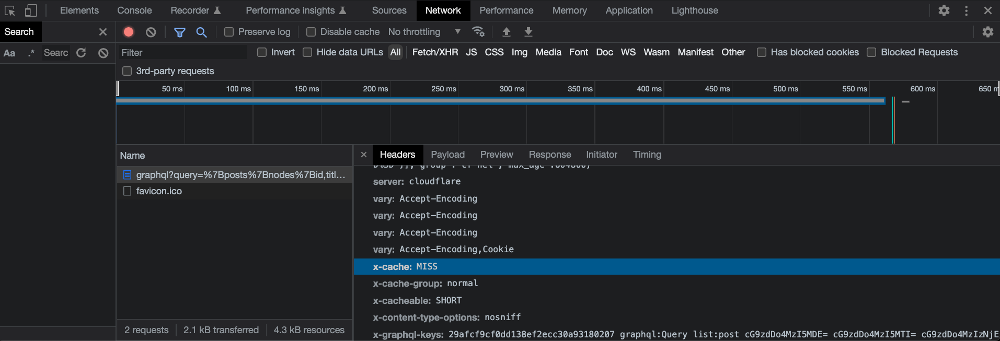
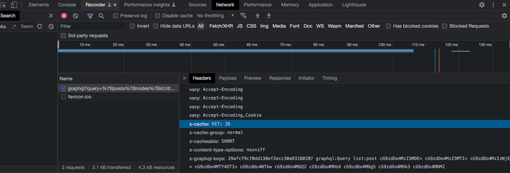
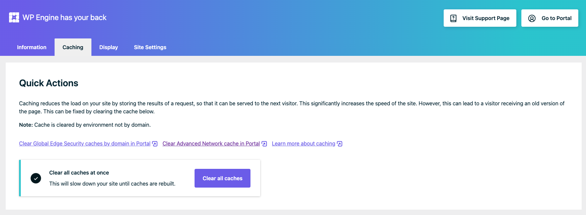

# Network Cache

- [Quick Start](#quick-start)
- [Supported Hosts](#supported-hosts)
- [How WPGraphQL Network Cache works?](#how-wpgraphql-network-cache-works)
- [Settings](#settings)
- [Purging Caches](#purging-caches)
- [Troubleshooting](#troubleshooting)
- [Hosting Guide](#hosting-guide)

----

## 🚀 Quick Start

This is the Quick Start guide to show the benefits of WPGraphQL Network Cache & Cache Invalidation.

**NOTE:**

Network Cache requires your WordPress instance to be on a [supported host](#supported-hosts).

As more hosts work with us to support this feature, some nuances (for example header responses) in this guide might be different from host to host.

To follow this quick start guide, we recommend having a WordPress install on WP Engine. You can [sign up for a FREE WP Engine Atlas sandbox account](https://wpengine.com/atlas) to follow this guide.

See the [development](development.md) guide about running Varnish locally to test the behavior.

### 👩‍💻 Execute a GraphQL Query (as an HTTP GET request)

Using a browser that is not authenticated to your WordPress site (or an incognito window), execute a GraphQL query as an HTTP GET request by visiting a url for a GraphQL query in the browser, like so (replacing the domain with your domain): `https://${yourdomain.com}/graphql?query={posts{nodes{id,title,uri}}}`

### 🧐 Inspect the Headers

Inspect the headers using your browser developer tools Network tab.

See an `x-cache` header with either a `MISS` value or a `Hit: #` value. The hit is the number of times the cached response has been served. The cache hits are returned from the network cache layer, instead of executing in WordPress.

Refresh the browser a few times and see the `x-cache: Hit: #` count increase.

### 📝 Edit Some Content

In another browser (or incognito window), login to your WordPress dashboard.

Edit the title of your most recent post (add a period to the title, for example) and click update.

### 🥳 Verify the Cache was Purged

Refresh the browser tab with the query and inspect the headers and the JSON response.

The response should have your updated title, and the `x-cache` header should be a `MISS`.

You just witnessed the power of WPGraphQL Smart Cache!

GraphQL responses are served from a cache and WPGraphQL Smart Cache tracks events (publishing, updating, deleting content, etc) and purges appropriate cache(s) in response to said events!

### 💸 Profit

Now that you know how to take advantage of WPGraphQL Caching, put it to action and make your sites faster!

----

## How WPGraphQL Network Cache works

For many years, managed WordPress hosts have sped up WordPress by using network-level page caching and serving WordPress pages to users from a cache, preventing the WordPress application itself from being executed to build the page for most requests.

For example, when you host your WordPress website hosted on [WP Engine](https://wpengine.com/atlas), when a visitor visits the website, the first visitor will cause WordPress to execute and build the page, then the page is returned and stored in Varnish cache, and subsequent users are served the cached page and WordPress itself is not loaded for those users.

WPGraphQL Smart Cache was built to work in environments that have a network caching layer that caches requests via URL, tags the requests with values from the WPGraphQL headers, and has the ability to purge caches based on the tags.

Hosts that want to support WPGraphQL Network Cache will need to make updates to their network cache layers to fully work with WPGraphQL Smart Cache. We have a [hosting guide](#hosting-guide) with more information.

In short, WPGraphQL Network Cache works like so:

- GraphQL Queries are made as HTTP GET requests
- The query response is cached by the Host's network cache layer (varnish, etc)
- The cached documents are "tagged" with the values of the "x-graphql-keys" header
- Future HTTP GET requests for the same query (and variables) will be served from the cache, preventing WordPress from loading
- When events in WordPress occur (publishing posts, etc) the plugin calls `purge( $tag_name )`.
- Documents tagged with the key name being purged will be evicted from the network cache
- The next request for the same query (and variables) will be a cache MISS


Below, we’ll look at how WPGraphQL Smart Cache works with network caching layers.

## GET Requests

To benefit from WPGraphQL Network Caching, you will need to use HTTP GET requests when querying public data, and you will need to be on a [supported WordPress host](#supported-hosts).

When making HTTP GET requests to the WPGraphQL Endpoint, the first request for a particular query will be a Cache Miss in the network cache and will be passed to WordPress for execution.

The response will be cached and subsequent requests for the same query (from any client, even a different user) will be served from the cache and the WordPress server won't be loaded or tasked with executing.

This significantly reduces the load on your WordPress server, and significantly reduces the overall responses times.

### GET Requests In Action

Visit the following URL in your browser: [https://content.wpgraphql.com/graphql?query={posts{nodes{id,title}}}](https://content.wpgraphql.com/graphql?query={posts{nodes{id,title}}})

If you inspect the "Network" tab in your browser's developer tools, you should see either an `X-Cache: MISS` header or a `X-Cache: Hit #` header, showing the number of times this query has been served from cache.

#### **X-Cache: MISS**

Below is a screenshot of a Cache Miss. Here, we see the `x-cache: MISS` header.

This means the request was passed through the network cache to WordPress for execution.

The total response time for the cache miss was ~520ms.



#### **X-Cache: HIT 26**

After refreshing the browser 26 times, I now see the header `x-cache: HIT 26`.

This means that the request was served from the network cache (in this case Varnish) and was not passed through to WordPress for execution.

This means that the WordPress server didn't experience any load from the 26 refreshes.

Your results may vary, but for me, the total response time for the cache hit was ~110ms, nearly 5x faster than the cache miss!

_Ideally, we'll be able to work with hosts to serve these cache hits even faster!_



### GET Query String Limitations?

One concern you might have with making GraphQL requests via HTTP GET is limitations around Query String Length.

GraphQL Queries can get quite long, so it's easy to push up against [max query string length limitations](https://stackoverflow.com/questions/812925/what-is-the-maximum-possible-length-of-a-query-string#answer-812962).

This is why WPGraphQL Smart Cache has support for [Persisted Queries](./persisted-queries.md).

----

## Settings

There is one "global" setting that can be configured for Network Cache: the "max-age" header.

Navigate to "WPGraphQL > Settings" and selecting the "Cache" tab.

The "Cache-Control max-age" setting allows for the default value of the max-age header to be customized.

By default, WPGraphQL returns a value of 600 (seconds), which is 10 minutes.

This means that any GET request that is made for a WPGraphQL query will be cached, by default, for 10 minutes.

If no event is triggered that purges the cache, it will automatically expire in 10 minutes.

You can increase or decrease this value to meet your applications needs.

Using [Persisted Queries](./persisted-queries.md) you can also override this on a per-query level.

----

## Purging Caches

The WPGraphQL Smart Cache plugin has [cache invalidation](./cache-invalidation.md) logic in place that will track common events in WordPress and will call a `purge()` function that will purge relevant caches.

Sometimes, you might want to purge _all_ caches.

Many hosts will provide a way to purge all network caches.

For example, WP Engine Customers can use the "Purge All Caches" button from their WordPress dashboard:




----

## Troubleshooting

This section will help with troubleshooting when using WPGraphQL Network Cache.

As more supported hosts work with WPGraphQL Smart Cache, some details may vary from host to host.

### My GraphQL Queries are served from the Cache, but not evicting when content changes

If your queries over GET requests are being served from the network cache, and you've verified this by inspecting the HTTP response headers, but the query is not being purged as expected, I would suggest the following:

#### Make sure you're on a [supported host](#supported-hosts)

Many WordPress hosts will already have a network caching layer in place that works with WPGraphQL requests. The problem is there's no way to smartly invalidate the cached queries.

Hosts that support network caching for WPGraphQL queries, but don't have proper support for WPGraphQL Smart Cache purging, will serve stale data from the cache until it expires based on the MAX Age header.

If you're host is not a [supported host](#supported-hosts), ask them to check out or [hosting guide](#hosting-guide) or sign up for a [FREE WP Engine Atlas sandbox account](https://wpengine.com/atlas) and test things there.

#### If you are on a supported host, but GET request caches are not invalidating as expected:

**Make sure the WPGraphQL Smart Cache plugin is still active.**

If the plugin was de-activated for some reason, the Invalidation events will not be triggered properly.

**Make sure the data you're querying for uses best practices for resolving data.**

WPGraphQL analyzes queries and adds nodes to the cache tags. If your GraphQL Schema has fields that resolve nodes without going through the GraphQL Loader and Model Layer, the nodes might be ignored by the Query Analyzer and the cache might not be tagged in relation to the node.

Custom GraphQL Types that are not nodes or loaded as nodes will not be tracked and tagged in the caches properly.


### How to identify if the request is served from network cache?

If you're making GET requests and want to be sure the results are being served from a network cache, you should be able to inspect the headers.

WP Engine returns an `X-Cache` key which will either contain a cache hit count, or a `MISS` value.

Other hosts might have different headers, but they should indicate whether the request was served from cache or not.


### Caches seem to be purging more than expected

If you're seeing more cache misses than you thought, here's some things to consider:

Based on the [cache invalidation](./cache-invalidation.md) strategies, the more nodes that are returned in a response, the more events will cause the cache to be purged.

For example, if you query for 100 posts, that means publishing a new post, deleting a post, or editing any of those 100 posts will purge the cache.

Smaller queries with fewer nodes will be associated with fewer purge actions.


### Skipped Headers

If your queries are _really_ big, there's a chance your x-graphql-keys header contains `skipped:$type_name` header(s).

This means that due to header size limitations some node ids were truncated from the header and replaced with a `skipped:$type_name` header.

Documents with these headers will be purged whenever any node of that type is edited, because the document isn't tagged with a specific node ID for that type.

The solution here is typically to query fewer nodes.

If you've filtered WPGraphQL to allow querying for 1000 nodes (instead of the default 100), consider not doing that.

----

## Supported Hosts

As we've mentioned, WPGraphQL Network Cache does require specific implementation details from the WordPress host.

Below is a list of hosting companies we know support for WPGraphQL Smart Cache.

- [WP Engine](https://developers.wpengine.com/docs/atlas/additional-guides/query-optimization/#use-wpgraphql-smart-cache-and-persisted-queries)
- [Pantheon](https://docs.pantheon.io/guides/decoupled/wp-backend-starters/caching)

Below is a [hosting guide](#hosting-guide) to help hosts add support for WPGraphQL Caching and Cache Invalidation.

----

## Hosting Guide

This guide is intended to help WordPress hosts support caching and cache invalidation of WPGraphQL Queries at the network cache level.

Each host will likely have its own stack and opinionated implementations so this guide won't prescribe specific implementation details, but will explain concepts that hosts can use to apply to their hosting environment.

In this guide we'll cover the following topics to have your hosting environment work well with WPGraphQL Smart Cache:

- [Caching WPGraphQL Responses](#caching-responses)
- [Purging Documents](#purging-caches)

### Caching Responses

When GraphQL queries are executed over HTTP GET, the network cache layer should cache the document.

Making the same query multiple times should return a cached response until an event purges the cache, or the cache expires based on the Max-Age header.

### Tagging Cached Documents

The cached document should be "tagged" using the values returned by the `x-graphql-keys` header.

In varnish, the [xkey](https://github.com/varnish/varnish-modules/blob/master/src/vmod_xkey.vcc) mod can be used for this.

Fastly has a similar feature called [Surrogate Keys](https://docs.fastly.com/en/guides/working-with-surrogate-keys).

### Purging Caches

WPGraphQL Smart Cache tracks events and sends out "purge" actions.

When these purge actions are sent out, your host should listen for the action and call a purge event specific to your network layer.

For example:

```php
add_action( 'graphql_purge', function ( $purge_keys, $event = '', $hostname = '' ) {

		if ( ! function_exists( 'your_network_cache_purge_function' ) ) {
			return;
		}

		// a function that communicates with Varnish, Fastly, etc to purge the tagged documents
		your_network_cache_purge_function( $purge_keys, $hostname );

}, 10, 1 );
```

The network cache layer should respond to calls of the purge action and purge any cached document(s) tagged with the key being purged.

- **Example with Varnish xkey**: [https://github.com/varnish/varnish-modules/blob/master/src/vmod_xkey.vcc#L45](https://github.com/varnish/varnish-modules/blob/master/src/vmod_xkey.vcc#L45)
- **Example with Fastly**: [https://docs.fastly.com/en/guides/purging-with-surrogate-keys](https://docs.fastly.com/en/guides/purging-with-surrogate-keys)

----

## 👉 Up Next:

- [Object Cache](./object-cache.md)
- [Persisted Queries](./persisted-queries.md)
- [Cache Invalidation](./cache-invalidation.md)
