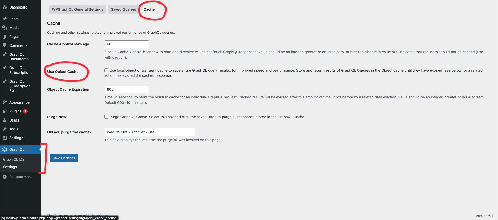

# GraphQL Query Object Caching

This guide covers WPGraphQL Object Caching, a feature of the WPGraphQL Smart Cache plugin that helps
reduce overall execution load and response times for WPGraphQL.

When possible, we recommend taking advantage of [Network Caching](./network-cache.md). But, if you're unable to, continue reading below.

----

## 📖 GraphQL Object Cache Guide

- [How GraphQL Object Cache works](#how-wpgraphql-object-caching-works)
- [Settings](#settings)
- [POST Requests](#object-cache-with-http-post-requests)
- [GET Requests](#object-cache-with-http-get-requests)
- [Troubleshooting](#troubleshooting)

----

## How WPGraphQL Object Caching Works

Assuming WPGraphQL Object Caching has been enabled in the [settings](#settings), it will work like so:

- GraphQL Queries are executed as a non-authenticated user in WordPress (HTTP GET, HTTP POST or even internal calls to the `graphql()` function)
- The query response is cached in a persistent object cache (or transients as a fallback)
- The cached object is "tagged" with the values determined by the [GraphQL Query Analyzer](https://github.com/wp-graphql/wp-graphql/blob/develop/src/Utils/QueryAnalyzer.php)
- Future requests for the same query (and variables) will be served from the cache, preventing full execution of all resolvers
- When events in WordPress occur (publishing posts, etc) the plugin calls `purge( $tag_name )`.
- Documents tagged with the key name being purged will be evicted from the object cache
- The next request for the same query (and variables) will be a cache MISS and will execute all resolvers of the query

## Object Cache with HTTP POST requests

If you’ve been using GraphQL for some time, there’s a good chance you use GraphQL via HTTP POST requests. It's the default HTTP method for many GraphQL APIs.

For most WordPress hosts, the [network cache](#network-cache) layer will **_NOT_** be in effect when using HTTP POST requests. That means HTTP POST requests to the WPGraphQL endpoint will bypass the network cache layer and will still be sent to WordPress for execution.

That means, if you want to take advantage of caching functionality for POST requests, you can use WPGraphQL Smart Cache's Object Cache functionality.

GraphQL Object Caching is a feature of the WPGraphQL Smart Cache plugin that, when enabled, will cache GraphQL responses in the persistent object cache (or transients as a fallback).

If your WordPress environment supports a persistent object cache (i.e. Redis, Memcached, etc) WPGraphQL Smart Cache will store responses to GraphQL queries in the object cache, and future requests of the same query will be returned from the cache instead of re-executing all the resolvers each time the request is made.

For WordPress environments that do not support persistent object cache, [transients](https://developer.wordpress.org/apis/handbook/transients/) will be used.

## Object Cache with HTTP GET requests

On many WordPress hosts, HTTP Get requests will pass through a Network Cache layer.

This means that the first time a request is made, it will execute in WordPress and the response will be cached at the network level, typically in something like Varnish.

Future requests will be served from that cache instead of making a trip all the way to the WordPress server.

If your host has this type of Network Cache layer, you might not be able to benefit from WPGraphQL Object Caching with HTTP GET requests. You should read the [Network Cache](network-cache.md) guide.

If your host does not have a network cache layer, or doesn't have it active for the GraphQL endpoint, then object caching can help you, even with GET requests.

For example, when using tools like [LocalWP](https://localwp.com), you won't have a Network Cache layer in front of your WordPress instance.

All requests to your WPGraphQL endpoint will execute against WordPress. In this case, even HTTP GET requests can benefit from GraphQL Object Caching.

----

## Settings

Below is an overview of the WPGraphQL Object Cache settings.

### Enable WPGraphQL Object Caching

**NOTE:** Enabling this is only recommended if want some benefits of caching, but are not able to take advantage of [Network Caching](#network-cache-recommended).

With the WPGraphQL Smart Cache plugin active, a new "Cache" tab is added to the WPGraphQL Settings page.



From this settings page, clicking "Use Object Cache" will enable object caching.

### Set Max Age (expiration) for GraphQL Object Cache

From the "WPGraphQL > Settings > Cache"

### Purge All GraphQL Object Caches

In addition to enabling Object Caching, you can:

- set an expiration (in seconds) for caches to auto expire
- purge all object caches
- see the last time caches were purged

Setting the expiration, and purging caches will only take effect if Object Caching is enabled.

----

## Troubleshooting

Below are some tips for troubleshooting the object cache

### How do I know if the response was served from the Object Cache?

If the response to a GraphQL query is returned from the Object Cache, there will be output in the "extensions" portion of the response indicating so.

You would see a response like so:

```json
 {
  "data": {
    ...
  },
  "extensions": {
    ...
    "graphqlSmartCache": {
      "graphqlObjectCache": {
        "message": "This response was not executed at run-time but has been returned from the GraphQL Object Cache",
        "cacheKey": "9cc3bbab3abfcc618153b3e9a3df403c2408f1007abe35aeaec0e2d640fb1233"
      }
    }
  }
}
```

If the `extensions.graphqlSmartCache` response is empty, it means the request was executed at runtime and not served from the cache.

Additionally, you can enable "Tracing" in the WPGraphQL > Settings page, and inspect the output for that.

If the `tracing.resolvers` output is empty, then no resolvers executed (cached response), but if the resolvers output is full of resolver information, that means each resolver was executed at run-time and not returned from a cache.

----

## 👉 Up Next:

- [Network Cache](./network-cache.md)
- [Persisted Queries](./persisted-queries.md)
- [Cache Invalidation](./cache-invalidation.md)
