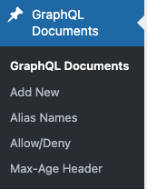
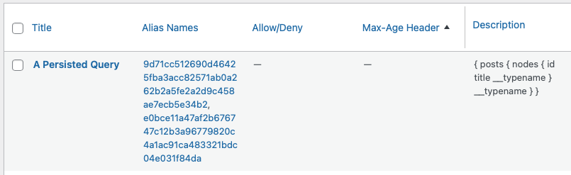
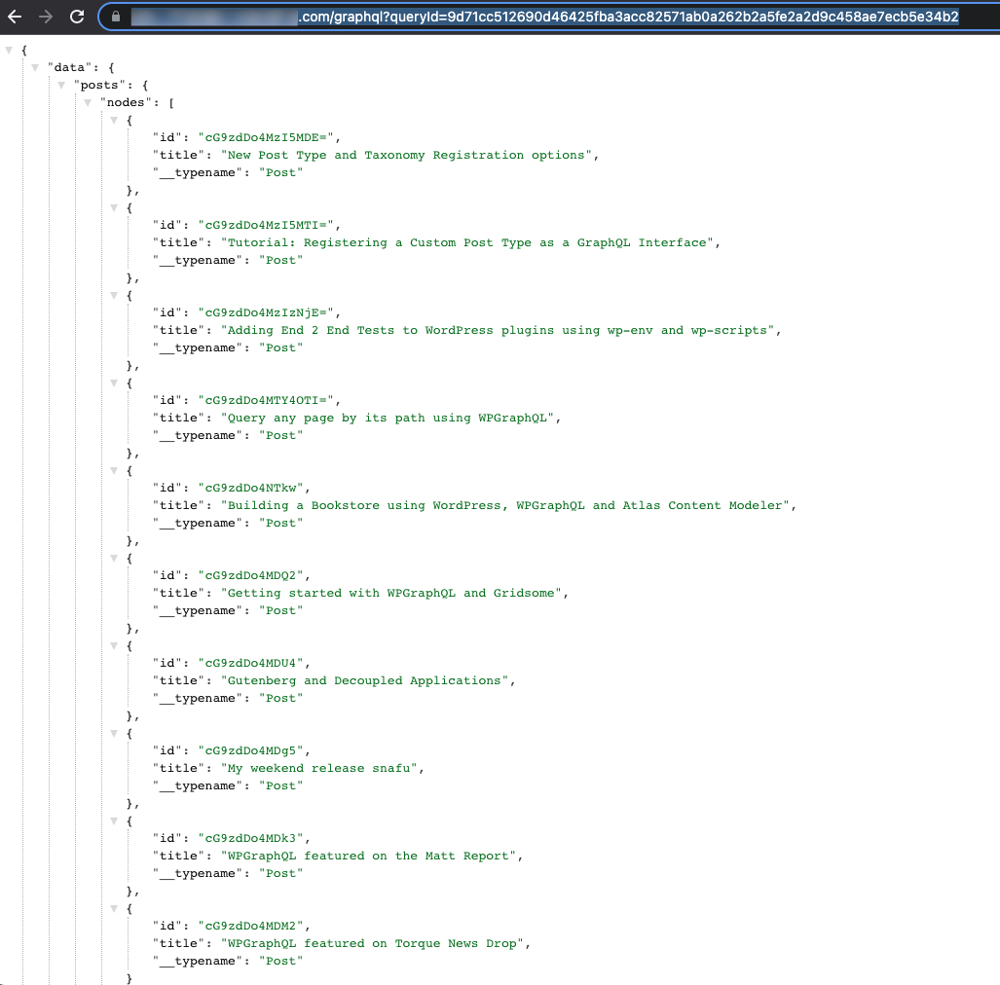
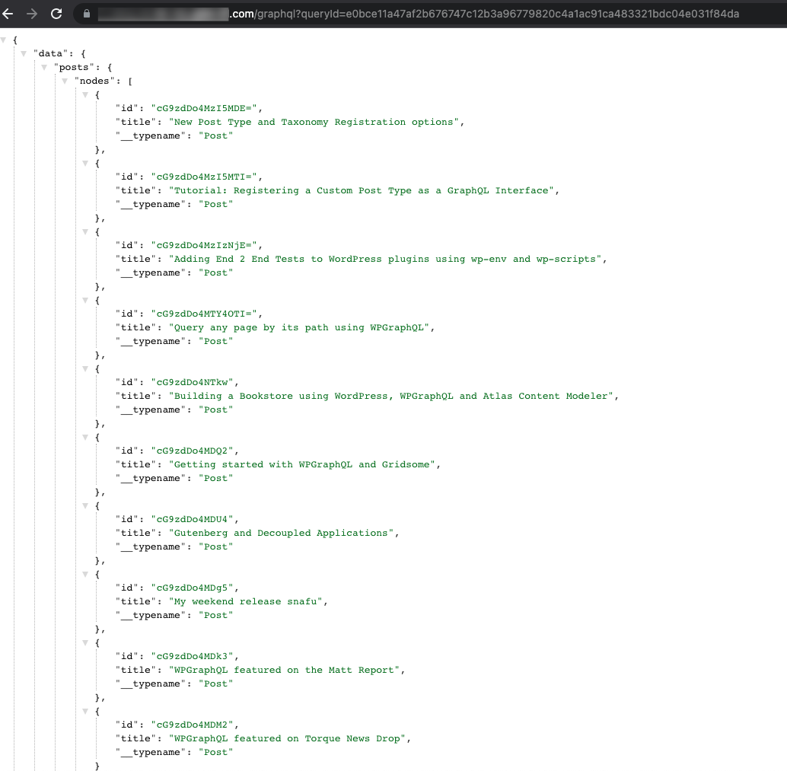
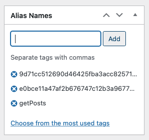
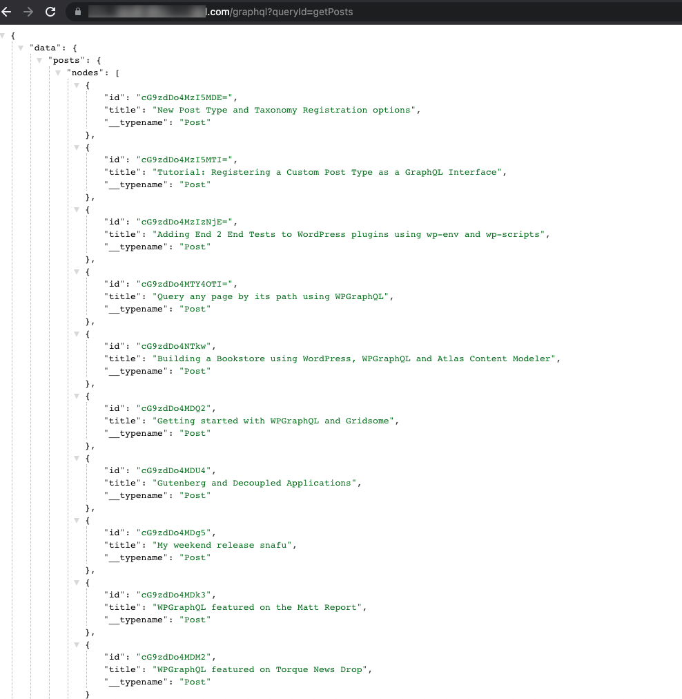
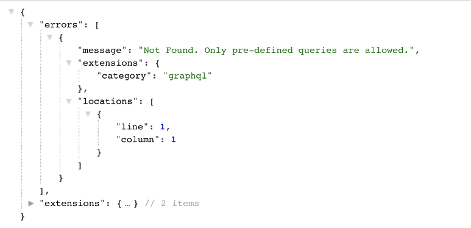
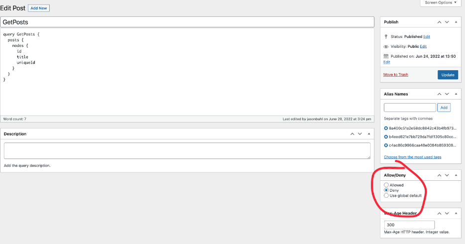
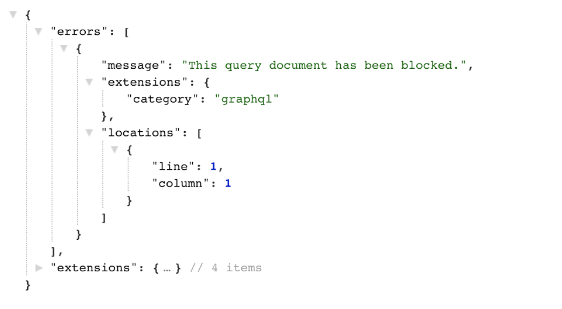

# Persisted Queries

In the GraphQL ecosystem, the term “Persisted Queries” refers to the idea that a GraphQL Query Document can be “persisted” on the server, and can be referenced via a Query ID.

There are several advantages to using Persisted Queries:

- Avoid query string limits
- Reduced upload cost per request (uploading large GraphQL query documents for each request has a cost)
- Ability to mark specific queries as allow/deny
- Ability to customize the cache-expiration time per query
- Future customizations at the individual query level

WPGraphQL Smart Cache provides support for "Persisted Queries" and plays nice with the [Apollo Persisted Query Link](https://www.apollographql.com/docs/react/api/link/persisted-queries/).

_**NOTE:** You can see the [implementation](https://github.com/wp-graphql/wpgraphql.com/blob/bab1429c0f25ba93ddd3dfba2e6998eec67b331a/src/plugins/PersistedQueriesPlugin.js) of the Apollo Persisted Queries link on WPGraphQL.com, a headless WordPress front-end powered by [NextJS](https://nextjs.org) and [FaustWP](https://www.npmjs.com/package/@faustwp/core)._

When WPGraphQL Smart Cache is active, there’s a non-public post type registered named “graphql_document”. This post type is used to “persist” query documents, associate them with unique IDs and maintain rules about the queries.

### Persisted Queries Admin UI

The Persisted Queries functionality of this plugin uses a private  “graphql_document” post_type. Since it’s a Post Type, we can make use of WordPress core ui’s.

**NOTE**: In the future we plan to have UIs more tightly integrated with the GraphiQL IDE, but for now, you can use the core WordPress UIs to interact with the saved GraphQL Documents.

There’s a setting under "GraphQL > Settings > Saved Queries" that lets you display the admin ui for saved queries.


With the UI set to be displayed, you will see a "GraphQL Documents" menu item.



From here, you can use the standard WordPress Admin User Interfaces to Create, Update and Delete GraphQL Documents.


Below is a look at the User Interface for editing a GraphQL Document.


From this screen you can add/update the following properties of a GraphQL Document:

- **title**: A reference name for the document. When using Automated Persisted Queries the title will be derived from the operation name(s) in the document, but the title can be updated to something you prefer for your own reference.
- **document**: The query string document
- **description**: A description of the document, for reference. For example, you might have been testing a document for a staging site and want to leave yourself a note here.
- **alias names / query IDs**: Alias Names can be used to query a document by queryId.
- **allow/deny**: Depending on the rules set at "GraphQL > Settings > Saved Documents", you can control whether a specific query should be allowed to execute (when the endpoint is otherwise locked down), or if a specific query should be denied execution, even though the endpoint is publicly queryable.
- **max-age header:** You can set a Cache expiration for this query, in seconds. This means that if no event occurs to purge the query will automatically purge when it hits this length of time. This can be useful for queries for data (such as custom plugin data) that might not be tracked in the Invalidation events.

#### Query IDs / Alias Names

One feature enabled by "Persisted Queries" is the ability to query documents by ID instead of by full query string.

When a GraphQL Document has been saved, it's assigned a unique ID that can be used to execute the query wihtout uploading the full document.

If the same query comes through with different formatting, a new ID is associated with the existing query.

For example, if I were to have the 2 following queries:

```graphql
{posts{nodes{id,title,__typename}}}
```

And:

```graphql
{
  posts {
    nodes {
      id
      title
      __typename
    }
  }
}
```

They would be stored once as a "GraphQL Document" in WordPress, because they're actually the same query, but because formatting is different, the client will have a different hash for each one, and we need to be able to resolve for each version of the hash the client has sent.

For example, if both of the above formatted versions of the query were sent over as persisted queries, I would see the following GraphQL Document persisted, with 2 Alias Names:



Either of these alias names can now be used to execute the document:





In addition to hashed Alias Names (IDs) being added when using Automated Persisted Queries, you can manually assign Alias Names to GraphQL Documents as well.

For example, I could add the alias name `getPosts` to the above GraphQL document:



Then I could use that Alias Name as the value of the `queryId` and execute the same document:



**NOTE:** Alias names must be unique across all GraphQL Documents. You cannot have 2 GraphQL Documents with the same alias name (manually entered or automatically generated).

### GraphQL Variables

Persisted queries support GraphQL variables which can passed in the query string, e.g. `?queryId=getPostById&variables={"id":"yourId"}`

#### Allow / Deny Rules

Saved GraphQL Documents can have allow/deny rules applied to them.

This goes hand in hand with the allow/deny rules setting under "GraphQL > Settings > Saved Queries".


If “Allow/Deny Mode” is left as “Public” then the WPGraphQL endpoint will be treated as a fully public endpoint (unless other code has been added to modify the endpoint)

If this setting is set to “Allow only specific queries” then the entire GraphQL Endpoint will be restricted from executing queries for public users, unless the query document is marked as “allowed”

For example, after setting the value to “Allow only specific queries” executing a new query will result with an error:



If the rule is set to "Deny some Specific Queries", then all queries will be allowed to execute as a fully public endpoint, with the exception of documents marked as "Deny".



If this query is executed now, an error will be returned.



#### Custom Max Age / Expiration Per Query

When creating / editing GraphQL Documents, you can set a custom max-age per document.

This max-age will be used as the max-age for the query to expire if another event has not already purged the cache.

This can be handy if you have queries that might not be invalidating properly based on changes to data in WordPress.

For example, currently queries for "Settings" are not invalidating when settings change. For these queries, they will invalidate (expire) when the max age has been hit.

> [!NOTE]
> Some hosts may not support this setting.
> Please refer to your host's documentation for more information.

## 👉 Up Next:

- [Network Cache](./network-cache.md)
- [Object Cache](./object-cache.md)
- [Cache Invalidation](./cache-invalidation.md)
