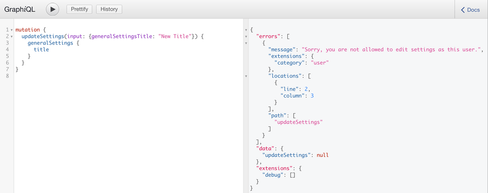
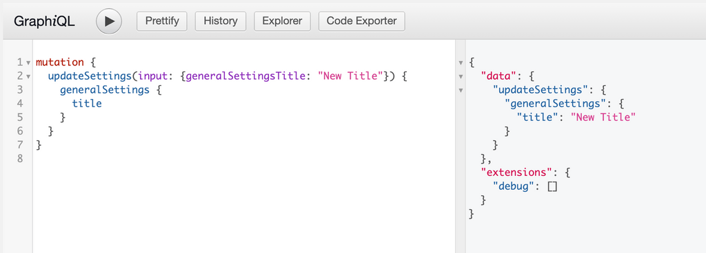
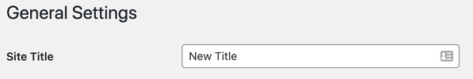

On this page you will find information about using GraphQL to interact with settings that have been registered to WordPress via the `register_settings()` API provided by WordPress.

## Core Settings

WPGraphQL respects settings that have been registered by WordPress core and exposes these settings to the GraphQL API for querying and mutating.

The Schema is created by adding an Object Type to the Schema representing the field group, and registering each field to that GraphQL Object Type.

For example, WordPress core provides a title, description and url field in the "general settings" group, so these settings can be queried like so:

```graphql
{
  generalSettings {
    title
    description
    url
  }
}
```

And you would get a response similar to the following:

```json
{
  "data": {
    "generalSettings": {
      "title": "Name of Your Site",
      "description": "Just another WordPress site",
      "url": "https://example.com"
    }
  }
}
```

## Registering Custom Settings

WordPress provides a `register_settings()` API that allows developers to register settings for their site. Check [here](https://developer.wordpress.org/reference/functions/register_setting/) for more information on how these settings are registered by group and name. In WordPress you could register a custom setting like so:

```php
/**
 * Registers a text field setting for WordPress 4.7 and higher.
 **/
function register_my_setting() {
    $args = [
      'type' => 'string',
      'sanitize_callback' => 'sanitize_text_field',
      'default' => NULL,
      'show_in_graphql' => true, // This tells WPGraphQL to show this setting in the Schema
    ];
    register_setting( 'my_options_group', 'my_option_name', $args );
}

add_action( 'init', 'register_my_setting' );
```

Since we set the `show_in_graphql` parameter to true the setting will now appear in the GraphQL schema under it's group name.

This could now be queried like so:

```graphql
{
  myOptionsGroupSettings {
    myOptionName
  }
}
```

> \*\*NOTE: \*\*If a setting is registered without a group defined it will appear under `generalSettings`.

## Exposing Options WordPress Doesn't Register

Some options are never registered through `register_setting()`, for example values a plugin saved with `update_option()`, or core options that WordPress simply doesn't register. WPGraphQL can't see those by default.

Rather than calling `register_setting()` yourself (which mutates global state for the rest of the request, affecting internal `graphql()` calls, block render callbacks, cron, and WP-CLI), use the `graphql_normalized_settings` filter to add an entry to WPGraphQL's own settings map, in memory:

```php
add_filter( 'graphql_normalized_settings', function ( array $settings ) {
    // Expose an option that was saved via update_option() but never
    // registered with register_setting(), so WPGraphQL can't see it by default.
    $settings['my_legacy_option'] = [
        'group'            => 'general',
        'type'             => 'string',
        'description'      => __( 'A value stored by a legacy plugin.', 'my-textdomain' ),
        'graphql_readonly' => true,
    ];

    return $settings;
} );
```

The entry follows the `register_setting()` args shape (`group`, `type`, `description`, …) plus the WPGraphQL-specific config in the next section. It then surfaces on both read surfaces like any registered setting, in this example as `generalSettings { myLegacyOption }` and `allSettings { generalSettingsMyLegacyOption }`.

> **NOTE:** Entries are keyed by the **option name**, which is globally unique in WordPress, there is a single row per option in the options table regardless of which group registered it, so the group is never part of the key. The `group` is metadata that places the field under the matching setting-group type. Because this filter runs *after* registered settings are collected, assigning an entry whose key matches an existing option name **overrides** that entry, so use a fresh option name unless you specifically intend to modify an existing setting's configuration.

WPGraphQL uses this same mechanism to expose a few common options core doesn't register: the **Site Address** (`generalSettings { homeUrl }`, also on the flat type as `generalSettingsHomeUrl`) and the **permalink** options under a `permalinkSettings` group (`structure`, `categoryBase`, `tagBase`). On multisite it also shims `siteurl` (core only registers it on single-site), so `generalSettings { url }` and `generalSettingsUrl` are available on multisite too. These are read-only.

## Per-Setting Configuration

Beyond the standard `register_setting()` args, WPGraphQL reads the following per-setting config keys. These apply whether the setting is registered with `register_setting()` (via its `$args`) or seeded through the `graphql_normalized_settings` filter above:

| Field                | Type     | Required | Description                                                                                                                                                                                                             |
| -------------------- | -------- | -------- | --------------------------------------------------------------------------------------------------------------------------------------------------------------------------------------------------------------------- |
| `graphql_field_name` | string   | No       | An explicit field name for the setting. Overrides the default name (which is derived from the `show_in_rest` name or the option key). The value is run through WPGraphQL's standard field-name formatter, the same one applied to every field, so `graphql_field_name => 'homeUrl'` exposes the field as `homeUrl`.                            |
| `graphql_readonly`   | boolean  | No       | If true, the setting is exposed for reading but cannot be changed through the `updateSettings` mutation. Use for values that must not be writable through the API, such as the site address.                            |
| `graphql_resolve`    | callable | No       | A resolver for the setting's value, given the first pass before the value is returned. Receives the stored value and returns the value to expose. Use to normalize or derive a value, such as deriving a timezone from a UTC offset when no named zone is set. |

## Querying Settings

### All Settings

Site settings can be queried in two different ways. As mentioned before, you register your own setting group, say `catGifSettings`, and you would see your setting group and fields appear in the GraphQL schema. You can query this data in two different ways. First, by accessing all of the site setting groups at once using the `allSettings` root query field which will return all of the settings fields with the setting group name prepended.

```graphql
{
  allSettings {
    generalSettingsDateFormat
    generalSettingsDescription
    generalSettingsLanguage
    generalSettingsStartOfWeek
    generalSettingsTimeFormat
    generalSettingsTimezone
    generalSettingsTitle
    generalSettingsUrl
    readingSettingsPostsPerPage
    discussionSettingsDefaultCommentStatus
    discussionSettingsDefaultPingStatus
    writingSettingsDefaultCategory
    writingSettingsDefaultPostFormat
    writingSettingsUseSmilies
  }
}
```

Would return results similar to the following:

```json
{
  "data": {
    "allSettings": {
      "generalSettingsDateFormat": "F j, Y",
      "generalSettingsDescription": "Just another WordPress site",
      "generalSettingsLanguage": "",
      "generalSettingsStartOfWeek": 0,
      "generalSettingsTimeFormat": "g:i a",
      "generalSettingsTimezone": "America/Denver",
      "generalSettingsTitle": "Example Site Title",
      "generalSettingsUrl": "http://example.com",
      "readingSettingsPostsPerPage": 10,
      "discussionSettingsDefaultCommentStatus": "open",
      "discussionSettingsDefaultPingStatus": "open",
      "writingSettingsDefaultCategory": 1,
      "writingSettingsDefaultPostFormat": "",
      "writingSettingsUseSmilies": true
    }
  }
}
```

### Site Settings by Settings Group

Site settings can *also* be queried by setting group name. Field names will be the camel case version of the setting, no longer prepended by the group name since you are using it to query with.

For example, fields in the General Settings group can be accessed like so:

```graphql
{
  generalSettings {
    dateFormat
    description
    language
    startOfWeek
    timeFormat
    timezone
    title
    url
  }
}
```

And that will return data similar to:

```json
{
  "data": {
    "generalSettings": {
      "dateFormat": "F j, Y",
      "description": "Just another WordPress site",
      "language": "",
      "startOfWeek": 0,
      "timeFormat": "g:i a",
      "timezone": "America/Denver",
      "title": "Example Site Title",
      "url": "http://example.com"
    }
  }
}
```

### Settings Groups are Nodes

Each settings group implements the `Node` interface and exposes a globally unique `id`, so a group can be fetched like any other node:

```graphql
{
  generalSettings {
    id
    title
  }
}
```

The `id` can be passed back to the `node` field to re-fetch the group:

```graphql
query GetSettingGroupNode($id: ID!) {
  node(id: $id) {
    ... on GeneralSettings {
      id
      title
    }
  }
}
```

The global ID encodes the `setting_group` type and the group's key (e.g. `general`, `permalink`), and clients can treat it as an opaque cache identifier. The flat `allSettings` field is a convenience view across every group and does not implement `Node`.

## Mutations

Settings can be updated using GraphQL through a mutation. Custom settings would follow the `allSettings` naming conventions where the group name is prepended before the setting field name.

Here's an example of a Mutation to update the Site's title:

```graphql
mutation {
  updateSettings(input: {generalSettingsTitle: "New Title"}) {
    generalSettings {
      title
    }
  }
}
```

### Unsuccessful Mutation

If the user executing the Mutation is not authenticated or does not have the capability to edit the setting, the setting will not be updated and an error will be returned:



### Successful Mutation

If the user executing the Mutation is authenticated and has proper capabilities to update the setting, the setting will be updated in WordPress and the specified fields will be returned.



After the mutation succeeds, we can confirm the change on the WordPress General Settings page:


