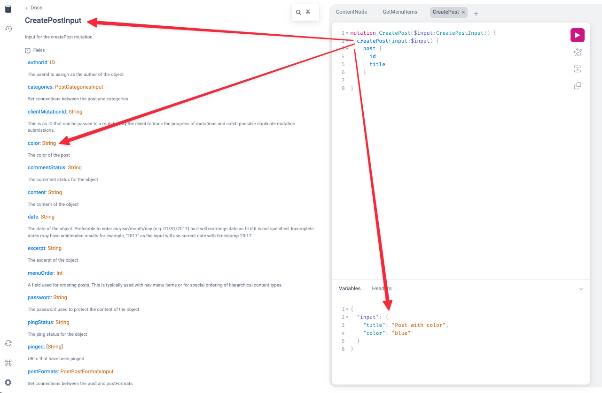
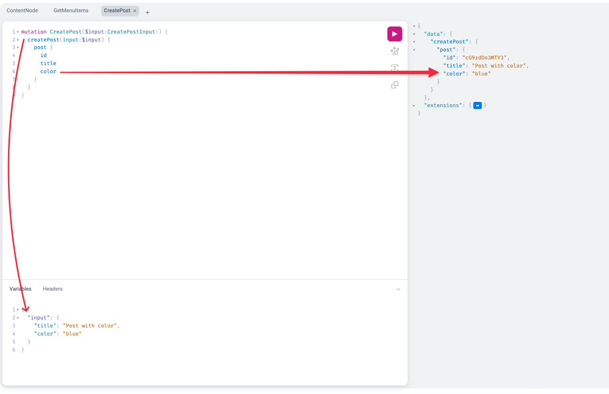

WPGraphQL provides support for Mutations, or the ability to use GraphQL to create, update and delete data managed in WordPress. This page covers general concepts of how WPGraphQL implements mutations. This page will be most useful for developers that are already [familiar with GraphQL](/docs/intro-to-graphql/).

## Register a new Mutation

To register a mutation to the GraphQL Schema, you can use the `register_graphql_mutation` function [documented here](/functions/register_graphql_mutation/).

## Extending existing mutations

To extend existing mutations, there are typically 2 things that need to happen: 

- add the new input field(s) to the schema
- hook into the mutation and do something with the input (i.e. save it as meta)

Below are some examples that showcase this in action:

### Extending the "Create Post" mutation

Let's say we wanted to extend the "Create Post" mutation to store a "color" as post_meta on a post. 

We could do this by adding a "color" input field to the CreatePostInput type in the schema, then hooking into the create post mutation lifecycle and using the input and save it as post_meta.

#### Adding the Mutation Input Field

Below is a snippet that registers a new "color" input field to the `CreatePostInput` type in the Schema.

```php
<?php
add_action( 'graphql_register_types', function() {
  register_graphql_field( 'CreatePostInput', 'color', [
    'type' => 'String',
    'description' => __( 'The color of the post', 'your-textdomain' )
  ] );
} );
?>
```

This adds the field to the Schema and we can see it in the GraphiQL IDE: 



However, if we execute the mutation at this point, the color that we input would do nothing. 

#### Extending the Mutation to save the data

We need to hook into the mutation lifecycle to save the data that was passed into the mutation. 

```php
add_action( 'graphql_post_object_mutation_update_additional_data', function( $post_id, $input, $post_type_object, $mutation_name, $context, $info, $default_post_status, $intended_post_status ) {

    // The input comes in as $input and we can use the input to save the post meta. If the input for this field doesn't exist, bail early
    if ( ! isset( $input['color'] ) ) {
        return;
    }

    $sanitized_color = sanitize_text_field( $input['color'] );
    update_post_meta( $post_id, 'color', $sanitized_color );


}, 10, 8 );
```

#### Adding the queryable "color" field

If you already have the "color" field in your Schema on the "Post" type using something like WPGraphQL for Advanced Custom Fields, you might be able to skip this step. But if you need to expose the "color" field to be queryable, you can do it like so: 

```php
add_action( 'graphql_register_types', function() {
    register_graphql_field( 'Post', 'color', [
        'type' => 'String',
        'description' => __( 'The color of the post', 'your-textdomain' ),
        'resolve' => function( $post, $args, $context, $info ) {
            $color = get_post_meta( $post->databaseId, 'color', true );
            return $color ?? null;
        }
    ] );
});
```

And now, with all 3 snippets in place we can successfully execute a `createPost` mutation, inputting a "color" value that will save to the post_meta and will be queryable as "color" on the post. 

