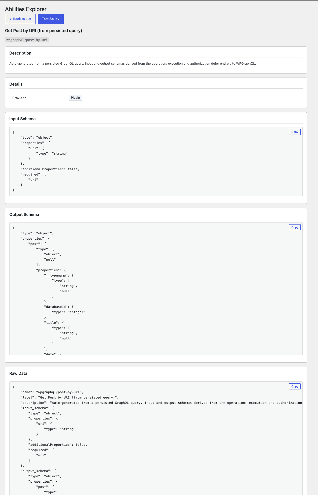
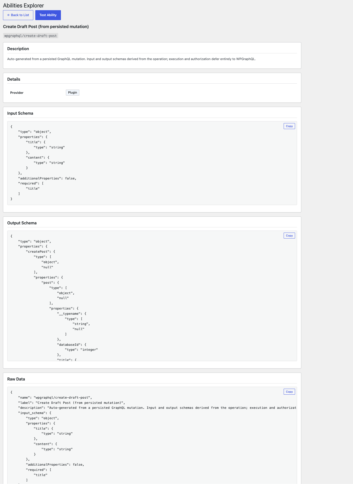
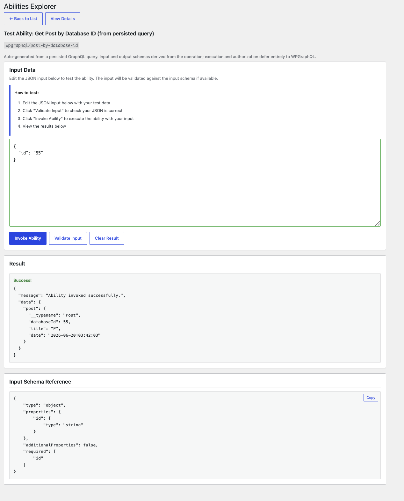
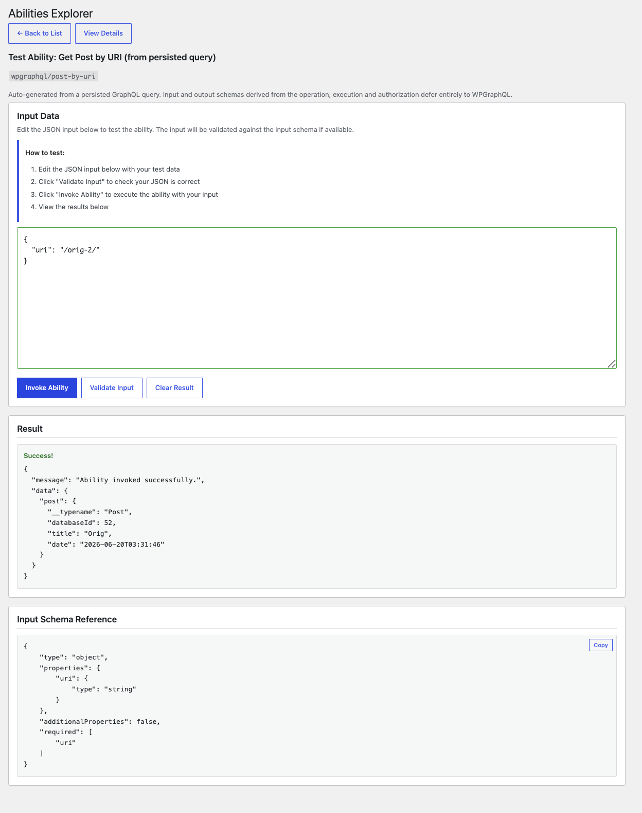
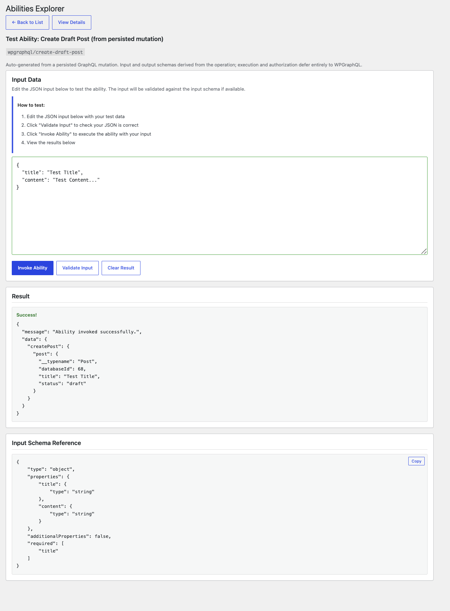

# POC — generate an ability from a persisted GraphQL query

> **TL;DR:** The experiments showed abilities don't belong *under* the resolver. This POC explores the constructive flip-side: an ability that sits *above* WPGraphQL and runs a persisted GraphQL query. It works cleanly — we **derive both** the ability's `input_schema` (from the operation's variables) **and** its `output_schema` (from the selection set + the GraphQL schema), with no hand-written schemas, and defer authorization to WPGraphQL's resolvers. The result is a fully functional, validated, authz-correct ability whose contract is generated **for free**. Which is exactly the point: in this role an ability is nearly indistinguishable from the persisted query it wraps — so for WPGraphQL the ability mostly adds a discovery/registry surface, not new capability.

## The idea

An ability is, structurally, a registry entry for a typed operation: a name, typed input, typed output, a permission gate. A **persisted GraphQL query** is already exactly that — and its types come from the schema. So instead of hand-authoring an ability's JSON Schemas (which must track behavior and are validated on every `execute()`), generate them from the persisted operation and let WPGraphQL do the real work.

## What we built

`poc-persisted-query-ability/persisted-query-ability.php`:

- Parses a persisted query with the bundled `GraphQL\Language\Parser`.
- Maps each operation **variable definition** to a JSON Schema property (`NonNull` → `required`, `List` → `array`, scalar → type). This becomes the ability's `input_schema`.
- Walks the operation's **selection set against the GraphQL schema** to type each returned field. This becomes the ability's `output_schema` (kept nullable-lenient so a legitimately-null node doesn't fail output validation).
- Detects the operation type (query vs mutation), walks the correct root type for the output schema, and derives a `meta.annotations.readonly` hint from it (a query is read-only, a mutation is not).
- Registers an ability whose `execute_callback` simply runs `graphql([ 'query' => $doc, 'variables' => $input ])` and returns `data`.
- `permission_callback` returns `true` and defers authorization to WPGraphQL's per-field / per-row resolvers.

The persisted query is defined inline here for a self-contained demo. In practice it would come from a persisted-query store (WPGraphQL Smart Cache's `graphql_document`s, or code/file-defined persisted queries); wiring that is left for later.

## It works

From `query PostByDatabaseId($id: ID!) { post(id: $id, idType: DATABASE_ID) { __typename databaseId title date } }`:

```
DERIVED input_schema  : {"type":"object","properties":{"id":{"type":"string"}},"additionalProperties":false,"required":["id"]}
DERIVED output_schema : {"type":"object","properties":{"post":{"type":["object","null"],
                         "properties":{"__typename":{"type":["string","null"]},"databaseId":{"type":"integer"},
                         "title":{"type":["string","null"]},"date":{"type":["string","null"]}}}}}
ANON  published id    : {"post":{"databaseId":65,"title":"POC Pub","date":"..."}}
ANON  draft id        : {"post":null}                      ← GraphQL authz, through the ability
ANON  missing id      : WP_Error: ability_invalid_input    ← validated against the DERIVED input schema
ADMIN draft id        : {"post":{"databaseId":66,...}}      ← identity-aware, for free
```

- **Both schemas were derived**, not written by hand. The `output_schema` tells a consumer this query returns `post.databaseId` (integer) and `post.title` / `post.date` (nullable strings); a different persisted query selecting `content` would derive a different output shape.
- **Validation works** off the derived schemas (missing `id` rejected; null nodes still pass output validation).
- **Authorization is correct and identity-aware for free** — anon sees the published post but `null` for the draft; admin sees the draft. WPGraphQL's resolvers did it; no `permission_callback` logic required.
- **One honest cost:** deriving the output schema needs the GraphQL schema (the input schema came free from the AST). In production you'd compute it once per persisted query and cache it, not rebuild per request.

## It's real, not a mockup — in the Abilities Explorer

These register and run like any other ability. The Abilities Explorer (a simple admin viewer) lists them, shows the **derived** schemas, and can invoke them live.

### Derived contracts, shown in the explorer

The detail view renders the generated input and output schemas straight from the persisted operation. Here's the `wpgraphql/post-by-uri` query (input from the `$uri` variable, output from the selection set):



The same holds for a **mutation** — the output schema is walked against the mutation root type, and `readonly` is derived as `false`:



All of these came out of the same generator, from different persisted operations, with zero per-ability schema work:

| Ability | Operation | Derived input | `readonly` |
|---|---|---|---|
| `wpgraphql/post-by-database-id` | query | `id` (string, required) | `true` |
| `wpgraphql/post-by-uri` | query | `uri` (string, required) | `true` |
| `wpgraphql/create-draft-post` | mutation | `title` (required), `content` | `false` |

### And they actually execute

Invoking each from the Explorer runs the real WPGraphQL operation, with authorization deferred to WPGraphQL.

`post-by-database-id` with `{ "id": "55" }`:



`post-by-uri` with `{ "uri": "/orig-2/" }`, a different persisted query, different input, real result:



The `create-draft-post` mutation with `{ "title": "Test Title", "content": "Test Content..." }` creates a real draft (note the returned `databaseId`):



Run as an unauthorized user, that same mutation returns `{ "createPost": null }`, WPGraphQL denies it, with no permission logic in the ability itself.

## What it shows

This is the genuinely useful direction: abilities as an outward, discoverable, typed surface *over* WPGraphQL. But it also sharpens the central question. Everything good here came from the persisted query and the schema — the ability contributed a name and a registry entry. So the value of "ability + WPGraphQL" is the **agent/MCP discovery layer**, not the data path. And if you already have persisted queries (which carry a schema-derived contract natively), an ability is a thin adapter on top, not a new capability — see [conclusions](conclusions.md).
