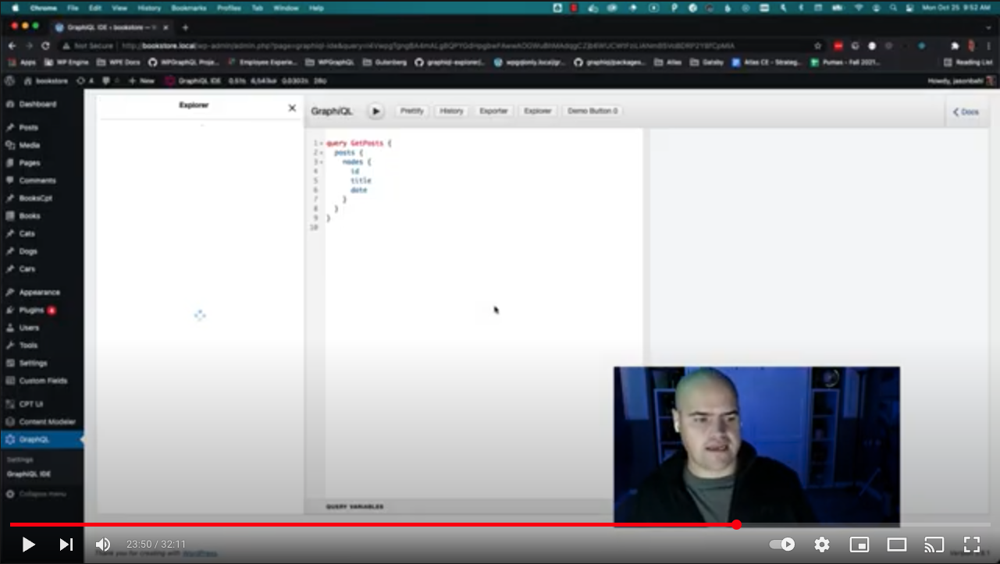

# WPGraphQL Admin Tools App

## What is this?

This is the WPGraphQL Admin Tools app.

This is an evolution of WPGraphiQL, an admin tool centered around the GraphiQL IDE.

This adds new functionality to GraphiQL, including the ability to exectute requests as a public
and a private user, but also allows the React app to be extended.

## Why rebuild WPGraphiQL?

You, like many other users, have probably used GraphiQL inside your WordPress dashboard
and thought to yourself "wow, this is perfect software" and so now you're wondering why it's being
re-built.

Extendability is the answer.

The main goal behind the rebuild of WPGraphiQL is to build it in a way where it, much like the
rest of WPGraphQL, can be extended by other WordPress plugins to create a customizable experience
for users using WPGraphQL.

That, and, despite the unanimous feedback, it's not actually perfect software.

In addition to making the IDE extendable, we're also working on improving some User Interfaces.

## What's Different?

For the most part, functionality should be similar, but the UI has been updated to provide a smoother
experience.

### New Explorer

The "Explorer" UI has been rebuilt with an updated UI (using Ant.Design components) and the ability
for plugin authors to customize the experience.

For example, the Explorer has filters in place that allow plugin authors the ability to add custom
action buttons for each operation, override input components for arguments, etc.

## How can I extend WPGraphiQL?

Ok, this sounds interesting!

So tell me, how can I, as a plugin developer, go about "extending" GraphiQL??

Here's a video you can watch, and below is some documentation about the filters available.

### JavaScript Hooks & Filters

Many WordPress developers are familiar with hooks and filters in PHP, and WPGraphiQL 2.0 now includes
a hook and filter system for JavaScript.

We've rebuilt WPGraphiQL to have many hookable/filterable areas, using
the [@wordpress/hooks](https://www.npmjs.com/package/@wordpress/hooks) package.

The following filters have been added (with more to come):

#### graphiql_app

This filter executes when the overall application is being rendered. Extensions can hook in here to bootstrap their code.

#### graphiql_query_params_provider_config

This filter can be used to adjust the default behavior for the Query Params Context

#### graphiql_app

This filter can be used to wrap the app with Context providers.

You can see this in use by the Explorer and Code Exporter

#### graphiql_app_context

This filter allows plugins to adjust the default values of the AppContext provider

#### graphiql_auth_switch_context_default_value

This filter allows plugins to adjust the default value of the Auth Switch Context Provider

#### graphiql_explorer_context_default_value

This filter allows plugins to adjust the default value of the Explorer Context provider

#### graphiql_code_exporter_context_default_value

This filter allows plugins to adjust the default value of the Code Exporter Context provider

#### graphiql_fetcher

This filter allows plugins to override the default fetcher that is used by the GraphiQL IDE.

#### graphiql_before_graphiql

This allows plugins to add panels before (to the left of) the GraphiQL IDE

#### graphiql_after_graphiql

This allows plugins to add panels after (to the right of) the GraphiQL IDE

#### graphiql_context_value

This filter allows plugins to adjust the context that's passed to the GraphiQL Context Provider

#### graphiql_container

This allows plugins to wrap the container with other markup

#### graphiql_toolbar_buttons

This allows plugins to filter the array of buttons in the Toolbar

#### graphiql_toolbar_before_buttons

This filter allows plugins to add custom components before (to the left of) the Toolbar buttons

#### graphiql_toolbar_after_buttons

This filter allows plugins to add custom components after (to the right of) the Toolbar buttons

#### graphiql_explorer_operation_action_menu_items

This filter allows plugins to add custom actions to the "Operation Actions" menu.
The default buttons are "Clone Query" and "Delete Query".

#### graphiql_router_screens

This filter allows plugins to add new "screens" to the admin UI. The initial built-in screens are "GraphiQL IDE" and "Help".
